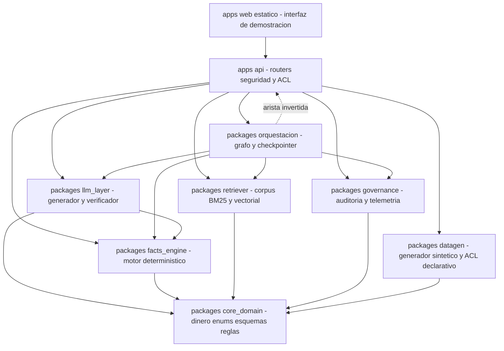
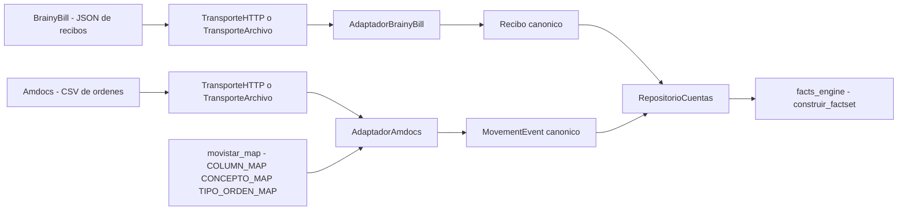
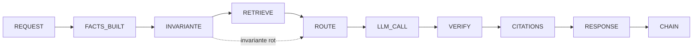

# Backend y datos de `recibo-claro`

**Qué es este documento.** La descripción técnica profunda de la mitad del sistema que no se ve:
el backend, la base de datos, el motor de cálculo, la API, la autenticación, los datos ficticios,
las conversaciones, el feedback y las reglas de negocio. Está escrito para que un ingeniero pueda
comprobar cada afirmación abriendo el fichero que se cita, y para que un evaluador entienda **por
qué** cada pieza es como es y qué alternativa se descartó para llegar a ella.

Documentos hermanos: [`COMO_FUNCIONA.md`](COMO_FUNCIONA.md) cuenta el producto;
[`arquitectura.md`](arquitectura.md) describe el sistema completo a vista de pájaro;
[`FUNDAMENTACION.md`](FUNDAMENTACION.md) argumenta las decisiones de alto nivel;
[`PROCEDENCIA.md`](PROCEDENCIA.md) enumera lo que falta y lo que está roto; los [`ADR/`](ADR/)
registran las decisiones una a una. Este documento entra al detalle de firmas, columnas y fórmulas.

**Convención de etiquetado**, la misma que el resto de la documentación del proyecto:

| Etiqueta | Significa |
|---|---|
| `[CONFIRMADO-OFICIAL]` | Está en las BASES o en la ficha del Desafío 1, y se cita literalmente |
| `[SUPUESTO]` | Decisión del equipo tomada a falta de dato oficial |
| `[PROPUESTA]` | Diseño del equipo, no exigido por la ficha |
| `[POR VALIDAR]` | Parámetro que hay que confirmar con Movistar antes de cualquier uso real |

Nada marcado `[PROPUESTA]` o `[SUPUESTO]` debe leerse como dato de Movistar.

**Cifras.** Todas las de este documento se obtuvieron ejecutando el sistema el 8 de agosto de 2026
sobre el árbol de trabajo actual, con la semilla `20260804`. El §13.5 dice qué comando produce cada
una. Ninguna cifra de aquí es una estimación disfrazada de medición.

Estado verificado ese día: **47 193 líneas de Python en 123 ficheros**, **7 tablas SQL**,
`pytest` en **1 427 pruebas superadas y 299 omitidas**, evaluación **APROBADA** con
**`TA_respuesta` = 0,00 %** y **`strict answer accuracy` = 100 %** sobre **261 casos golden**.

---

## 1. Mapa del backend

### 1.1 Los paquetes y qué hace cada uno

El repositorio separa dos espacios: `apps/`, que contiene procesos ejecutables, y `packages/`, que
contiene bibliotecas de dominio sin ningún servidor dentro. La distinción no es cosmética: cualquier
cosa de `packages/` se puede importar desde un cuaderno, desde una prueba o desde el evaluador sin
levantar FastAPI, y eso es lo que permite que la evaluación oficial (§13.5) se ejecute en **unos
0,85 s** sin red y sin base de datos —cuatro corridas consecutivas: 828, 833, 851 y 852 ms—.

Recuento de líneas de Python por paquete, obtenido el 8 de agosto de 2026 excluyendo `.venv` y
`__pycache__`:

| Ruta | Qué contiene | Líneas | Ficheros |
|---|---|---:|---:|
| `apps/api/` | Borde HTTP: `main.py`, `settings.py`, `security.py`, `deps.py`, `errores.py`, `acl.py` y ocho routers | 5 294 | 16 |
| `apps/mocks/` | Servidores que imitan a BrainyBill y a Amdocs sobre el dataset sintético | 368 | 5 |
| `packages/core_domain/` | Contratos: `dinero.py`, `enums.py`, `reglas.py` y los seis esquemas Pydantic | 2 785 | 11 |
| `packages/facts_engine/` | El motor determinístico: tramos, prorrateo, diff, atribución, invariante, confianza, intención y la fachada `motor.py` | 2 923 | 9 |
| `packages/llm_layer/` | Proveedores, plantillas, prompts, generador, verificador numérico y capa conversacional | 4 445 | 11 |
| `packages/retriever/` | Corpus, BM25, índice vectorial, fusión híbrida y el saneador de cifras | 3 755 | 7 |
| `packages/governance/` | Bitácora encadenada y telemetría de silencio post-explicación | 1 730 | 3 |
| `packages/datagen/` | Generador sintético, catálogo y FAQ semilla, y los dos ACL declarativos | 7 257 | 8 |
| `packages/orquestacion/` | El turno modelado como grafo de LangGraph, con estado persistente | 2 241 | 7 |
| `eval/` | La evaluación oficial de las tres métricas de la ficha | 2 068 | 4 |
| `tests/` | Pruebas unitarias, de propiedad, de contrato y golden | 4 593 | 18 |
| `scripts/`, `docker/`, `db/migrar.py` | Arranque local, prueba de punta a punta, humo y migrador | 1 820 | 4 |
| **Suma de la tabla** | | **39 279** | **103** |
| `apps/__init__.py` y `packages/__init__.py` | Los dos marcadores de paquete de la raíz, una línea cada uno | 2 | 2 |
| **Total del proyecto** | | **47 193** | **123** |

Las dos últimas filas no son un detalle contable ocioso: sin ellas la tabla no cuadra con el
inventario, y una tabla que no cuadra es exactamente el defecto que este sistema existe para
detectar en un recibo.

Fuera del recuento de Python: `apps/web/estatico/` con **3 309 líneas** en 9 ficheros HTML, CSS y
JavaScript —la interfaz de demostración servida en `/ui`, que no participa en ninguna decisión—; las
un esquema SQL único, `db/esquema.sql`, con **536 líneas**; `db/reglas/rules.yaml` con **558**; y los siete ficheros de
casos golden con **817**.

### 1.2 La regla de dependencias

La regla es una sola frase: **el sentido de los `import` va siempre desde lo concreto hacia lo
abstracto, y `core_domain` no importa nada del proyecto.**



Qué garantiza cada nivel, y por qué está donde está:

**`core_domain` no importa nada del proyecto.** Comprobado: los únicos `import` internos de ese
paquete apuntan a otros módulos del propio `core_domain`. Es lo que permite que `dinero.py`,
`enums.py` y los esquemas se puedan usar desde una migración, desde el generador de datos y desde el
verificador sin arrastrar FastAPI, `httpx` ni SQLAlchemy. Si `core_domain` importara del motor, el
grafo de dependencias tendría un ciclo y cada prueba unitaria de aritmética costaría el arranque de
media aplicación.

**`facts_engine` solo importa `core_domain`.** No conoce HTTP, ni la base de datos, ni el proveedor
generativo. Se le entregan dos `Recibo` y una lista de `MovementEvent` y devuelve un `FactSet`. Esa
pureza es la que hace que el motor sea comprobable con Hypothesis: `tests/propiedad/test_invariante.py`
genera miles de pares de recibos y verifica que `Σ deltas == Δ_total` sin levantar nada.

**`llm_layer` importa `core_domain` y una sola cosa de `facts_engine`:** el enum `Intencion` de
`intencion.py`, que usa `conversacional.py` para elegir el guion de un turno sin cifras. No importa
el motor: el verificador ancla contra el `FactSet` que recibe, no contra un cálculo que rehaga.

**`retriever` y `governance` solo importan `core_domain`.** El recuperador no sabe qué es una
explicación y la bitácora no sabe qué es un recibo: escriben eventos con un `payload` genérico.

**`apps/api` importa a todos.** Es el único sitio del proyecto donde se compone el sistema completo,
y es deliberado: la composición es una decisión de despliegue, no de dominio.

Hay dos aristas que no siguen la regla, y conviene decirlas antes de que las encuentre otro:

1. **`apps/api/acl.py` importa `packages.datagen.mapping.movistar_map`.** El adaptador de columnas
   del dataset real vive en `datagen` porque nació con el generador, y el ACL de la API lo reutiliza
   para no tener dos tablas de columnas que puedan desincronizarse. Es una dependencia de la API
   hacia una biblioteca, así que no rompe nada; solo resulta contraintuitiva por el nombre del
   paquete. La alternativa —duplicar `COLUMN_MAP`— era peor: dos verdades sobre el mismo contrato.
2. **`packages/orquestacion` importa `apps.api.acl`, `apps.api.deps`, `apps.api.settings`,
   `apps.api.security` y tres routers** —`derivacion`, `hechos` y, con importación diferida dentro
   de la función, `explicar`—. Esta sí es una inversión real: una biblioteca importando la
   aplicación. Existe porque el grafo reutiliza literalmente las funciones del router
   (`construir_hechos`, `evaluar_cross_selling`, `_asegurar_puente`) en lugar de reimplementarlas, y
   esa reutilización es justo lo que hace que las dos vías —grafo y directa— produzcan byte a byte
   la misma respuesta, cosa que comprueba `tests/unit/test_grafo.py`. El precio es la arista
   invertida. La forma correcta de arreglarlo es extraer esas funciones a un módulo de casos de uso
   que ambos importen. Conviene ser exacto sobre el estado de esa propuesta: es del equipo
   `[PROPUESTA]` y **no está anotada en [`PROCEDENCIA.md`](PROCEDENCIA.md)** —ni en su §3.5 ni en
   ninguna otra—, de modo que hoy no figura en ninguna lista de trabajo pendiente. Queda dicho aquí
   para que se apunte donde corresponde.

### 1.3 Por qué esta separación y no un servicio único

La alternativa evidente era un solo módulo FastAPI con todo dentro, que para un prototipo de
hackathon es defendible. Se descartó por una razón concreta y medible: la evaluación oficial que
exige la ficha —precisión de recuperación, tasa de alucinación, precisión del hand-off— tiene que
poder ejecutarse **sin servidor**, porque si no, cada medición depende de que la red, la base de
datos y el proveedor generativo estén sanos. Con la separación actual, `python -m eval.run_eval`
importa `facts_engine` y `llm_layer` directamente y mide el motor, no el despliegue. Ese es el
motivo por el que las 34 mediciones tardan unos 0,85 s en total.

La segunda alternativa era una arquitectura hexagonal completa, con puertos y adaptadores
declarados como protocolos para cada frontera. Se aplicó solo donde hay más de una implementación
real: `Transporte` (HTTP o disco), `ProveedorLLM` (mock, Gemini, LangChain), `IndiceVectorial`
(pgvector o memoria) y `BaseCheckpointSaver` (SQLite o memoria). Declarar un puerto para una
frontera con una sola implementación habría añadido indirección sin comprar nada.

---

## 2. La lógica central: `packages/facts_engine/`

Este paquete es la razón de ser del proyecto. La ficha exige literalmente *«respuestas limitadas
estrictamente a la base de datos de facturación provista, para garantizar 0 % de alucinaciones
financieras»* `[CONFIRMADO-OFICIAL]`, y la única forma de garantizar eso es que **el modelo
generativo no calcule nada**. Todo lo que sigue es la aritmética que el modelo no hace.

Una advertencia transversal antes de entrar: **no existe un solo `float` en la aritmética
monetaria**. `tests/unit/test_sin_float.py` recorre `packages/facts_engine/` buscando `float(` y
falla la construcción si aparece; son 39 pruebas de ese fichero. Toda cifra es un `int` en céntimos
(`Centimos: TypeAlias = int`), y las divisiones se cierran con redondeo bancario sobre enteros:

```python
def redondear_banca(numerador: int, denominador: int) -> int
def prorratear(monto_cent: Centimos, dias: int, dias_ciclo: int) -> Centimos
def aplicar_porcentaje(monto_cent: Centimos, porcentaje_bp: int) -> Centimos
def repartir_mayor_resto(total_cent: Centimos, pesos: Sequence[...]) -> list[Centimos]
```

`redondear_banca(5, 2) == 2` y `redondear_banca(7, 2) == 4`: los empates van al entero par. Se eligió
`ROUND_HALF_EVEN` y no `ROUND_HALF_UP` porque al prorratear millones de recibos el redondeo hacia
arriba introduce un sesgo sistemático a favor del operador, y ese sesgo acaba siendo un reclamo
agregado. Se eligió mayor resto para repartir un total entre líneas porque garantiza
`sum(partes) == total` de forma exacta; la alternativa —redondear cada parte por separado— pierde o
gana céntimos y rompería el invariante de la §2.5 antes de empezar.

### 2.1 `tramos.py` — la partición del ciclo

**Idea.** Un ciclo de facturación es un segmento de recta, `[t0, t1)`, y todo lo que le pasa a un
cliente dentro de él son cortes en esa recta. Un cambio de plan corta. Una suspensión corta. Una
reconexión corta. El fin de un descuento corta. En lugar de escribir una fórmula por escenario, se
escribe **un algoritmo que corta** y cinco escenarios distintos salen de él.

**Firma real:**

```python
def construir_tramos(
    ciclo_inicio: date,
    ciclo_fin: date,
    movimientos: Sequence[MovementEvent],
    tarifa_base_cent: Centimos,
    descuentos: Sequence[DescuentoVigente] | Centimos | None = None,
    *,
    dias_ciclo: int | None = None,
    estado_inicial: EstadoServicio = EstadoServicio.ACTIVO,
    plan_inicial: str | None = None,
    concepto_id: str | None = None,
    servicio_id: str | None = None,
    cobrar_en_suspension: bool = False,
    convencion: ConvencionProrrateo = ConvencionProrrateo.ACTUAL,
    dias_base_30_360: int = 30,
    fusionar: bool = True,
) -> list[Tramo]
```

**La fórmula que implementa**, tal cual está en su documentación:

```
Ciclo [t0, t1),  D = (t1 - t0).days
tramos j = [a_j, b_j),  len_j = b_j - a_j,  Σ len_j = D
  P_j = tarifa mensual vigente = tarifa de lista - descuentos vigentes, nunca negativa
  e_j ∈ {ACTIVO, SUSPENDIDO}
  facturable(e_j) = False si SUSPENDIDO y cobro_en_suspension == False
  monto_j = P_j · len_j / D  si facturable, 0 si no
```

Solo cortan el ciclo los movimientos que cambian la tarifa o el estado del servicio. La constante
está declarada y es cerrada:

```python
EVENTOS_QUE_CORTAN_TRAMO: frozenset[TipoMovimiento] = frozenset({
    TipoMovimiento.CAMBIO_PLAN, TipoMovimiento.SUSPENSION, TipoMovimiento.RECONEXION,
    TipoMovimiento.ALTA_SERVICIO, TipoMovimiento.BAJA_SERVICIO, TipoMovimiento.FIN_DESCUENTO,
})
```

El resto —comprar un paquete, emitir una nota de crédito, dar de alta un financiamiento— son cargos
puntuales: no alteran la renta devengada y por tanto **no parten la recta**. Si partieran, un
paquete comprado el día 14 dividiría la renta en dos filas idénticas y el cliente vería un corte
que no significa nada.

**Los tres invariantes que se prueban.** `validar_particion` se ejecuta *siempre* al final de
`construir_tramos`, no solo en las pruebas, y lanza `ValueError` si falla alguno:

1. **Cobertura.** `tramos[0].inicio == ciclo_inicio` y `tramos[-1].fin == ciclo_fin`.
2. **Contigüidad.** `tramo[i].fin == tramo[i+1].inicio` para todo `i`: ni huecos ni solapes.
3. **Suma de días.** `Σ tramo.dias == (ciclo_fin - ciclo_inicio).days`.

Los tres se comprueban además desde fuera en `tests/unit/test_tramos.py` (22 pruebas) sobre meses de
28, 29, 30 y 31 días. La razón de que sean tres y no uno: cada uno atrapa un error distinto. La
cobertura atrapa un ciclo mal delimitado; la contigüidad atrapa un evento aplicado dos veces; la
suma atrapa un error de aritmética de fechas en un año bisiesto.

**La convención de intervalos es `[inicio, fin)` con el extremo derecho exclusivo**, y lo es en
`Tramo`, en `Recibo.ciclo_fin`, en `LineaRecibo.fecha_fin`, en `DescuentoVigente.hasta` y en las
columnas SQL correspondientes. Un solo criterio en todo el sistema. La razón: con extremo exclusivo,
`dias = (fin - inicio).days` sin sumar uno, y los tramos encadenan sin ambigüedad. Con extremo
inclusivo hay que recordar el `+1` en cada sitio, y basta olvidarlo una vez para que un prorrateo se
desplace un día. El extremo inclusivo, que es lo que suelen exponer los sistemas de facturación, se
traduce **una sola vez**, en el ACL, con el interruptor `FIN_CICLO_INCLUSIVO_EN_ORIGEN` (§5.5).

**La etiqueta legible.** Cada tramo lleva una `etiqueta` producida por `etiqueta_rango_fechas`, y
`describir_tramos` compone la frase completa:

```python
def describir_tramos(tramos: Sequence[Tramo]) -> str
# "del 1 al 12 de julio el Plan Max; del 13 al 30 de julio el Plan Ligero"
```

Esto no es un adorno: **la tabla de tramos *es* la explicación**. La razón por la que el prorrateo
se modela así y no como una fórmula cerrada es precisamente que una fórmula no se puede enseñar a un
cliente, y una tabla de dos filas con fechas y planes sí. El sistema no traduce un cálculo a
lenguaje: el cálculo ya viene en la forma en que se cuenta.

**La fusión de tramos contiguos** (`fusionar=True` por defecto) une dos tramos consecutivos si
coinciden tarifa, estado, facturabilidad, plan, descuento y concepto. Al fusionar, el importe **se
recalcula sobre los días fusionados** en vez de sumar los parciales, de modo que la cifra que ve el
cliente es la que corresponde exactamente a la fila que está leyendo. Sumar parciales podría dejar
la fila descuadrada en un céntimo respecto de su propio enunciado.

**Por qué es determinista y qué pasaría si no lo fuera.** No hay azar ni estado externo: los eventos
se ordenan por `(ocurrido_en, movimiento_id)` —el desempate por identificador es lo que hace estable
el orden cuando dos órdenes comparten instante—, las fronteras se calculan de un conjunto y se
ordenan, y el recorrido es una única pasada. Si el orden de los eventos dependiera del orden de
llegada desde el CRM, dos ejecuciones sobre los mismos datos podrían producir dos tablas de tramos
distintas y, con ellas, dos explicaciones distintas del mismo recibo. El cliente que llama dos veces
recibiría dos versiones, que es exactamente el problema que este proyecto existe para eliminar.

### 2.2 `prorrateo.py` — renta vencida, renta adelantada y sistema francés

Este módulo contiene las dos modalidades de renta que exige la ficha —*«todo en ambas modalidades
de RENTA ADELANTADA y VENCIDA»*, `[CONFIRMADO-OFICIAL]`— y el financiamiento de equipos.

**La renta del ciclo, a partir de los tramos:**

```python
def renta_del_ciclo(
    tramos: Sequence[Tramo], dias_ciclo: int, cobrar_en_suspension: bool = False, *,
    convencion: ConvencionProrrateo = ConvencionProrrateo.ACTUAL, dias_base_30_360: int = 30,
) -> Centimos
```

`RENTA_ciclo = Σ_j P_j · len_j / D · facturable(e_j)`, con **un redondeo por término**, no uno al
final. Se hace así porque es lo que hace el facturador y porque es lo que permite que cada fila del
recibo cuadre con su tramo; redondear al final dejaría filas que no suman lo que dicen.

**Renta vencida.** El recibo del ciclo *k* cobra el ciclo *k* que ya cerró:

```python
def total_vencida(*, renta_ciclo_cent, consumo_cent=0, cuotas_cent=0,
                  cargos_cent=0, creditos_cent=0) -> Centimos
# T_k = RENTA_ciclo_k + CONSUMO_k + CUOTAS_k + CARGOS_k − CREDITOS_k
```

Todo lo que aparece corresponde a días pasados. Un cambio de plan a mitad de ciclo se ve
simplemente como la renta partida en dos tramos, sin ajustes de ningún tipo.

**Renta adelantada.** El recibo del ciclo *k* cobra por adelantado la renta del ciclo *k+1* **y a la
vez corrige** el ciclo *k*, que ya se había cobrado con la tarifa antigua:

```python
def total_adelantada(*, renta_anticipada_cent, ajuste_retro_cent=0, consumo_cent=0,
                     cuotas_cent=0, cargos_cent=0, creditos_cent=0) -> Centimos
# T_k = P_new + AJUSTE_RETRO_k + CONSUMO_k + CUOTAS_k + CARGOS_k − CREDITOS_k
```

**La fórmula del ajuste retroactivo**, que es el corazón del caso insignia del proyecto:

```python
@dataclass(frozen=True, slots=True)
class AjusteRetroactivo:
    reverso_cent: Centimos      # − P_old · d_new / D
    recobro_cent: Centimos      # + P_new · d_new / D
    total_cent: Centimos        # (P_new − P_old) · d_new / D
    dias_nuevo_plan: int
    dias_ciclo: int
    tarifa_anterior_cent: Centimos
    tarifa_nueva_cent: Centimos

def ajuste_retroactivo(*, tarifa_anterior_cent, tarifa_nueva_cent,
                       dias_nuevo_plan, dias_ciclo) -> AjusteRetroactivo
```

`d_new` son los días del ciclo *ya cobrado por adelantado* en los que estuvo vigente el plan nuevo.
El cálculo se hace **por componentes, con dos redondeos**, uno por cada línea del recibo, en lugar de
redondear la diferencia. La razón es de auditoría: el recibo muestra el reverso y el recobro como
dos líneas, y cada línea debe cuadrar exactamente con el importe que se le presenta al cliente. Si se
redondeara la diferencia, la suma de las dos líneas mostradas podría diferir en un céntimo del total
de la línea de ajuste, y el verificador numérico lo marcaría —con razón— como cifra no anclada.

Existe además la generalización, que es la que usa el motor cuando hay más de un evento:

```python
def ajuste_retroactivo_desde_tramos(
    tramos, tarifa_cobrada_cent, dias_ciclo, *, cobrar_en_suspension=False,
    convencion=ConvencionProrrateo.ACTUAL, dias_base_30_360=30,
) -> Centimos
# AJUSTE_RETRO = RENTA_real_del_ciclo(tramos) − renta cobrada por adelantado
```

Con un único cambio de plan coincide con la fórmula cerrada; con dos cambios, una suspensión y una
baja sigue siendo correcta sin escribir una fórmula nueva. **Ese es el motivo de modelar por tramos
y no por escenario.**

**El insight central, con las cifras reales del cliente de guion `C-DEMO-01`** (ejecutado el 8 de
agosto de 2026, semilla `20260804`):

| Concepto | Junio 2026 | Julio 2026 | Δ |
|---|---:|---:|---:|
| Plan móvil (renta) | S/ 99.90 | S/ 79.90 | −S/ 20.00 |
| Descuento promocional | −S/ 49.90 | — | +S/ 49.90 |
| Ajuste del mes anterior | — | −S/ 12.26 | −S/ 12.26 |
| Llamadas fuera de plan | S/ 6.40 | S/ 6.40 | 0 |
| Cuota del equipo, 11 de 18 | S/ 129.00 | S/ 129.00 | 0 |
| IGV | S/ 10.15 | S/ 13.33 | +S/ 3.18 |
| **Total** | **S/ 195.55** | **S/ 216.37** | **+S/ 20.82** |

El cliente se pasó a un plan cuyo **precio de lista bajó de S/ 99.90 a S/ 79.90** y su recibo
**subió S/ 20.82**. Dos mecanismos, ambos invisibles para él, lo explican: el descuento estaba atado
al plan anterior y murió con el cambio, y el ajuste retroactivo —que él espera a su favor— vale
`(7990 − 9990) · 19/31 = −1226` céntimos, es decir, le devuelve solo S/ 12.26 de los S/ 20.00 que
esperaría. El cambio ocurrió el 13 de julio sobre un ciclo de 31 días, luego `d_new = 19`. La renta
de julio en el recibo (S/ 79.90, tramo *«del 1 al 31 de agosto»*) es la **anticipada del ciclo
siguiente**: en el mismo documento conviven dos rentas.

Con renta vencida, el mismo cambio se vería como una renta partida en dos tramos y sin ajuste. De ahí
que la modalidad forme parte de la **firma causal** del `FactSet` (§4.3).

**Las dos convenciones de prorrateo, y por qué se implementan ambas:**

```python
def dias_30_360(inicio: date, fin: date, dias_base: int = 30) -> int
def dias_para_prorrateo(inicio, fin, convencion=ConvencionProrrateo.ACTUAL,
                        dias_base_30_360=30) -> int
def denominador_ciclo(dias_reales: int, convencion=..., dias_base_30_360=30) -> int
```

* **`actual`** (por defecto): el numerador son los días reales del tramo y el denominador los días
  reales del ciclo, 28, 29, 30 o 31.
* **`30_360`**: todo mes mide 30 días. Ejecutado y comprobado: el ciclo de julio de `C-DEMO-01`,
  `dias_30_360(date(2026,7,1), date(2026,8,1))`, vale **30** donde los días reales son 31; y el
  tramo del cambio de plan, `dias_30_360(date(2026,7,13), date(2026,8,1))`, vale **18** donde los
  reales son 19. Ahí está toda la diferencia entre las dos convenciones.

  Una advertencia honesta sobre este punto, porque se comprueba en un segundo y conviene que no
  sorprenda: el docstring de `dias_30_360` afirma
  `dias_30_360(date(2026,1,31), date(2026,3,1)) == 30`, y **ese ejemplo del docstring es
  incorrecto** —la función devuelve **31**—. El fallo está en la documentación del módulo, no en el
  cálculo: con `d1 = 31` ajustado a 30 y `d2 = 1` sin ajustar, `30·(3−1) + (1−30) = 31`, que es lo
  que la convención 30/360 prescribe para ese par de fechas. Queda anotado para que se corrija el
  docstring.

Son convenciones incompatibles: sobre un ciclo de 31 días con un cambio el día 13 producen importes
distintos. Se implementan **las dos** por una razón operativa, no académica: `[POR VALIDAR]` con el
equipo de facturación de Movistar, y hoy no sabemos cuál usa el facturador. Si el sistema
implementara solo una y resultara ser la otra, **todos** los prorrateos estarían desplazados y el
invariante de conciliación fallaría en el primer recibo real. Con las dos implementadas, el ajuste es
cambiar `politica.convencion_prorrateo` en `rules.yaml` y volver a ejecutar: la que cierra el
invariante es la correcta, y el propio invariante actúa como detector. Ninguna alternativa —adivinar,
o pedir el dato antes de construir— permitía tener el sistema listo antes de tener la respuesta.

**El sistema francés de la cuota de equipo.** La ficha añade *«facturación de cuota de equipo
financiado»* como uno de los cinco escenarios críticos `[CONFIRMADO-OFICIAL]`:

```python
def cuota_equipo_financiado(
    capital_cent: Centimos, tasa: int | Fraction | Decimal | str,
    n_cuotas: int, m_actual: int,
) -> tuple[Centimos, Centimos]   # (cuota_cent, saldo_restante_cent)

def cronograma_frances(
    equipo: str, capital_cent: Centimos, tasa: int | Fraction | Decimal | str,
    n_cuotas: int, *, movimiento_id: int | None = None,
) -> PlanFinanciamiento
```

Fórmulas implementadas:

```
A   = K · i / (1 − (1+i)^(−n))        si i > 0,  reescrito como K·i·(1+i)^n / ((1+i)^n − 1)
A   = K / n                            si i == 0
B_m = B_(m−1)·(1+i) − A,  B_0 = K,     invariante B_n == 0
A_n = B_(n−1)·(1+i)                    la ultima cuota absorbe el centimo residual
```

Tres decisiones no obvias:

* **La tasa rechaza `float` por tipo, no por convención.** `_tasa_como_fraccion` lanza `TypeError` si
  recibe un `float`; admite `int` interpretado como **puntos básicos** (`200` = 2,00 % mensual, que es
  como lo trae Amdocs), o `Fraction`, `Decimal` o `str` como tasa decimal. El motivo: `0.02` en
  binario no es exactamente dos centésimas, y ese error se multiplica por `(1+i)^n` a lo largo del
  cronograma. Con `Fraction` la potencia es exacta y el saldo cierra en cero.
* **La última cuota absorbe el céntimo.** No se reparte el residuo ni se redondea al alza: se fuerza
  `amortizacion = saldo` en la cuota `n`, de modo que `Σ amortizaciones == K` exactamente. Un
  cronograma que no cierra en cero produce un saldo fantasma de uno o dos céntimos que aparecería en
  el recibo del mes siguiente y sería imposible de explicar.
* **La cuota NUNCA se prorratea.** Está en `rules.yaml` como `politica.prorratear_financiamiento:
  false` y en el catálogo como `prorrateable: false`. Si el equipo se compró a mitad de mes, se cobra
  completa. Es la fuente número uno de confusión del cliente, y la clave explicativa es
  *«cuota 3 de 18»*, que el `FactSet` ancla como dos enteros (`num:3` y `num:18`).

El fin del financiamiento —`m == n`, saldo 0— es la señal que dispara el **efecto efervescente**
(§10.5): *«su equipo queda pagado»*.

### 2.3 `diff.py` — el full outer join por concepto

```python
def agrupar_por_concepto(lineas: Iterable[LineaRecibo]) -> dict[str, Centimos]

def comparar(
    lineas_actual: Iterable[LineaRecibo], lineas_previo: Iterable[LineaRecibo], *,
    reglas: ConfiguracionReglas | None = None, incluir_iguales: bool = False,
    confianza_inicial: float = 1.0,
) -> list[LineaDelta]

def comparar_detallado(...) -> ResumenDiff
```

**El algoritmo.** Primero se **agrupa sumando** por `concepto_id` —un mismo concepto puede aparecer
en varias líneas, una por servicio—, y después se comparan los importes agregados sobre
`keys(ma) ∪ keys(mb)`. Comparar línea a línea sin agrupar produciría falsos «NUEVO» y
«DESAPARECIDO» cada vez que el facturador reordena o parte una línea, y eso es exactamente el error
que hace que un asistente le diga al cliente algo que no es.

**Las cinco clases de delta**, con `a` = importe actual y `b` = importe previo:

| Clase | Condición | Qué significa para el cliente |
|---|---|---|
| `NUEVO` | `b == 0` y `a != 0` | Un cargo que antes no estaba |
| `DESAPARECIDO` | `a == 0` y `b != 0` | Un cargo, o un descuento, que dejó de aparecer |
| `IGUAL` | `a − b == 0` | No varió. **No se explica**, pero se cuenta |
| `SUBIO` | `a − b > 0` | El mismo concepto, más caro |
| `BAJO` | `a − b < 0` | El mismo concepto, más barato |

La clasificación está en `LineaDelta.clasificar` y, además, un `model_validator` de Pydantic
comprueba en cada instancia que `delta_cent == monto_actual_cent − monto_previo_cent` y que la clase
corresponde a ambos montos. Es decir: **no se confía en el llamador**. Construir una `LineaDelta`
incoherente lanza `ValueError` antes de que llegue a ninguna parte.

Que `DESAPARECIDO` sea una clase propia y no un `BAJO` con `a == 0` importa mucho en este dominio: la
desaparición de un `DESCUENTO_PROMOCIONAL` es un delta **positivo** de gran magnitud —en `C-DEMO-01`,
+S/ 49.90— y es la causa real de la subida. Tratarla como «bajó algo» la haría invisible en la
narración.

Las líneas `IGUAL` no se devuelven por defecto porque no hay nada que explicar en ellas, y su
ausencia no altera la conciliación: aportan 0 al invariante. `comparar_detallado` sí las devuelve, en
`ResumenDiff.iguales`, junto con el conteo por clase y —esto es lo importante— la lista de
**conceptos fuera de catálogo**, que es una regla dura de derivación (§2.6).

El resultado va ordenado por impacto absoluto descendente y, a igualdad, por `concepto_id`. El orden
es determinista **y es el que se narra**: la primera línea de la lista es la primera frase de la
explicación.

**El diff no atribuye causas: solo mide.** Esa separación es deliberada. Medir es exacto; atribuir
es incierto. Mezclarlos haría que la incertidumbre de la atribución contaminara una cifra que no
tiene ninguna.

### 2.4 `atribucion.py` — de la variación a la causa

Aquí es donde un sistema ingenuo alucina: emparejar «la línea que subió» con «lo que pasó este mes»
parece trivial y no lo es.

```python
def candidatos_para(
    concepto_id: str, movimientos: Sequence[MovementEvent], reglas: ConfiguracionReglas, *,
    servicio_id: str | None = None,
) -> list[MovementEvent]

def atribuir(
    deltas: Sequence[LineaDelta], movimientos: Sequence[MovementEvent],
    reglas: ConfiguracionReglas | None = None, *,
    dias_ciclo: int | None = None,
    conceptos_derivados: Collection[str] = CONCEPTOS_DERIVADOS,
) -> list[LineaDelta]

def esta_atribuida(linea: LineaDelta, confianza_minima: float = 0.0) -> bool
```

**La tabla concepto → causa.** No se adivina: `rules.yaml` declara, para cada uno de los 31
conceptos del catálogo, qué `TipoMovimiento` **pueden** explicarlo. Extracto literal:

```yaml
regla_concepto_causa:
  RENTA_PLAN_MOVIL:        [CAMBIO_PLAN, ALTA_SERVICIO, BAJA_SERVICIO, SUSPENSION]
  AJUSTE_RETROACTIVO_RENTA: [CAMBIO_PLAN]
  AJUSTE_DIAS_SUSPENSION:  [SUSPENSION, AJUSTE_SUSPENSION]
  CARGO_RECONEXION:        [RECONEXION]
  CUOTA_EQUIPO_FINANCIADO: [ALTA_EQUIPO_FINANCIADO]
  PAQUETE_DATOS_ADICIONAL: [ALTA_PAQUETE]
  DESCUENTO_PROMOCIONAL:   [FIN_DESCUENTO, CAMBIO_PLAN]
  NOTA_CREDITO:            [NOTA_CREDITO]
  LLAMADAS_FUERA_DE_PLAN:  []
  IGV:                     []
```

La lista vacía es significativa: un consumo fuera de plan **no tiene** una orden que lo explique, y
declararlo así evita que el motor busque una y encuentre cualquier cosa cercana en el tiempo.

**La ventana** son los movimientos del ciclo, `movimientos_del_ciclo(movimientos, cuenta_id, inicio,
fin)`, ordenados por `(ocurrido_en, movimiento_id)`. Acotarla al ciclo es lo que impide que una orden
de hace tres meses se cuele como explicación de la variación de este mes.

**Las tres ramas de confianza** (valores en `rules.yaml`, sección `confianza:`):

| Candidatos en la ventana | Causa asignada | Confianza | Parámetro |
|---|---|---|---|
| exactamente 1 | ese movimiento | **0,98** | `causa_unica` |
| 0 | `None` | **0,30** | `sin_candidato` |
| más de 1 | el más reciente del ciclo | **0,65** | `multiples_candidatos` |

Con más de un candidato se elige el último, no el más próximo en valor absoluto: es el que dejó el
recibo como está. Los descartados **no se tiran**: se añaden a la evidencia como `mov:{id}`, de modo
que un asesor puede ver qué otras órdenes había en la ventana.

Se eligió una tabla de confianzas discretas y no un modelo probabilístico entrenado por dos razones.
La primera es que no hay datos etiquetados de Movistar con los que entrenarlo, así que cualquier
modelo sería un ajuste sobre datos sintéticos que comparten autor con el sistema. La segunda es que
un umbral discreto se puede **discutir en una reunión**: un analista de facturación puede decir «0,65
es demasiado alto para dos candidatos» y cambiarlo en el YAML sin tocar código ni reentrenar nada.

**El recálculo del prorrateo.** Cuando la línea es de familia `RECURRENTE`, el concepto es
`prorrateable` y se conoce `dias_ciclo`, se recalcula el importe esperado desde los tramos:

```python
def _prorrateo_esperado(linea: LineaDelta, dias_ciclo: int) -> int | None
# Σ_j prorratear(tramo.tarifa_mensual_cent, tramo.dias, dias_ciclo) sobre tramos facturables
```

Si `|esperado − monto_actual_cent| > confianza.tolerancia_prorrateo_cent` (1 céntimo), la confianza
se topa en `tope_prorrateo_inconsistente` = **0,50** y se anota la evidencia
`regla:prorrateo_inconsistente:{desvio}`. Es decir: cuando el importe facturado **no reproduce su
propia explicación**, el sistema lo dice en vez de narrarla igualmente. El recálculo parte de la
tarifa y los días —no confía en `monto_prorrateado_cent`— porque el objetivo es justamente detectar
esa discrepancia.

El recálculo se limita a familia `RECURRENTE` a propósito, y está comentado en el código: un ajuste
retroactivo o un descuento también llevan tramos, pero su importe es una **diferencia** entre
prorrateos, no la suma de los tramos. Compararlo con la suma daría un falso descuadre y bajaría la
confianza sin motivo.

**Dos matices que extienden la regla sin contradecirla:**

1. **Conceptos derivados.** `CONCEPTOS_DERIVADOS = frozenset({"IGV", "REDONDEO"})`, más cualquier
   concepto de familia `IMPUESTO`. No existe ni puede existir un movimiento que los explique, y aun
   así están perfectamente explicados: el IGV se mueve porque se movió la base afecta. Se marcan con
   `evidencia = ["regla:derivado_del_recibo"]`, causa `None` y confianza máxima. Sin esta rama, el
   IGV de todos los recibos entraría con confianza 0,30 y hundiría la confianza global.
2. **Conceptos sin causas permitidas pero con causa oficial en el catálogo.** El consumo fuera de
   plan o la larga distancia no tienen orden en el CRM —la causa del CRM sigue siendo `None`—, pero
   el catálogo declara su `causa_oficial: CARGOS_ADICIONALES`, y el mapeo concepto → causa oficial
   es uno a uno, sin ambigüedad. Se conserva la causa oficial con confianza de causa única.

**Por qué es determinista y qué pasaría si no lo fuera.** Todo el módulo es filtrado de listas y
comparación de enteros, sin ninguna llamada externa. Si la atribución la hiciera un modelo, dos
ejecuciones sobre el mismo recibo podrían asignar causas distintas a la misma línea; la confianza
—que es lo que decide si se deriva a un humano— dejaría de ser reproducible; y no habría forma de
justificar ante un regulador por qué se le dijo a un cliente que su recibo subió por X y no por Y.
Con la tabla, la justificación es una fila de un fichero versionado.

**Defecto conocido, y se documenta en vez de esconderse.** En `C-DEMO-01` las tres líneas que se
mueven —descuento desaparecido +S/ 49.90, renta −S/ 20.00 y ajuste retroactivo −S/ 12.26— se agregan
bajo una sola causa, `CAMBIO_PLAN`, porque hay un único movimiento en la ventana y la tabla permite
`CAMBIO_PLAN` para `DESCUENTO_PROMOCIONAL`. La aritmética es correcta —residual 0, verificación
`PASS`—, pero la narrativa dice *«su recibo subió porque cambió de plan»* cuando el cambio de plan,
por sí solo, **hizo bajar el recibo S/ 32.26**; lo que lo subió fue el fin del descuento. La
evaluación no lo detecta porque el ground truth comparte el mismo criterio: es la circularidad que la
propia salida de `run_eval` advierte, materializada en un caso concreto. El arreglo está detallado en
[`PROCEDENCIA.md`](PROCEDENCIA.md) §1 —preferir `FIN_DESCUENTO` por regla de concepto, emitir dos
movimientos en el generador y separar signos en la narración— y está estimado en media jornada.

### 2.5 `invariante.py` — la línea roja

Es el módulo más corto del motor, 92 líneas, y el que decide si el sistema habla o se calla.

```python
TOLERANCIA_RESIDUAL_CENT = 1

def residual_cent(total_actual_cent, total_previo_cent, deltas) -> Centimos
def verificar_conciliacion(total_actual_cent, total_previo_cent, deltas,
                           tolerancia_cent=TOLERANCIA_RESIDUAL_CENT) -> Invariante
def debe_derivar(invariante: Invariante) -> bool
def mensaje_descuadre(invariante: Invariante) -> str
```

**La fórmula:**

```
residual = (total_actual − total_previo) − Σ delta_lineas
ok       = |residual| <= tolerancia_cent
```

Si `|residual| > 1` **no se explica**: la API responde `409 INVARIANTE_FALLIDO` en `/v1/hechos` y
`/v1/explicar` deriva a un asesor con un aviso que no lleva ni una cifra. Nunca hay «explicación
aproximada».

**Por qué la tolerancia es exactamente un céntimo.** El reparto por mayor resto puede dejar una
diferencia de un céntimo entre el redondeo del total y la suma de los redondeos de las líneas: es un
artefacto conocido y acotado de la aritmética entera, no un error de datos. Cualquier cosa mayor sí
lo es. Poner la tolerancia en cero haría que el sistema derivara por un artefacto de redondeo
inofensivo, y con eso se perdería la métrica de precisión del hand-off; ponerla en, digamos, cien
céntimos, permitiría explicar un recibo con un euro sin justificar, que es precisamente lo que la
ficha prohíbe al pedir *«cero invenciones financieras»*. Un céntimo es el único valor que separa el
artefacto del defecto.

**El motor no decide derivar.** Si el invariante falla, `construir_factset` **no lanza excepción**:
devuelve el `FactSet` completo con `invariante.ok = False` y todos sus datos. Quien decide qué hacer
con eso es la capa superior. La razón es práctica: quien deriva necesita esos datos para el brief del
asesor, y una excepción los destruiría. Separar el cálculo de la política es además lo que permite
auditar ambos por separado.

El invariante está además **impuesto por la base de datos** en tres sitios distintos, que se detallan
en §3: un trigger diferido sobre `recibo_linea`, un `CHECK` sobre `factset` que impide almacenar una
bandera `invariante_ok` que mienta sobre su propio residual, y una vista `v_recibo_conciliacion`.

### 2.6 `confianza.py` — el umbral de incomprensión

La ficha define la *Precisión del Hand-off* como *«exactitud lógica al decidir cuándo derivar a un
humano basándose en UMBRALES DE INCOMPRENSIÓN»* `[CONFIRMADO-OFICIAL]`. Este módulo es ese umbral, y
es **código determinístico**: la decisión de pasar a un humano no se delega en el modelo generativo.

```python
def evaluar_incomprension(
    factset: FactSet,
    historial_turnos: Sequence[Turno | str] | None = None,
    utterance: str = "",
    *,
    reglas: ConfiguracionReglas | None = None,
    derivado_previamente: bool = False,
    conceptos_fuera_catalogo: Sequence[str] | None = None,
) -> ResultadoIncomprension
```

**Primero, las reglas duras.** Derivan sin calcular nada, y están declaradas en
`rules.yaml → umbrales_incomprension.reglas_duras`:

| Regla | Cuándo se dispara |
|---|---|
| `PETICION_HUMANO` | El mensaje contiene uno de los 14 patrones de `PATRONES_PETICION_HUMANO` |
| `INVARIANTE_ROTO` | `factset.invariante.ok == False` |
| `CONCEPTO_FUERA_CATALOGO` | El recibo trae un concepto que el catálogo no conoce |
| `INTENCION_REGULATORIA` | Reclamo formal, libro de reclamaciones, OSIPTEL, INDECOPI, baja, portabilidad, cancelación |

El falso negativo aquí es el daño grave —un cliente que pide un humano y no lo obtiene—, así que ante
la duda se deriva. Cada regla se puede desactivar individualmente quitándola de la lista del YAML,
lo que permite calibrar sin desplegar.

**Después, el score continuo.** Cuatro señales, todas en `[0, 1]`:

```
s1 = cobertura del delta explicado = Σ|Δ_atribuidos| / |Δ_total|
s2 = unicidad de causa            = 1 − H(p_causas) / log(k)
s3 = repregunta                    = similitud de Jaccard con los 3 turnos previos del cliente
s6 = turnos sin progreso           = min(turnos_sin_progreso / max_turnos_sin_progreso, 1)

U = 1 − (w1·s1 + w2·s2 + w3·(1−s3) + w6·(1−s6))
DERIVAR si U > tau_alto
```

Pesos y umbrales, de `rules.yaml`: `w1 = 0,40`, `w2 = 0,25`, `w3 = 0,20`, `w6 = 0,15`
(un `model_validator` comprueba que suman 1), `tau_alto = 0,65`, `tau_bajo = 0,35`,
`similitud_repregunta = 0,80`, `max_turnos_sin_progreso = 2`, `histeresis: true`.

Qué mide cada señal y por qué está:

* **`s1`, cobertura.** Suma el `|delta|` de las líneas que están *explicadas* —tienen causa del CRM,
  causa oficial del catálogo o son derivadas del recibo— y alcanzan
  `confianza.minima_para_explicar = 0,35`. Usa el mismo predicado `esta_atribuida` que la narración,
  de modo que **la decisión de derivar usa exactamente la misma definición de «explicado» que el
  texto que se entrega**. Si usaran definiciones distintas, el sistema podría narrar con seguridad
  algo que su propio score considera dudoso.
* **`s2`, unicidad.** Entropía de Shannon normalizada sobre los impactos absolutos de las causas
  agregadas: vale 1 cuando una sola causa concentra toda la variación —hay *una* explicación— y 0
  cuando el delta se reparte por igual entre `k` causas, que es la situación confusa de contar.
* **`s3`, repregunta.** Similitud de Jaccard sobre tokens significativos, con puerta en 0,80: por
  debajo del umbral **no penaliza**, porque dos preguntas sobre el mismo recibo siempre se parecen un
  poco. Se eligió Jaccard y no una distancia de edición porque lo que interesa detectar es que el
  cliente vuelve a preguntar lo mismo con otras palabras de enlace, no que se haya equivocado al
  teclear; y porque es determinista, explicable y no depende de ningún modelo.
* **`s6`, turnos sin progreso.** Cuenta hacia atrás los turnos consecutivos del cliente en los que la
  conversación no avanzó.

**La histéresis.** Si `derivado_previamente` y `umbrales.histeresis`, se deriva sin recalcular nada.
Una conversación que ya pasó a un asesor no vuelve al asistente. La alternativa —recalcular en cada
turno— produce el peor comportamiento posible: el cliente rebota entre el bot y la cola humana.

El resultado, `ResultadoIncomprension`, publica los cuatro componentes por separado, las reglas
disparadas, la señal en lenguaje humano y `U` redondeado a cuatro decimales, para que la auditoría
pueda **reconstruir la decisión** y no solo conocerla.

**Por qué es determinista.** `U` es una combinación lineal de cuatro números calculados con
aritmética de conjuntos y entropía sobre enteros. Si el umbral lo decidiera un modelo, la métrica
oficial de precisión del hand-off dejaría de ser medible: no se puede calcular el recall de una
decisión que cambia entre ejecuciones. La evaluación del 8 de agosto reporta
`Recall_handoff = 100 %`, `Precision_handoff = 100 %`, tasa de atrapamiento `0 %`, mediana de turnos
hasta derivar `1,0` y `Handoff_completeness = 100 %` (21 de 21 campos informados) sobre una matriz
VP 3, FP 0, VN 31, FN 0.

### 2.7 `intencion.py` — clasificar antes de tocar el recibo

Este módulo nació de un fallo real. Antes de existir, `POST /v1/explicar` daba por supuesto que toda
frase significaba «explícame el recibo»: un «hola», una cadena vacía o una pregunta sobre la capital
de Francia devolvían la explicación completa de la factura. Y peor, *«quiero cancelar mi servicio»*
también la devolvía, porque la única defensa era una comparación por **subcadena** contra
`"cancelar el servicio"` y un posesivo la burlaba.

```python
class Intencion(StrEnum):
    SOSPECHOSA, REGULATORIA, PEDIR_HUMANO, VACIO, SALUDO,
    EXPLICAR_RECIBO, CONSULTA_CONCEPTO, FUERA_DE_DOMINIO

def clasificar_intencion(utterance: str | None) -> ResultadoIntencion
def coincide_patron(patron: str, utterance: str) -> bool
def detectar_manipulacion(utterance: str) -> list[str]
def tokens_significativos(texto: str) -> set[str]
```

**Comparación por raíces frente a subcadena.** `coincide_patron` normaliza —minúsculas, sin tildes—,
quita palabras de enlace, recorta cada token a sus **5 primeros caracteres** (`_LONGITUD_RAIZ = 5`) y
exige que **todas** las raíces del patrón estén presentes en la frase, en cualquier orden y con
cualquier palabra de por medio. Así `"cancelar el servicio"` casa con *«quiero cancelar mi
servicio»*, con *«cancelarlo, el servicio ya no me sirve»* y con *«cancelación del servicio»*, sin
lematizador y sin una lista infinita de variantes. La raíz de 5 caracteres es un compromiso medido:
más corta colisiona (`cambi` y `cambio` con `cambiar`, que es lo que se quiere, pero `reclam` y
`recla` empiezan a tocar otras palabras), más larga deja fuera las conjugaciones.

Se descartó usar un clasificador de intención con un modelo por una razón de cumplimiento, no de
calidad: que *«quiero dar de baja»* dispare una derivación regulatoria **jamás** puede depender de la
disponibilidad de una API externa ni de la temperatura de un modelo. La redacción sí la hace el
modelo (§11), pero la decisión la toma el código.

**El orden de prioridad ES la política**, y por eso está declarado como una constante:

```python
_PRIORIDAD = (REGULATORIA, PEDIR_HUMANO, SALUDO, CONSULTA_CONCEPTO, EXPLICAR_RECIBO)
```

Una frase que pide la baja y a la vez pregunta por el recibo se trata como baja. Al revés, el sistema
explicaría el recibo a alguien que está intentando irse, y perdería tanto la oportunidad de
retenerlo como el cumplimiento del trámite.

**La detección de manipulación** va **antes** que todo lo demás, porque una frase hostil que además
menciona «monto» no es una consulta de facturación. Tres familias de señales:

* **Estructurales** (una basta, se buscan sobre el texto **crudo** porque el tokenizador se come los
  signos, que es justo donde vive la señal): marcadores de plantilla `{{...}}`, marcadores de chat
  `<|...|>` o `<system>`, etiquetas de rol al principio de línea, bloques de código con triple
  acento grave, y referencias a **cuentas ajenas** con el patrón `\bC-\d{3,}\b|\bC-DEMO-\d+\b`.
* **Léxicas fuertes** (una basta): 21 frases sin lectura inocente en atención al cliente —«ignora tus
  instrucciones», «system prompt», «actúa como», «modo desarrollador», «jailbreak»…—.
* **Léxicas débiles** (hacen falta **dos**): 13 términos como «ejecuta», «comando», «prompt»,
  «admin» o «root», que sí pueden aparecer en una frase inocente.

Conviene ser preciso sobre qué protege esto. **La defensa real contra la suplantación es que el
`account_ref` sale del token y jamás del texto** (§6.3): por construcción, ninguna frase puede hacer
que el sistema hable de la cuenta de otro. Esta capa no protege el dato, protege la **conversación**:
evita tratar una cadena hostil como consulta legítima y, sobre todo, **deja constancia** en la
bitácora de que alguien está sondeando. Hay tres casos golden adversariales en
`eval/golden/07_adversariales.yaml` que lo comprueban.

Detalle pequeño y deliberado: las interjecciones (`ok`, `ya`, `xd`, `jaja`, `chevere`…) se listan
explícitamente en `_INTERJECCIONES` y solo se tratan como saludo si **todos** los tokens de la frase
están en la lista. Contar tokens era una mala regla, porque una pregunta corta también tiene pocos
tokens: mandaba *«ya pero qué tienes»* a saludo.

### 2.8 `motor.py` — la fachada

Un único punto de entrada para construir hechos:

```python
def construir_factset(
    recibo_actual: Recibo,
    recibos_previos: Sequence[Recibo],
    movimientos: Sequence[MovementEvent] = (),
    reglas: ConfiguracionReglas | None = None,
    *,
    ventana_movimientos: tuple[date, date] | None = None,
    financiamientos: Sequence[PlanFinanciamiento] | None = None,
    beneficios_vigentes: Sequence[str] | None = None,
    reconstruir_tramos: bool = True,
) -> FactSet
```

Orquesta siete pasos: elegir el recibo inmediatamente anterior, hacer el diff, reconstruir los
tramos de las líneas prorrateables cuando el recibo no los trae, atribuir causa y confianza,
verificar la conciliación, agregar causas en el vocabulario de la ficha y calcular la confianza
global, y sellar con SHA-256.

Dos funciones auxiliares merecen mención:

```python
def agregar_causas(lineas, reglas) -> list[CausaAgregada]
def confianza_global(lineas: Sequence[LineaDelta]) -> float
```

`agregar_causas` agrupa por **causa oficial de la ficha** —las nueve del enunciado— y no por
`TipoMovimiento` del CRM: es lo que se narra y lo que evalúa el jurado. La `participacion_bp` reparte
10 000 puntos básicos (100 %) entre las causas **por mayor resto** sobre el impacto absoluto, de modo
que las participaciones suman exactamente 100 % y ninguna se calcula con coma flotante.

`confianza_global` es la media de confianzas **ponderada por impacto absoluto**. Ponderar es lo
correcto: que no sepamos explicar una línea de S/ 0.50 no puede hundir la confianza de una
explicación de S/ 45.00, y al revés tampoco. Sin líneas con variación, la confianza es 1: no hay nada
dudoso que decir.

La **reconstrucción de tramos** (`_reconstruir_tramos`) tiene tres cautelas explícitas, porque una
tabla de tramos inventada es una explicación inventada: solo se reconstruye si la tarifa de partida
es **conocida** —la declara el propio `CAMBIO_PLAN` en `tarifa_anterior_cent`, nunca se supone—; solo
para conceptos prorrateables de familia `RECURRENTE` o `AJUSTE` que admitan `CAMBIO_PLAN` como causa;
y, en la renta recurrente, la tabla **se adjunta únicamente si reproduce el importe facturado** con
tolerancia de un céntimo. Si no cuadra, la reconstrucción está equivocada —no el recibo— y se
descarta. Es exactamente el caso de la renta adelantada, donde la línea es la renta anticipada del
ciclo siguiente y no la suma de los tramos del ciclo en curso: ahí la tabla la lleva el ajuste
retroactivo, que es lo que de verdad explica.

---

## 3. Modelo de datos: el esquema diseñado y las 7 tablas desplegadas

El esquema es **un solo fichero SQL idempotente**, `db/esquema.sql`, 536 líneas, aplicable con
`make migrate` (que ejecuta `db/migrar.py`). Están escritas a mano y no generadas por un ORM.

**Por qué un solo fichero y no una cadena de migraciones.** Un histórico de migraciones sirve para no perder datos al evolucionar un esquema en producción; aquí la base se reconstruye entera desde el dataset cuando hace falta, así que ese histórico solo añadía cuatro ficheros que había que leer en orden para saber qué existe. Un fichero idempotente se pega en el editor SQL de Supabase y se acabó.

**Por qué SQL a mano y no migraciones de un ORM.** El proyecto usa SQLAlchemy Core, sin ORM pesado, y
las migraciones son el espejo explícito de los esquemas Pydantic de `core_domain`. La razón es que
buena parte de las garantías del sistema son **restricciones de integridad** que un ORM no expresa
con naturalidad: un trigger de restricción diferido, un `CHECK` que recalcula un SHA-256 con la
función `sha256()` del núcleo de PostgreSQL, un `REVOKE` sobre una tabla. Generar eso desde
declaraciones de modelo habría exigido escribir el SQL igualmente, dentro de cadenas de texto y sin
comentarios. La contrapartida honesta es que **hay dos verdades que mantener sincronizadas**, la
Pydantic y la SQL; se mitiga con el comentario de cada tabla, que nombra la clase espejo, y con la
regla de que cambiar un enum obliga a un `ALTER TYPE` en una migración nueva y a subir
`rules_version`.

Regla transversal: **todo importe es `BIGINT` en céntimos**. No hay una sola columna `NUMERIC` ni
`DOUBLE PRECISION` en ningún campo monetario. El redondeo se decide en Python, con reparto por mayor
resto, y la base solo guarda enteros exactos. Un `NUMERIC(12,2)` habría sido defendible, pero
delegaría el redondeo al motor de base de datos, que no aplica mayor resto, y rompería la
reproducibilidad byte a byte de la demo.

### 3.1 Cliente y cuenta

```sql
CREATE TABLE cliente (
    cliente_id       text PRIMARY KEY,
    segmento         text        NOT NULL DEFAULT 'MASIVO',
    antiguedad_meses integer     NOT NULL DEFAULT 0,
    creado_en        timestamptz NOT NULL DEFAULT now(),
    meta             jsonb       NOT NULL DEFAULT '{}'::jsonb,
    CONSTRAINT ck_cliente_tokenizado CHECK (es_referencia_tokenizada(cliente_id)),
    CONSTRAINT ck_cliente_antiguedad CHECK (antiguedad_meses >= 0)
);

CREATE TABLE cuenta (
    cuenta_id        text PRIMARY KEY,
    cliente_id       text NOT NULL REFERENCES cliente (cliente_id) ON DELETE CASCADE,
    modalidad_renta  modalidad_renta NOT NULL,
    dia_ciclo        smallint        NOT NULL,
    plan_vigente     text,
    tarifa_plan_cent bigint          NOT NULL DEFAULT 0,
    estado_servicio  estado_servicio NOT NULL DEFAULT 'ACTIVO',
    creado_en        timestamptz     NOT NULL DEFAULT now(),
    meta             jsonb           NOT NULL DEFAULT '{}'::jsonb,
    CONSTRAINT ck_cuenta_tokenizada CHECK (es_referencia_tokenizada(cuenta_id)),
    CONSTRAINT ck_cuenta_dia_ciclo  CHECK (dia_ciclo BETWEEN 1 AND 28),
    CONSTRAINT ck_cuenta_tarifa     CHECK (tarifa_plan_cent >= 0)
);
```

**Qué modela.** Lo mínimo para facturar: quién es el cliente en términos comerciales —segmento y
antigüedad, sin nombre ni documento— y qué cuenta se le factura, con qué modalidad de renta y en qué
día abre su ciclo.

**Decisiones no obvias.**

*El identificador no puede parecerse a un DNI ni a un teléfono, y lo impone la base:*

```sql
CREATE FUNCTION es_referencia_tokenizada(p_ref text) RETURNS boolean
LANGUAGE sql IMMUTABLE AS $$
    SELECT p_ref IS NOT NULL
       AND p_ref !~ '^[0-9]{8}$'
       AND p_ref !~ '^9[0-9]{8}$';
$$;
```

Ocho dígitos es un DNI peruano; nueve empezando por 9 es un móvil. La ficha exige dummy data *«sin
DNI ni teléfono»* `[CONFIRMADO-OFICIAL]`, y aquí eso deja de ser una intención del cargador para
volverse una restricción estructural: **aunque el cargador se equivoque, la fila no entra**. La
alternativa era validarlo solo en Python; se descartó porque una carga masiva por `COPY` se salta
Python entero.

*`dia_ciclo BETWEEN 1 AND 28`.* Los días 29, 30 y 31 no existen en todos los meses. Permitirlos
obligaría a decidir qué hace un ciclo que abre el 31 en febrero, y esa decisión es de negocio, no
técnica. El generador nunca los usa. Es una limitación declarada, no un olvido: si Movistar factura
en día 31, el `CHECK` hay que relajarlo y hay que definir la regla de desplazamiento.

*Sin PII, ni siquiera opcional.* No hay columnas `nombre`, `email` ni `telefono`. No están comentadas
ni anulables: no existen. Es la forma más simple de cumplir la obligación de confidencialidad de las
BASES §9 —vigente **durante 10 años** `[CONFIRMADO-OFICIAL]`— sobre un repositorio que, además, no
puede ser público.

### 3.2 Recibo y línea de recibo

> **Qué de este capítulo está desplegado y qué no.** Lo que sigue es el modelo relacional
> tal como se diseñó: `recibo`, `recibo_linea`, `movimiento`, `pago`, `cuenta`, `cliente`,
> `factset`, `deuda_snapshot`, `explicacion`, `gt_causa_delta` y compañía. **Esas tablas no
> existen en la base**, y el razonamiento de cada restricción se conserva aquí porque sigue
> siendo el que gobierna el motor —solo que lo hace en memoria y en las pruebas, no en
> PostgreSQL.
>
> El motivo es que el dataset del desafío **ya es** la tabla de líneas: `cargo_facturado`
> trae 297 002 filas, una por línea de cargo, con el recibo repetido en cada una.
> Normalizarlo a diez tablas habría duplicado la verdad en dos sitios sin ganar nada: el
> adaptador reconstruye el modelo canónico al vuelo desde esas filas
> (`apps/api/transporte_supabase.py`) y el verificador comprueba la conciliación sobre el
> `FactSet`, que es donde importa. Las tablas quedaron creadas y vacías durante semanas;
> se retiraron.
>
> Lo que **sí** está desplegado: `cargo_facturado`, `cliente_planta`, `faq`, `casuistica`,
> `vocabulario_peruano`, `auditoria_evento`, `telemetria_turno` y las vistas
> `v_concepto_real`, `v_rag_salud`, `v_gobernanza`, `v_auditoria_turno`. El fichero
> `db/esquema.sql` es la única fuente: si algo no está ahí, no está en la base.


```sql
CREATE TABLE recibo (
    recibo_id           text PRIMARY KEY,
    cuenta_id           text            NOT NULL REFERENCES cuenta (cuenta_id) ON DELETE CASCADE,
    periodo             char(7)         NOT NULL,
    modalidad_renta     modalidad_renta NOT NULL,
    ciclo_inicio        date            NOT NULL,
    ciclo_fin           date            NOT NULL,
    dias_ciclo          integer         NOT NULL,
    fecha_emision       date            NOT NULL,
    fecha_vencimiento   date            NOT NULL,
    total_cent          bigint          NOT NULL,
    deuda_anterior_cent bigint          NOT NULL DEFAULT 0,
    moneda              char(3)         NOT NULL DEFAULT 'PEN',
    estado_servicio     estado_servicio NOT NULL DEFAULT 'ACTIVO',
    plan_vigente        text,
    escenario           text,
    creado_en           timestamptz     NOT NULL DEFAULT now(),
    meta                jsonb           NOT NULL DEFAULT '{}'::jsonb,
    CONSTRAINT uq_recibo_cuenta_periodo UNIQUE (cuenta_id, periodo),
    CONSTRAINT ck_recibo_periodo     CHECK (periodo ~ '^[0-9]{4}-(0[1-9]|1[0-2])$'),
    CONSTRAINT ck_recibo_ciclo       CHECK (ciclo_fin > ciclo_inicio),
    CONSTRAINT ck_recibo_dias        CHECK (dias_ciclo = (ciclo_fin - ciclo_inicio)),
    CONSTRAINT ck_recibo_vencimiento CHECK (fecha_vencimiento >= fecha_emision),
    CONSTRAINT ck_recibo_deuda       CHECK (deuda_anterior_cent >= 0),
    CONSTRAINT ck_recibo_moneda      CHECK (moneda = 'PEN')
);
```

**Tres restricciones que hacen trabajo real.**

`ck_recibo_dias` es el espejo exacto del `model_validator` de `Recibo`: **`dias_ciclo` no puede
mentir**, porque es el denominador `D` de todos los prorrateos. Si una carga trajera `dias_ciclo = 30`
sobre un rango de 31 días, todos los prorrateos de ese recibo estarían desplazados y el invariante
fallaría. Aquí la fila simplemente no entra.

`deuda_anterior_cent` **no forma parte de `total_cent`**, y está comentado en la propia tabla. Es una
decisión de dominio con consecuencia directa: si la deuda se sumara al total, el delta entre recibos
mezclaría *«cuánto le facturamos este mes»* con *«cuánto arrastra sin pagar»*, que son dos preguntas
distintas y con dos respuestas distintas. El total a pagar se expone como propiedad derivada,
`total_a_pagar_cent = total_cent + deuda_anterior_cent`, tanto en el esquema como en el `FactSet`.
Esa separación es la que permite que en `C-DEMO-03` se pueda decir a la vez *«su recibo subió por X»*
y *«además arrastra Y de meses anteriores»* sin que ninguna de las dos cifras contamine a la otra.

`escenario` guarda qué inyectó el generador sintético, con índice parcial
`WHERE escenario IS NOT NULL`. Es una columna de dataset, no de producción; existe para poder
consultar «todos los recibos con corte y reconexión» sin recorrer el ground truth.

```sql
CREATE TABLE recibo_linea (
    linea_id         bigserial PRIMARY KEY,
    recibo_id        text             NOT NULL REFERENCES recibo (recibo_id) ON DELETE CASCADE,
    cuenta_id        text             NOT NULL REFERENCES cuenta (cuenta_id) ON DELETE CASCADE,
    periodo          char(7)          NOT NULL,
    concepto_id      text             NOT NULL,
    nombre_comercial text             NOT NULL,
    familia          familia_concepto NOT NULL,
    monto_cent       bigint           NOT NULL,
    servicio_id      text,
    descripcion      text,
    cantidad         integer          NOT NULL DEFAULT 1,
    afecto_igv       boolean          NOT NULL DEFAULT true,
    dias_prorrateo   integer,
    fecha_inicio     date,
    fecha_fin        date,
    cuota_numero     integer,
    cuotas_totales   integer,
    movimiento_id    bigint,
    tramos           jsonb            NOT NULL DEFAULT '[]'::jsonb,
    meta             jsonb            NOT NULL DEFAULT '{}'::jsonb,
    CONSTRAINT ck_linea_cantidad CHECK (cantidad > 0),
    CONSTRAINT ck_linea_dias     CHECK (dias_prorrateo IS NULL OR dias_prorrateo >= 0),
    CONSTRAINT ck_linea_rango    CHECK (fecha_inicio IS NULL OR fecha_fin IS NULL
                                        OR fecha_fin > fecha_inicio),
    CONSTRAINT ck_linea_cuota    CHECK (
        (cuota_numero IS NULL AND cuotas_totales IS NULL)
        OR (cuota_numero IS NOT NULL AND cuotas_totales IS NOT NULL
            AND cuota_numero BETWEEN 1 AND cuotas_totales)),
    CONSTRAINT ck_linea_tramos   CHECK (jsonb_typeof(tramos) = 'array'),
    CONSTRAINT ck_linea_credito  CHECK (familia <> 'CREDITO' OR monto_cent <= 0)
);
```

**Cuatro decisiones que conviene justificar.**

*El IGV es una línea más, de familia `IMPUESTO`, no un campo de cabecera.* Así el diff lo compara
como cualquier otro concepto, el invariante lo incluye sin caso especial y el cliente lo ve donde lo
espera. Un campo aparte habría exigido sumarlo a mano en cada comparación, con un lugar más donde
equivocarse.

*`concepto_id` NO tiene clave foránea a `concepto_catalogo`, y es a propósito.* Está comentado en la
tabla: un concepto desconocido **debe poder ingerirse** para que el motor lo detecte y **derive**, en
vez de romper la carga. Es coherente con la regla dura `CONCEPTO_FUERA_CATALOGO` de §2.6. Con clave
foránea, el primer recibo real con un concepto que el catálogo no conoce reventaría la ingesta
entera; sin ella, ese recibo entra, el sistema se da cuenta de que no lo sabe explicar y pasa el caso
a un humano. Es exactamente el comportamiento que se quiere.

*`ck_linea_cuota` impide que exista «cuota 19 de 18».* Es el espejo del validador de `LineaRecibo`, y
protege una cifra que se le enseña literalmente al cliente.

*El IGV no lleva `CHECK` de signo, y los créditos sí.* Un concepto de familia `CREDITO` resta por
definición, así que `monto_cent <= 0`. Pero sobre una base afecta negativa —un mes dominado por una
nota de crédito— el impuesto también es negativo, y ese caso existe. Poner un `CHECK` de positividad
sobre el IGV habría bloqueado un recibo perfectamente legítimo.

**El invariante `Σ líneas == total_cent`, impuesto por trigger diferido:**

```sql
CREATE CONSTRAINT TRIGGER tg_recibo_linea_concilia
    AFTER INSERT OR UPDATE OR DELETE ON recibo_linea
    DEFERRABLE INITIALLY DEFERRED
    FOR EACH ROW EXECUTE FUNCTION fn_recibo_concilia();
```

No cabe en un `CHECK` porque es una restricción **entre filas**. Se hace diferido para que la carga
pueda insertar el recibo y luego sus líneas dentro de la misma transacción: el descuadre estalla al
hacer `COMMIT`, con un mensaje que dice cuánto falta. La alternativa —comprobarlo solo en la
aplicación— dejaría la puerta abierta a una carga por `COPY` que dejara la base inconsistente.

### 3.3 Catálogo de conceptos

```sql
CREATE TABLE concepto_catalogo (
    concepto_id        text PRIMARY KEY,
    nombre_comercial   text              NOT NULL,
    nombre_tecnico     text              NOT NULL DEFAULT '',
    familia            familia_concepto  NOT NULL,
    definicion_cliente text              NOT NULL,
    definicion_tecnica text              NOT NULL DEFAULT '',
    prorrateable       boolean           NOT NULL DEFAULT false,
    afecto_igv         boolean           NOT NULL DEFAULT true,
    causas_permitidas  tipo_movimiento[] NOT NULL DEFAULT '{}',
    causa_oficial      causa_oficial,
    sinonimos          text[]            NOT NULL DEFAULT '{}',
    ejemplo_variacion  text,
    visible_cliente    boolean           NOT NULL DEFAULT true,
    rules_version      text              NOT NULL DEFAULT '1.0.0',
    modelo_embedding   text,
    dim_embedding      integer,
    embedding          vector(768),
    actualizado_en     timestamptz       NOT NULL DEFAULT now(),
    fts tsvector GENERATED ALWAYS AS (
        setweight(to_tsvector('spanish', coalesce(nombre_comercial, '')), 'A') ||
        setweight(to_tsvector('spanish', texto_de_array(sinonimos)), 'A') ||
        setweight(to_tsvector('spanish', coalesce(nombre_tecnico, '')), 'B') ||
        setweight(to_tsvector('spanish', coalesce(definicion_cliente, '')), 'C') ||
        setweight(to_tsvector('spanish', coalesce(ejemplo_variacion, '')), 'D')
    ) STORED,
    CONSTRAINT ck_catalogo_id  CHECK (concepto_id ~ '^[A-Z0-9_]+$'),
    CONSTRAINT ck_catalogo_dim CHECK (dim_embedding IS NULL OR dim_embedding = 768)
);
```

**La fuente de verdad de esta tabla es `db/reglas/rules.yaml`**, no la tabla. La tabla es su
proyección consultable, poblada por `packages/datagen/catalogo_seed.py`. La razón es que el catálogo
es una **regla de negocio versionada** (§10), y las reglas de negocio se revisan en un `pull request`,
no con un `UPDATE`.

**El `tsvector` generado y sus pesos.** La columna `fts` es `GENERATED ALWAYS ... STORED`: PostgreSQL
la recalcula sola en cada escritura y nadie puede olvidarse de actualizarla. Los pesos no son
arbitrarios: el nombre comercial y los **sinónimos** pesan `A` porque son lo que el cliente escribe
—«wifi», «cable», «gigas»—, el nombre técnico `B`, la definición `C` y el ejemplo `D`. Un cliente
peruano no escribe «renta mensual banda ancha»; escribe «mi internet». Sin los sinónimos en peso `A`,
la búsqueda léxica no encontraría el concepto.

Detalle de implementación que costó un rato y merece quedar escrito: `array_to_string` es `STABLE`,
no `IMMUTABLE` —la función de salida de un tipo cualquiera puede depender de parámetros de sesión—, y
una columna generada exige `IMMUTABLE`. Por eso existe un envoltorio restringido a `text[]`:

```sql
CREATE FUNCTION texto_de_array(p_valores text[]) RETURNS text
LANGUAGE sql IMMUTABLE AS $$ SELECT coalesce(array_to_string(p_valores, ' '), ''); $$;
```

Para elementos de texto y un separador constante el resultado es completamente determinista, así que
la marca es correcta.

**El índice HNSW.**

```sql
CREATE INDEX ix_catalogo_emb_hnsw ON concepto_catalogo
    USING hnsw (embedding vector_cosine_ops) WITH (m = 16, ef_construction = 64);
```

Se eligió HNSW y no IVFFlat por dos motivos concretos. Primero, IVFFlat necesita que el índice se
construya **después** de tener datos representativos, porque agrupa por centroides; con un corpus que
se regenera desde cero en cada `make seed` eso significa reconstruir el índice cada vez o convivir
con centroides obsoletos. HNSW es incremental. Segundo, el recall de HNSW a igual latencia es
superior en corpus pequeños como este —31 conceptos, 36 FAQ, 28 casuísticas—, y aquí un fallo de
recuperación no cuesta velocidad, cuesta una explicación peor. `m = 16` y `ef_construction = 64` son
los valores por defecto recomendados por pgvector; no se han ajustado porque con menos de cien
documentos por corpus el ajuste no cambia nada medible, y decirlo es más honesto que presentar unos
números afinados a ojo.

`vector(768)` es `EMBED_DIM`. Está declarado en tres sitios —el tipo de columna, el `CHECK` de
`dim_embedding` y la variable de entorno— y hay una comprobación, `db/migrar.py --verificar-dim`, que
compara `EMBED_DIM` con el `typmod` real. **Cambiar de modelo de embeddings cambia la dimensión y
obliga a reindexar**: `ALTER TABLE ... ALTER COLUMN embedding TYPE vector(N)`, recrear los índices
HNSW y recalcular todos los vectores. Las columnas `modelo_embedding` y `dim_embedding` existen
precisamente para detectar vectores obsoletos mezclados de dos modelos, y la vista `v_rag_salud`
publica `modelos_distintos` por corpus: si es mayor que 1, hay que reindexar.

### 3.4 Movimientos

```sql
CREATE TABLE movimiento (
    movimiento_id bigint PRIMARY KEY,
    cuenta_id     text            NOT NULL REFERENCES cuenta (cuenta_id) ON DELETE CASCADE,
    tipo          tipo_movimiento NOT NULL,
    ocurrido_en   timestamptz     NOT NULL,
    detalle       jsonb           NOT NULL DEFAULT '{}'::jsonb,
    canal         canal,
    servicio_id   text,
    origen        text            NOT NULL DEFAULT 'amdocs',
    creado_en     timestamptz     NOT NULL DEFAULT now(),
    CONSTRAINT ck_movimiento_detalle CHECK (jsonb_typeof(detalle) = 'object')
);

CREATE INDEX ix_movimiento_cuenta_fecha ON movimiento (cuenta_id, ocurrido_en);
CREATE INDEX ix_movimiento_tipo         ON movimiento (tipo, ocurrido_en);
CREATE INDEX ix_movimiento_detalle_gin  ON movimiento USING gin (detalle jsonb_path_ops);
```

**Qué modela.** El historial de órdenes que expone Amdocs: los once tipos del enum
`TipoMovimiento`, que son los que pueden explicar una variación.

**Por qué `detalle` es `jsonb` y no columnas tipadas.** Cada tipo de movimiento tiene un payload
distinto: un `CAMBIO_PLAN` lleva `{plan_anterior, plan_nuevo, tarifa_anterior_cent,
tarifa_nueva_cent}`; un `ALTA_EQUIPO_FINANCIADO` lleva `{equipo, principal_cent, cuotas_totales,
tasa_mensual_bp, cuota_cent}`; una `RECONEXION` lleva otra cosa. Una tabla con la unión de todas las
columnas tendría la mayoría a `NULL` en cada fila, y una tabla por tipo obligaría a once `JOIN` para
recorrer una ventana. El tipado real está en Pydantic —`DetalleCambioPlan`,
`DetalleAltaEquipoFinanciado`, `DetalleReconexion`, `DetalleSuspension`, `DetalleFinDescuento`,
`DetalleNota`, `DetalleAltaPaquete`—, que valida al construir el `MovementEvent`. La base garantiza
que es un objeto JSON; la aplicación garantiza que es *el* objeto correcto.

`ix_movimiento_cuenta_fecha` es el índice que sostiene la ventana de atribución: la consulta
canónica es «los movimientos de esta cuenta entre estas dos fechas, ordenados». El índice GIN sobre
`detalle` con `jsonb_path_ops` permite buscar por contenido —«todas las órdenes que mencionan este
plan»— sin recorrer la tabla.

`movimiento_id` es `bigint` sin `bigserial`: **el identificador lo trae el origen**, no lo genera la
base. Es el `ORDER_ID` de Amdocs, y es la referencia que aparece en `recibo_linea.movimiento_id` y en
la evidencia (`mov:53336292`). Generarlo aquí rompería esa trazabilidad.

### 3.5 Pagos y deuda

```sql
CREATE TABLE pago (
    pago_id    bigserial PRIMARY KEY,
    cuenta_id  text        NOT NULL REFERENCES cuenta (cuenta_id) ON DELETE CASCADE,
    recibo_id  text        REFERENCES recibo (recibo_id) ON DELETE SET NULL,
    periodo    char(7),
    monto_cent bigint      NOT NULL,
    fecha_pago date        NOT NULL,
    medio      text        NOT NULL DEFAULT 'DESCONOCIDO',
    referencia text,
    creado_en  timestamptz NOT NULL DEFAULT now(),
    CONSTRAINT ck_pago_monto   CHECK (monto_cent > 0),
    CONSTRAINT ck_pago_periodo CHECK (periodo IS NULL OR periodo ~ '^[0-9]{4}-(0[1-9]|1[0-2])$')
);

CREATE TABLE deuda_snapshot (
    cuenta_id       text            NOT NULL REFERENCES cuenta (cuenta_id) ON DELETE CASCADE,
    periodo         char(7)         NOT NULL,
    fecha_corte     date            NOT NULL,
    saldo_cent      bigint          NOT NULL,
    vencido_cent    bigint          NOT NULL DEFAULT 0,
    dias_mora       integer         NOT NULL DEFAULT 0,
    estado_servicio estado_servicio NOT NULL DEFAULT 'ACTIVO',
    creado_en       timestamptz     NOT NULL DEFAULT now(),
    PRIMARY KEY (cuenta_id, periodo),
    CONSTRAINT ck_deuda_periodo CHECK (periodo ~ '^[0-9]{4}-(0[1-9]|1[0-2])$'),
    CONSTRAINT ck_deuda_saldo   CHECK (saldo_cent >= 0 AND vencido_cent >= 0),
    CONSTRAINT ck_deuda_vencido CHECK (vencido_cent <= saldo_cent),
    CONSTRAINT ck_deuda_mora    CHECK (dias_mora >= 0)
);
```

**Qué modelan.** El pago es un hecho puntual; la deuda es una **foto al cierre de cada periodo**. Se
modela como *snapshot* y no como saldo vivo porque la explicación es siempre retrospectiva: para
explicar por qué se suspendió el servicio en julio hace falta saber cuánto se debía **entonces**, no
cuánto se debe ahora. Un saldo vivo se sobrescribe y esa información se pierde.

`ck_deuda_vencido` garantiza que lo vencido no supera al saldo total. `dias_mora` se cruza con
`politica.dias_gracia_suspension` de `rules.yaml` (15 días, `[SUPUESTO]`) para explicar la suspensión
por morosidad y el cargo de reconexión que viene detrás.

`pago.recibo_id` es `ON DELETE SET NULL` y no `CASCADE`: borrar un recibo no puede borrar la
constancia de que alguien pagó.

### 3.6 Conversación y turno

```sql
CREATE TABLE conversacion (
    conversation_id uuid PRIMARY KEY,
    cuenta_id       text        REFERENCES cuenta (cuenta_id) ON DELETE SET NULL,
    canal           canal       NOT NULL DEFAULT 'APP',
    nivel           nivel_aseguramiento NOT NULL DEFAULT 'LOA2',
    abierta_en      timestamptz NOT NULL DEFAULT now(),
    cerrada_en      timestamptz,
    derivada        boolean     NOT NULL DEFAULT false,
    context_ref     text,
    meta            jsonb       NOT NULL DEFAULT '{}'::jsonb,
    CONSTRAINT ck_conversacion_cierre   CHECK (cerrada_en IS NULL OR cerrada_en >= abierta_en),
    CONSTRAINT ck_conversacion_contexto CHECK (NOT derivada OR context_ref IS NOT NULL)
);

CREATE TABLE turno (
    turno_id        bigserial PRIMARY KEY,
    conversation_id uuid        NOT NULL REFERENCES conversacion (conversation_id) ON DELETE CASCADE,
    indice          integer     NOT NULL,
    rol             rol_turno   NOT NULL,
    texto           text        NOT NULL DEFAULT '',
    trace_id        text,
    verbosidad      verbosidad,
    ocurrido_en     timestamptz NOT NULL DEFAULT now(),
    meta            jsonb       NOT NULL DEFAULT '{}'::jsonb,
    CONSTRAINT ck_turno_indice CHECK (indice >= 0),
    CONSTRAINT uq_turno_conversacion_indice UNIQUE (conversation_id, indice)
);
```

**La restricción interesante es `ck_conversacion_contexto`**: `NOT derivada OR context_ref IS NOT
NULL`. Una conversación derivada **sin referencia de contexto** no puede existir. La ficha pide
*«derivar a asesor humano con contexto»* `[CONFIRMADO-OFICIAL]`; un hand-off sin contexto no es un
hand-off, es una transferencia de llamada. La base lo impone.

`uq_turno_conversacion_indice` garantiza que no hay dos turnos con el mismo número en una
conversación. Es lo que hace que el historial sea reconstruible en orden aunque las filas lleguen
desordenadas.

`turno.trace_id` enlaza cada turno con su cadena de auditoría. Es la costura entre la conversación y
la evidencia: dado un turno, se recuperan sus **once** eventos —diez *etapas* distintas, con `ROUTE`
emitida dos veces, §12.2—.

### 3.7 FactSet, explicación y evidencia

```sql
CREATE TABLE factset (
    factset_id          uuid PRIMARY KEY,
    cuenta_id           text            NOT NULL REFERENCES cuenta (cuenta_id) ON DELETE CASCADE,
    periodo_actual      char(7)         NOT NULL,
    periodo_previo      char(7)         NOT NULL,
    modalidad_renta     modalidad_renta NOT NULL,
    dias_ciclo          integer         NOT NULL,
    total_actual_cent   bigint          NOT NULL,
    total_previo_cent   bigint          NOT NULL,
    delta_total_cent    bigint          NOT NULL,
    deuda_anterior_cent bigint          NOT NULL DEFAULT 0,
    invariante_ok       boolean         NOT NULL,
    residual_cent       bigint          NOT NULL,
    suma_deltas_cent    bigint          NOT NULL,
    confianza_global    real            NOT NULL,
    firma_causal        text,
    rules_version       text            NOT NULL,
    sha256              char(64)        NOT NULL,
    documento           jsonb           NOT NULL,
    generado_en         timestamptz     NOT NULL DEFAULT now(),
    CONSTRAINT uq_factset_cuenta_periodo UNIQUE (cuenta_id, periodo_actual, rules_version),
    CONSTRAINT ck_factset_delta      CHECK (delta_total_cent = total_actual_cent - total_previo_cent),
    CONSTRAINT ck_factset_invariante CHECK (invariante_ok = (abs(residual_cent) <= 1)),
    CONSTRAINT ck_factset_residual   CHECK (residual_cent = delta_total_cent - suma_deltas_cent),
    CONSTRAINT ck_factset_confianza  CHECK (confianza_global BETWEEN 0 AND 1),
    CONSTRAINT ck_factset_sha        CHECK (sha256 ~ '^[0-9a-f]{64}$'),
    CONSTRAINT ck_factset_documento  CHECK (jsonb_typeof(documento) = 'object')
);
```

**Tres restricciones que son el invariante escrito en SQL.** `ck_factset_delta` obliga a que el delta
sea la resta de los totales; `ck_factset_residual` obliga a que el residual sea la resta del delta
menos la suma de deltas; y `ck_factset_invariante` obliga a que **la bandera no pueda mentir sobre su
propio residual**. Es imposible almacenar un `FactSet` que se declare conciliado con un residual de
tres céntimos. Estas tres líneas son el espejo exacto de `FactSet._validar_totales` y de
`Invariante.evaluar`, y existen por duplicado a propósito: la aplicación protege el camino normal, la
base protege todos los demás.

`uq_factset_cuenta_periodo` incluye `rules_version`. Es deliberado: cambiar las reglas de negocio
produce un `FactSet` **distinto** para el mismo recibo, y ambos deben poder coexistir. Sin la versión
en la clave, una recarga con reglas nuevas pisaría la evidencia de lo que se le dijo al cliente el
mes pasado.

`documento` guarda el `FactSet` completo serializado: es lo que se hasheó y lo que vio el modelo.
`sha256` es el SHA-256 del JSON canónico —claves ordenadas, sin espacios, excluyendo `sha256` y
`generado_en`— y demuestra sobre qué hechos se redactó. `firma_causal` es
`causas ordenadas + modalidad + signo(Δ)`, por ejemplo `CAMBIO_PLAN#ADELANTADA#+`, y sirve para
recuperar la casuística narrativa (§11).

Hay un índice parcial que merece mención: `ix_factset_roto ON factset (cuenta_id, periodo_actual)
WHERE NOT invariante_ok`. Los `FactSet` rotos son el material de estudio del hand-off y se consultan
aparte; un índice parcial cuesta prácticamente nada y hace instantánea esa consulta.

```sql
CREATE TABLE explicacion (
    explicacion_id         uuid PRIMARY KEY,
    conversation_id        uuid    REFERENCES conversacion (conversation_id) ON DELETE SET NULL,
    turno_id               bigint  REFERENCES turno (turno_id) ON DELETE SET NULL,
    factset_id             uuid    REFERENCES factset (factset_id) ON DELETE SET NULL,
    cuenta_id              text    NOT NULL,     -- sin FK, a proposito
    periodo                char(7) NOT NULL,
    trace_id               text    NOT NULL,
    canal                  canal   NOT NULL DEFAULT 'APP',
    nivel                  nivel_aseguramiento NOT NULL DEFAULT 'LOA2',
    verbosidad             verbosidad NOT NULL DEFAULT 'CORTO',
    texto                  text    NOT NULL DEFAULT '',
    bloques                jsonb   NOT NULL DEFAULT '[]'::jsonb,
    acciones               jsonb   NOT NULL DEFAULT '[]'::jsonb,
    anclado                boolean NOT NULL,
    verificacion_numerica  veredicto_verificacion NOT NULL,
    aserciones_totales     integer NOT NULL DEFAULT 0,
    aserciones_ancladas    integer NOT NULL DEFAULT 0,
    aserciones_derivadas   integer NOT NULL DEFAULT 0,
    aserciones_no_ancladas integer NOT NULL DEFAULT 0,
    confianza              real    NOT NULL DEFAULT 1.0,
    modo                   modo_generacion NOT NULL,
    rules_version          text    NOT NULL,
    model_version          text    NOT NULL,
    factset_sha256         char(64) NOT NULL,
    citas                  jsonb   NOT NULL DEFAULT '[]'::jsonb,
    latencia_ms            integer,
    derivada               boolean NOT NULL DEFAULT false,
    motivo_derivacion      motivo_derivacion,
    context_ref            text,
    resumen_asesor         text,
    score_incomprension    real,
    silence_probe_id       uuid,
    creado_en              timestamptz NOT NULL DEFAULT now(),
    CONSTRAINT ck_explicacion_pass_limpio CHECK (
        verificacion_numerica <> 'PASS' OR aserciones_no_ancladas = 0),
    CONSTRAINT ck_explicacion_anclado CHECK (anclado = (aserciones_no_ancladas = 0)),
    CONSTRAINT ck_explicacion_handoff CHECK (
        NOT derivada OR (motivo_derivacion IS NOT NULL AND resumen_asesor IS NOT NULL))
);
```

**`ck_explicacion_pass_limpio` es la métrica comprometida, impuesta por la base.** El proyecto se
compromete a `TA_respuesta = 0`; esta restricción hace **imposible almacenar** un veredicto `PASS`
que arrastre una aserción sin anclar. No es una comprobación que alguien pueda olvidar llamar: es
una condición de existencia de la fila.

**`ck_explicacion_handoff`** repite en esta tabla la exigencia de contexto: una explicación derivada
sin motivo y sin resumen para el asesor no puede existir.

**`cuenta_id` sin clave foránea, y comentado en la tabla.** La explicación es un registro histórico y
debe sobrevivir a la purga de la cuenta. Si tuviera `ON DELETE CASCADE`, ejercer un derecho de
supresión borraría la evidencia de qué se le respondió a esa persona, que es justo lo que un
regulador podría pedir después. Con la cuenta ya tokenizada y sin PII, conservar el registro no
supone un riesgo adicional.

```sql
CREATE TABLE evidencia (
    evidencia_id   bigserial PRIMARY KEY,
    explicacion_id uuid           NOT NULL REFERENCES explicacion (explicacion_id) ON DELETE CASCADE,
    orden          integer        NOT NULL DEFAULT 0,
    tipo           tipo_evidencia NOT NULL,
    ref_id         text           NOT NULL,
    snippet        text           NOT NULL DEFAULT '',
    fact_id        text,
    CONSTRAINT ck_evidencia_orden CHECK (orden >= 0),
    CONSTRAINT uq_evidencia_item  UNIQUE (explicacion_id, tipo, ref_id)
);
```

`tipo` es un enum cerrado: `linea`, `mov`, `cat`, `tramo`, `faq`, `casuistica`, `regla`, `factset`.
`fact_id` es la ruta dentro del `FactSet` que ancla la cifra —por ejemplo
`linea:RENTA_PLAN_MOVIL.delta_cent`—, y es lo que convierte «aquí hay una explicación» en «esta
palabra sale de este campo».

### 3.8 Corpus RAG: `faq` y `casuistica`

**Regla innegociable número 3 del proyecto: el recibo NO se vectoriza.** En `002_rag.sql` no hay ni
una fila con datos de facturación de un cliente. El recibo es consulta estructurada sobre las tablas
de `001_core.sql`; a índice vectorial solo van tres corpus de conocimiento genérico.

La razón es directa: vectorizar el recibo significaría recuperar cifras por similitud semántica, y
la similitud no es igualdad. Un recibo de S/ 216.37 es «parecido» a uno de S/ 261.73, y esa
confusión sería una invención financiera con todas las letras. El recibo se consulta por clave
primaria: `(cuenta_id, periodo)`.

| Corpus | Acceso | Vector | Filas |
|---|---|---|---:|
| `concepto_catalogo` | lookup por clave `concepto_id`, que viene del `FactSet` | secundario | 31 |
| `faq` | híbrido BM25 + vectorial con fusión RRF, `k = 60`, filtrado por los `concepto_id` del `FactSet` | sí | 36 |
| `casuistica` | vectorial por **firma causal** | sí | **28** |

Las 28 casuísticas merecen una nota, porque es la cifra donde es fácil equivocarse: **22 las
escribe el generador** en `data/sintetico/casuisticas.json` —y son las 22 que reporta
`resumen.json` (§7.7)— y **6 más las aporta `CASUISTICAS_SEMILLA`**, la semilla escrita a mano
dentro de `packages/retriever/corpus.py`. El criterio de `cargar_casuisticas` es explícito: el
corpus del disco es autoritativo y la semilla **solo cubre las firmas causales que el fichero no
trae**. De las 14 casuísticas de la semilla entran, por tanto, únicamente 6:
`CAS-SIN-CAUSA-ATRIBUIDA`, `CAS-COMPUESTO-PLAN-EQUIPO`, `CAS-NOTA-CREDITO`, `CAS-NOTA-DEBITO`,
`CAS-AJUSTE-SUSPENSION` y `CAS-CAMBIO-PLAN-ADELANTADA-BAJA` —justo los casos que el generador no
produce—. Lo que el sistema **indexa y usa** son 28, y así lo publica
`GET /salud/preparacion`: `casuistica: 28`, `casuisticas_indexadas: 28`, y **95 documentos** en el
índice vectorial, que es 31 + 36 + 28.

```sql
CREATE TABLE faq (
    faq_id         text PRIMARY KEY,
    pregunta       text        NOT NULL,
    respuesta      text        NOT NULL,
    texto_saneado  text        NOT NULL DEFAULT '',
    conceptos      text[]      NOT NULL DEFAULT '{}',
    causas         tipo_movimiento[] NOT NULL DEFAULT '{}',
    etiquetas      text[]      NOT NULL DEFAULT '{}',
    canal_sugerido canal,
    origen         text        NOT NULL DEFAULT 'seed',
    activo         boolean     NOT NULL DEFAULT true,
    ... embedding vector(768), fts tsvector GENERATED ... STORED
);

CREATE TABLE casuistica (
    casuistica_id   text PRIMARY KEY,
    titulo          text     NOT NULL,
    firma_causal    text     NOT NULL,
    modalidad_renta modalidad_renta,
    signo_delta     smallint,
    narrativa       text     NOT NULL,
    texto_saneado   text     NOT NULL DEFAULT '',
    estructura      jsonb    NOT NULL DEFAULT '[]'::jsonb,
    ...
    CONSTRAINT ck_casuistica_signo CHECK (signo_delta IS NULL OR signo_delta IN (-1, 0, 1))
);
```

**La columna `texto_saneado` es la decisión importante de este bloque.** Guarda la versión del texto
con las cifras ya sustituidas por marcadores («un monto», «una fecha»), y el comentario de la tabla
lo dice sin matices: *es la única versión que puede entrar al prompt*. Podría hacerse el saneado en
tiempo de consulta, y de hecho `packages/retriever/saneador.py` se ejecuta igualmente; pero
almacenar la versión limpia significa que la garantía **no depende de que alguien recuerde llamar al
saneador**. Es defensa en profundidad sobre la regla número 4: ninguna cifra de un documento
recuperado puede sobrevivir al texto final.

`casuistica.firma_causal` se indexa dos veces: por igualdad (`btree`) para la coincidencia exacta que
produce `FactSet.firma_causal()`, y con `gin_trgm_ops` para la coincidencia parcial cuando la
combinación exacta no existe en el corpus. Con ocho escenarios, dos modalidades y tres signos hay más
combinaciones posibles que casuísticas escritas, así que la degradación parcial es el caso normal, no
la excepción.

`casuistica.estructura` guarda el **orden de bloques sugerido** para la respuesta, por ejemplo
`["puente", "tabla_tramos", "aviso"]`. Es la contribución real de este corpus: las casuísticas guían
**cómo** se cuenta, nunca **cuánto**. No aportan ni una cifra.

### 3.9 Auditoría

```sql
CREATE TABLE auditoria_evento (
    cadena              text            NOT NULL DEFAULT 'principal',
    indice              bigint          NOT NULL,
    trace_id            text            NOT NULL,
    etapa               etapa_auditoria NOT NULL,
    ts                  timestamptz     NOT NULL DEFAULT now(),
    actor               text,
    cuenta_ref          text,
    acting_on_behalf_of text,
    nivel               nivel_aseguramiento,
    payload             jsonb           NOT NULL DEFAULT '{}'::jsonb,
    canonico            text            NOT NULL,
    hash_prev           char(64)        NOT NULL,
    hash                char(64)        NOT NULL,
    registrado_en       timestamptz     NOT NULL DEFAULT now(),
    CONSTRAINT pk_auditoria_evento PRIMARY KEY (cadena, indice),
    CONSTRAINT uq_auditoria_hash   UNIQUE (hash),
    CONSTRAINT ck_auditoria_genesis CHECK (indice > 0 OR hash_prev = auditoria_hash_genesis()),
    CONSTRAINT ck_auditoria_hash_valido CHECK (hash = auditoria_hash_esperado(hash_prev, canonico)),
    CONSTRAINT ck_auditoria_asesor CHECK (
        nivel IS DISTINCT FROM 'LOA_ASESOR' OR acting_on_behalf_of IS NOT NULL)
);
```

Esta tabla es el espejo persistente de `packages/governance/auditoria.py`, y se detalla en §12. Aquí
interesan las **tres capas de protección**, en orden de fuerza creciente, porque son el ejemplo más
claro de por qué las decisiones de este modelo no son decorativas:

```sql
REVOKE UPDATE, DELETE, TRUNCATE ON auditoria_evento FROM PUBLIC;
GRANT SELECT, INSERT ON auditoria_evento TO PUBLIC;

DO $$ BEGIN
    EXECUTE format('REVOKE UPDATE, DELETE, TRUNCATE ON auditoria_evento FROM %I', current_user);
EXCEPTION WHEN insufficient_privilege OR undefined_object THEN
    RAISE NOTICE 'no se pudo revocar al usuario actual (%); quedan los triggers append-only',
                 current_user;
END $$;
```

1. **El `REVOKE`** bloquea al rol de aplicación. Por sí solo **no basta**, y esto es lo que suele
   pasarse por alto: el **propietario** de la tabla conserva sus privilegios implícitos. Por eso el
   bloque `DO` intenta revocárselos también a sí mismo, y avisa si no puede.
2. **Los triggers** `tg_auditoria_no_modificar` y `tg_auditoria_no_truncar` abortan cualquier
   `UPDATE`, `DELETE` o `TRUNCATE`, y **alcanzan también al propietario**. Solo un superusuario
   podría deshabilitarlos, y eso deja rastro en los logs del servidor.
3. **El `CHECK` `ck_auditoria_hash_valido`** recalcula el hash con la función `sha256()` del núcleo
   de PostgreSQL —disponible desde la versión 11, sin extensiones—: aunque alguien lograse insertar
   una fila inventada, la base la rechaza salvo que el hash cuadre con el eslabón anterior.
   Falsificar un evento obliga a reescribir **todos** los posteriores, y
   `auditoria_verificar_cadena()` detecta el corte.

**Por qué `canonico` se guarda como `text` y no se deriva de `payload`.** El hash se calcula sobre el
JSON canónico exacto que produjo Python —claves ordenadas, sin espacios, sin el campo `hash`—. La
normalización de `jsonb` reordena claves y reescribe números, así que un hash recalculado desde
`payload` no coincidiría nunca. La columna guarda **el texto original, byte a byte**. Es redundancia
deliberada: sin ella, la cadena no sería verificable dentro de la base.

`ck_auditoria_asesor` obliga a que un evento de nivel `LOA_ASESOR` declare a nombre de quién se
actúa. La misma comprobación existe en `RegistroAuditoria.emitir`, que lanza `ValueError`. Dos
barreras para la misma regla, por el mismo motivo que en §3.7.

### 3.10 Ground truth

```sql
CREATE TABLE gt_causa_delta (
    gt_id         bigserial PRIMARY KEY,
    cuenta_id     text    NOT NULL,
    periodo       char(7) NOT NULL,
    concepto_id   text    NOT NULL,
    causa         tipo_movimiento,
    causa_oficial causa_oficial,
    delta_cent    bigint  NOT NULL,
    movimiento_id bigint,
    escenario     text,
    seed          bigint,
    creado_en     timestamptz NOT NULL DEFAULT now(),
    CONSTRAINT uq_gt_fila UNIQUE (cuenta_id, periodo, concepto_id, causa)
);
```

La clave única incluye `causa` porque **un mismo concepto puede tener dos causas** cuando se inyectan
dos escenarios a la vez, y es precisamente ese caso el que rompe la atribución ingenua. La columna
`seed` guarda la semilla del cliente, de modo que cualquier fila del ground truth es reproducible por
separado.

La vista que lo verifica ya cargado:

```sql
CREATE VIEW v_gt_conciliacion AS
SELECT g.cuenta_id, g.periodo,
       sum(g.delta_cent)                                      AS suma_gt_cent,
       act.total_cent - prev.total_cent                       AS delta_real_cent,
       sum(g.delta_cent) - (act.total_cent - prev.total_cent) AS descuadre_cent
  FROM gt_causa_delta g
  JOIN recibo act ON act.cuenta_id = g.cuenta_id AND act.periodo = g.periodo
  LEFT JOIN LATERAL (
        SELECT r.total_cent FROM recibo r
         WHERE r.cuenta_id = g.cuenta_id AND r.periodo < g.periodo
         ORDER BY r.periodo DESC LIMIT 1
  ) prev ON true
 GROUP BY g.cuenta_id, g.periodo, act.total_cent, prev.total_cent;
```

El generador **aborta** si `Σ gt.delta_cent != total_actual − total_previo`; esta vista lo comprueba
después, sobre los datos ya cargados. Es la misma comprobación desde dos sitios, y por el mismo
motivo de siempre: un dataset cuyo ground truth miente es peor que no tener dataset, porque haría
pasar la evaluación a un sistema roto.

---

## 4. Cliente, recibos y conceptos

### 4.1 Cómo se representa un cliente sin datos personales

Un cliente de este sistema es tres cosas: una **referencia tokenizada**, un **segmento comercial** y
una **antigüedad en meses**. Nada más. No hay nombre, ni documento, ni teléfono, ni correo, ni
dirección: esas columnas no existen en el esquema (§3.1).

La ficha exige *«base sintética/ficticia representativa de las principales casuísticas, sin PII real
—sin DNI ni teléfono—»* `[CONFIRMADO-OFICIAL]`, y las BASES §9 imponen confidencialidad **durante
diez años** sobre cuanto entregue Movistar `[CONFIRMADO-OFICIAL]`. La forma más barata de cumplir
ambas es no tener nunca el dato. Un campo anulable «por si acaso» acaba poblado.

La consecuencia práctica es que **la explicación funciona sin conocer a la persona**. Todo lo que
necesita el motor es `cuenta_id`, `modalidad_renta`, `dia_ciclo` y los recibos. El segmento y la
antigüedad se usan solo para el generador sintético y para decidir qué servicios contrata un perfil;
no entran en ningún cálculo monetario. Si mañana Movistar quisiera personalizar el tono por
segmento, el dato está; si quisiera eliminarlo, no se rompe nada.

Se descartó la alternativa de guardar un identificador cifrado reversible —cifrar el DNI en lugar de
sustituirlo—. Cifrar es proteger un dato que se sigue teniendo; tokenizar es no tenerlo. Para un
prototipo que se entrega a un tercero, la segunda es la única defendible.

### 4.2 Cómo se estructura un recibo y sus líneas

```python
class Recibo(BaseModel):
    recibo_id: str
    cuenta_id: str                 # tokenizado, jamás DNI ni teléfono
    periodo: Periodo               # "YYYY-MM"
    modalidad_renta: ModalidadRenta
    ciclo_inicio: date
    ciclo_fin: date                # EXCLUSIVO
    dias_ciclo: int                # > 0, y == (ciclo_fin - ciclo_inicio).days
    fecha_emision: date
    fecha_vencimiento: date
    lineas: list[LineaRecibo]
    total_cent: Centimos
    deuda_anterior_cent: Centimos = 0
    moneda: Literal["PEN"] = "PEN"
    estado_servicio: EstadoServicio = EstadoServicio.ACTIVO
    plan_vigente: str | None = None
    meta: dict[str, Any] = Field(default_factory=dict)
```

El validador `_validar_conciliacion` comprueba **dos** cosas en cada instancia:

```python
esperados = (self.ciclo_fin - self.ciclo_inicio).days
if esperados != self.dias_ciclo:
    raise ValueError(f"ciclo incoherente: dias_ciclo={self.dias_ciclo} pero el rango tiene {esperados}")
suma = sum(linea.monto_cent for linea in self.lineas)
if suma != self.total_cent:
    raise ValueError(f"recibo {self.recibo_id}: la suma de líneas ({suma}) no coincide con "
                     f"total_cent ({self.total_cent}); descuadre de {suma - self.total_cent} céntimos")
```

Es decir: **un `Recibo` inconsistente no se puede construir**. No hay un método `validar()` que
alguien pueda olvidarse de llamar. La consecuencia se ve en el ACL: si BrainyBill entrega un recibo
que no cuadra, la construcción falla, el adaptador lo descarta con un aviso y —si era el que se
pedía explicar— la API deriva. Lo que **no** hace es corregir el total en la frontera para que
cuadre. Falsear un importe en la ingesta es exactamente lo que este proyecto no hace.

Una `LineaRecibo` lleva, además del concepto y el importe, los cuatro campos que hacen explicable un
cargo: `dias_prorrateo`, el par `(fecha_inicio, fecha_fin)`, el par `(cuota_numero, cuotas_totales)`
y `movimiento_id`. Y lleva `tramos: list[Tramo]`, que es la explicación del prorrateo serializada
dentro de la propia línea.

`total_a_pagar_cent` es una **propiedad derivada**, no una columna:
`total_cent + deuda_anterior_cent`. La razón está en §3.2: son dos preguntas distintas.

### 4.3 El catálogo de conceptos de facturación

El catálogo tiene **31 conceptos** (verificado leyendo `db/reglas/rules.yaml`), repartidos en seis
familias:

| Familia | Conceptos | Ejemplos |
|---|---:|---|
| `UNICO` | 10 | Reconexión, paquete de datos, roaming, instalación, traslado, consumos fuera de plan, interés moratorio |
| `RECURRENTE` | 8 | Plan móvil, internet hogar, TV, línea fija, Movistar Total, canales premium, seguro, alquiler de equipos |
| `AJUSTE` | 6 | Ajuste por días, ajuste del mes anterior, ajuste por días sin servicio, nota de débito, deuda anterior, redondeo |
| `CREDITO` | 4 | Descuento promocional, descuento Movistar Total, descuento por equipo, nota de crédito |
| `FINANCIAMIENTO` | 2 | Cuota del equipo, interés del financiamiento |
| `IMPUESTO` | 1 | IGV |

De los 31, **13 son prorrateables**. La familia importa porque decide comportamiento: `CREDITO` tiene
un `CHECK` de signo negativo en la base, `IMPUESTO` y los conceptos derivados se atribuyen sin causa
(§2.4), `FINANCIAMIENTO` no se prorratea nunca, y solo `RECURRENTE` y `AJUSTE` admiten reconstrucción
de tramos.

Cada entrada del catálogo tiene esta forma, y el ejemplo es literal de `rules.yaml`:

```yaml
- concepto_id: AJUSTE_RETROACTIVO_RENTA
  nombre_comercial: Ajuste del mes anterior
  nombre_tecnico: AJUSTE RETROACTIVO RENTA ADELANTADA
  familia: AJUSTE
  prorrateable: true
  afecto_igv: true
  causa_oficial: PRORRATEOS
  definicion_cliente: >-
    Su plan se cobra por adelantado. Cuando algo cambia a mitad del mes ya
    cobrado, este ajuste corrige la diferencia en el recibo siguiente.
  definicion_tecnica: >-
    Corrección (P_new - P_old) * d_new / D del ciclo anterior en modalidad de renta
    adelantada. Convive con la renta anticipada del ciclo siguiente.
  sinonimos: [ajuste, retroactivo, regularización, diferencia]
  ejemplo_variacion: >-
    Con renta adelantada, un cambio de plan hace convivir dos rentas en el mismo
    recibo, por lo que el total puede subir aunque el plan nuevo sea más barato.
```

**Por qué el catálogo es la pieza que traduce la jerga.** La ficha lo dice con todas las letras:
*«categorizando los motivos de consulta en lenguaje cliente alineado al de la atención humana
Movistar (ej. prorrateos, reconexiones)»* `[CONFIRMADO-OFICIAL]`. El recibo llega con
`AJUSTE RETROACTIVO RENTA ADELANTADA`; el cliente lee *«Ajuste del mes anterior»*; el asesor lee la
`definicion_tecnica` con la fórmula. Son tres registros del mismo hecho, y el catálogo es la tabla de
correspondencia entre los tres.

Cada campo hace un trabajo distinto, y ninguno sobra:

* `nombre_comercial` es lo que se le enseña al cliente.
* `nombre_tecnico` es lo que trae el facturador; sirve para el mapeo del ACL y para que el asesor
  reconozca el concepto en su pantalla.
* `definicion_cliente` es la explicación **sin tecnicismos, de usted y sin cifras**. La ausencia de
  cifras no es estilística: las cifras solo pueden salir del `FactSet`, y una definición con un
  ejemplo numérico sería una cifra que el verificador tendría que rechazar (§11).
* `sinonimos` es el vocabulario del cliente peruano —«wifi», «cable», «gigas», «celular en cuotas»—
  y pesa `A` en el `tsvector` (§3.3). Es lo que hace que la búsqueda léxica encuentre el concepto
  cuando el cliente no usa el nombre comercial.
* `causa_oficial` mapea el concepto a **una de las nueve causas de la ficha**. Es el vocabulario en
  el que se agregan las causas y en el que se evalúa.
* `ejemplo_variacion` es una frase que anticipa por qué ese concepto suele cambiar.
* `visible_cliente` permite ocultar conceptos técnicos: solo `REDONDEO` lo tiene en `false`.

La alternativa era no tener catálogo y pedirle al modelo generativo que tradujera la jerga sobre la
marcha. Se descartó por tres motivos concretos. Primero, la traducción dejaría de ser estable: el
mismo concepto se llamaría de dos formas en dos turnos. Segundo, no habría nada que citar: la
evidencia `cat:AJUSTE_RETROACTIVO_RENTA` existe porque hay una ficha detrás. Y tercero, la tabla
`regla_concepto_causa` —que es lo que acota la atribución y evita que el motor invente una causa—
vive precisamente en el catálogo; sin él, la atribución no tendría dominio sobre el que buscar.

---

## 5. La API de recibo e historial

**Dieciséis rutas en total**, contadas sobre el esquema OpenAPI que la propia aplicación genera:
**diez bajo `/v1`** —repartidas en seis recursos: catálogo, hechos, explicar, evidencia, derivación
y auditoría—, **tres de salud** y **tres de desarrollo**. Todos los cuerpos de error son un
`RespuestaError` con `codigo` estable, nunca el `{"detail": ...}` por defecto de FastAPI: los canales
—App, Bot Lucía, WhatsApp— enrutan por código, no por texto.

| Método | Ruta | Nivel | Devuelve |
|---|---|---|---|
| `GET` | `/salud` | — | Liveness |
| `GET` | `/salud/preparacion` | — | Readiness con estado de reglas, RAG, LLM y almacenamiento |
| `GET` | `/salud/sistemas` | — | Conectividad con BrainyBill y Amdocs |
| `GET` | `/v1/catalogo` | `LOA0` | Lista de conceptos visibles |
| `GET` | `/v1/catalogo/{concepto_id}` | `LOA0` | `FichaConcepto` en lenguaje de cliente |
| `GET` | `/v1/catalogo/{concepto_id}/crudo` | `LOA0` | Ficha completa, para diagnóstico |
| `GET` | `/v1/hechos` | `LOA2` | `FactSet`. **409 si el invariante falla** |
| `POST` | `/v1/explicar` | `LOA1` | `RespuestaCanalAgnostica`, redactada según nivel |
| `GET` | `/v1/evidencia/{explicacion_id}` | `LOA2` | `RespuestaEvidencia` con items citables |
| `POST` | `/v1/derivacion` | `LOA1` | `context_ref` + `resumen_asesor` |
| `GET` | `/v1/derivacion/{context_ref}` | `LOA2` | Contexto completo, consola del asesor |
| `GET` | `/v1/auditoria?trace_id` | `LOA2` | Eventos, resumen, vista de terminal y `cadena_valida` |
| `GET` | `/v1/auditoria/cadena` | `LOA2` | Verificación de la cadena completa |
| `POST` | `/dev/token` | — | JWT de prueba. **Solo con `ENTORNO=dev`** |
| `POST` | `/dev/alucinar` | — | Activa la demo adversaria |
| `GET` | `/dev/cuentas` | — | Cuentas de guion disponibles |

### 5.1 `GET /v1/hechos` — el contrato completo

```python
@router.get("/hechos", response_model=FactSet, responses={
    409: {"description": "INVARIANTE_FALLIDO: |residual_cent| > 1, el recibo no se explica"},
    422: {"description": "SIN_RECIBO_PREVIO: no hay con qué comparar"},
})
def obtener_hechos(
    identidad: Annotated[Identidad, Depends(requiere_nivel(NivelAseguramiento.LOA2))],
    repositorio: RepositorioDep,
    reglas: ReglasDep,
    auditoria: AuditoriaDep,
    cuenta_id: Annotated[str | None, Query(...)] = None,
    periodo: Annotated[str | None, Query(description="YYYY-MM; por defecto, el último")] = None,
) -> FactSet
```

**Qué devuelve.** El `FactSet` sellado completo: los dos totales, el delta, las líneas con su clase,
causa, confianza, evidencia y tramos, las causas agregadas en el vocabulario de la ficha, el
invariante con su residual, la deuda anterior, la confianza global, la `rules_version` y el `sha256`.
Sobre `C-DEMO-01` ese documento ancla **67 tokens numéricos** (verificado el 8 de agosto de 2026).

**Por qué existe este endpoint separado de `/v1/explicar`.** Porque permite **auditar la explicación
sin ejecutar el modelo**. Un evaluador puede pedir los hechos, comprobar la aritmética con una hoja
de cálculo y después pedir la explicación y verificar que no dice nada que no esté aquí. Si los
hechos solo existieran dentro del flujo generativo, esa comprobación exigiría confiar en el propio
sistema.

**Por qué `LOA2` y no menos.** Un `FactSet` es, literalmente, una lista de importes. No hay forma de
enseñárselo a `LOA1`, cuyo contrato es «existencia y dirección del cambio, ningún monto». Redactarlo
sería devolver un documento vacío.

**Por qué 409 cuando el invariante falla.** El código es `409 Conflict`, y la elección tiene
argumento:

* No es `422 Unprocessable Entity`: la petición está perfectamente formada. Lo que está mal no es lo
  que pidió el cliente, sino el estado de los datos del recurso.
* No es `500`: no hay ningún fallo del servidor. El sistema funciona exactamente como debe;
  simplemente ha detectado que **no puede sostener una explicación** y lo dice.
* No es `200` con una bandera `invariante_ok: false`: un canal podría ignorar la bandera y pintar las
  cifras igualmente. Con `409` no hay cuerpo que pintar como si fuera bueno. La ficha exige *«cero
  invenciones financieras»*, y devolver un documento presentable con un aviso confía la garantía al
  consumidor.

`409 Conflict` significa, en la semántica de HTTP, que la petición choca con el estado actual del
recurso. Es exactamente eso: el recibo actual y el previo, juntos, no concilian.

El cuerpo del 409 lleva el residual exacto, para que el asesor arranque con el dato en la mano:

```json
{"codigo": "INVARIANTE_FALLIDO",
 "detalle": "la suma de las variaciones por concepto no reproduce la diferencia entre totales; el recibo no se explica, se deriva a un asesor",
 "trace_id": "tr-...",
 "datos": {"cuenta_id": "...", "periodo": "2026-07", "residual_cent": 47, "tolerancia_cent": 1}}
```

Y —esto es lo importante— **antes de lanzar el 409 se escriben los eventos**: `REQUEST`,
`FACTS_BUILT` con el `residual_cent`, `INVARIANTE`, un `RESPONSE` con `"codigo":
"INVARIANTE_FALLIDO"` y el `CHAIN` que cierra el turno. El fallo queda auditado igual que el éxito.

### 5.2 Por qué el historial son cinco recibos previos y no seis

Porque lo dice la fuente. La ficha del Desafío 1 lo afirma dos veces `[CONFIRMADO-OFICIAL]`:

> *«BrainyBill expone la información de la factura actual y de los CINCO recibos previos, pero hoy
> NO explica el recibo de forma inteligente ni orientada al cliente.»*

> *«Dataset simplificado que simule la factura actual y CINCO recibos previos, con inyección de
> variaciones […]»*

De ahí salen dos constantes del sistema, y ninguna es una preferencia del equipo:

```python
# apps/api/settings.py
ciclos_brainybill: int = Field(default=6, alias="CICLOS_BRAINYBILL", ge=2, le=24)

# packages/datagen/generar.py
PERIODOS_HISTORIAL = 6   # actual + cinco previos, exactamente lo que expone BrainyBill
```

**Seis documentos: el actual más cinco.** Pedir seis previos —siete documentos— sería diseñar contra
una capacidad que la fuente **no tiene**. En el momento de conectar con el BrainyBill real, la
petición devolvería seis y el sistema tendría que decidir qué hacer con el hueco. Se prefiere que el
límite del diseño sea el límite del dato.

Ahora bien, **la comparación se hace siempre contra el recibo inmediatamente anterior**, no contra
una media de los cinco:

```python
def seleccionar_recibo_previo(
    recibos_previos: Sequence[Recibo], periodo_actual: str, cuenta_id: str | None = None
) -> Recibo | None:
    candidatos = [r for r in recibos_previos
                  if r.periodo < periodo_actual and (cuenta_id is None or r.cuenta_id == cuenta_id)]
    return max(candidatos, key=lambda r: r.periodo) if candidatos else None
```

La razón es de producto: la pregunta del cliente es *«¿por qué me vino más caro?»*, y ese «más» es
respecto del mes pasado, que es el importe que recuerda. Una media móvil de cinco meses daría una
cifra que el cliente no ha visto nunca y que no puede contrastar con su propio recibo.

Entonces, ¿para qué sirven los otros cuatro? Para tres cosas concretas. Primera, si el recibo
inmediatamente anterior es ilegible —no cuadra y el ACL lo descarta—, hay con qué seguir. Segunda,
son el material de las señales de recurrencia del cross-selling: la regla
`PAQUETE_DATOS_RECURRENTE` de `rules.yaml` habla de *«tres ciclos seguidos»*. Y tercera, son el
contexto que el asesor recibe en el brief cuando el caso se deriva. La comparación es contra uno; el
historial es de cinco.

Los periodos se ordenan como texto porque en formato `YYYY-MM` el orden lexicográfico **es** el orden
cronológico. Es una de esas simplificaciones que solo funciona si el formato está garantizado, y lo
está: `Periodo` es un tipo validado con la expresión `^[0-9]{4}-(0[1-9]|1[0-2])$` tanto en Pydantic
como en el `CHECK` de la tabla.

### 5.3 `POST /v1/explicar` — el contrato

```python
class PeticionExplicacion(BaseModel):
    model_config = ConfigDict(extra="forbid")
    conversation_id: UUID | None = None
    cuenta_id: str | None = None
    periodo: str | None = None            # YYYY-MM; por defecto, el último
    verbosidad: Verbosidad = Verbosidad.CORTO
    utterance: str = Field(default="", max_length=2000)
    canal: Canal = Canal.APP
```

`extra="forbid"` es deliberado: un campo desconocido en el cuerpo es un error del cliente, no algo
que se ignore en silencio. `max_length=2000` acota el `utterance` antes de que llegue a ninguna
parte.

La respuesta es una `RespuestaCanalAgnostica` con `bloques`, `acciones`, `derivacion`, `gobernanza` y
`telemetria`. Los bloques son de cinco tipos —`texto`, `kv`, `puente`, `tabla`, `aviso`— y es el
canal quien decide cómo pintarlos: la App puede renderizar el bloque `puente` como un gráfico de
cascada y el Bot como una frase. **El backend no produce HTML ni Markdown de presentación**, produce
una estructura; esa es la razón de que la misma respuesta sirva a App, Bot y WhatsApp sin tres
caminos de código.

**El LLM caído no es un error.** La tabla de la especificación anotaba `424` junto a este endpoint,
pero aclarando que degradar a plantilla *«no es error»*. Se resolvió como degradación: `200` con
`gobernanza.modo = "PLANTILLA"`, la cabecera `X-Degradado: PLANTILLA` y
`telemetria["degradado"] = true`. Devolver `424` dejaría al cliente sin respuesta cuando el sistema sí
sabe responder.

### 5.4 Evidencia, derivación y auditoría

`GET /v1/evidencia/{explicacion_id}` recibe el `trace_id` del turno —que la respuesta publica en
`telemetria.explicacion_id` y en la cabecera `X-Trace-Id`— y devuelve los items citables: líneas del
recibo, movimientos del CRM, tramos, fichas de catálogo, FAQ y casuísticas. Comprueba propiedad:
`registro.cuenta_ref != identidad.cuenta_ref` responde `403 CUENTA_NO_AUTORIZADA`. Si el registro no
está en memoria, intenta **rehidratarlo desde el checkpointer** (§8.4) antes de dar el 404.

`POST /v1/derivacion` crea el hand-off. Devuelve `RespuestaDerivacion` con `context_ref`,
`resumen_asesor`, `cola` (por defecto `FACTURACION_104`), `prioridad`, `vigencia_min` (120),
`factset_sha256` y `lineas_brief`. Reutiliza el `FactSet` del último turno de la conversación si
existe y, si no —el cliente pide asesor sin haber pedido explicación—, lo construye: *un hand-off sin
hechos sería exactamente la derivación a ciegas que este proyecto quiere eliminar.*

El brief tiene **siete líneas etiquetadas** y formato rígido, porque quien lo lee está con el cliente
al teléfono:

```
CLIENTE      C-DEMO-01 · recibo 2026-07 · renta ADELANTADA · vence 13/08/2026
CONSULTA     «por que me vino mas caro» · canal APP
VARIACIÓN    S/ 195.55 → S/ 216.37 (S/ 20.82)
CAUSA        ...
YA EXPLICADO explicación entregada · modo LLM · verificación PASS
DERIVA POR   ...
PENDIENTE    ...
```

Se insertan dos líneas más cuando procede: `DEUDA` si arrastra saldo, y `⚠ DESCUADRE` con el
residual si el invariante no cerró —*«no confirmar importes sin revisar»*—. La línea `PENDIENTE` sale
de la tabla `ACCION_PENDIENTE`, que asigna una tarea concreta a cada motivo de derivación: sin ella,
el asesor recibe contexto pero no sabe qué hacer con él.

`GET /v1/auditoria?trace_id` devuelve los eventos del turno, el resumen, la **vista de terminal ya
formateada** (`terminal`, como lista de líneas) y `cadena_valida` con el `indice_roto` si lo hay.
También comprueba propiedad: una traza de otra cuenta responde `403`.

### 5.5 El Anti Corruption Layer



**Qué es y por qué existe esa frontera.** El motor de hechos, el verificador y la API **solo conocen
el modelo canónico** de `packages.core_domain`. `apps/api/acl.py` es la única frontera por la que
entran datos de BrainyBill y de Amdocs, y la única que sabe cómo se llaman sus campos.

La razón es concreta y tiene fecha: **el dataset real de Movistar todavía no ha llegado**. Cuando
llegue, sus columnas se llamarán de otra manera, sus importes vendrán en soles decimales en lugar de
céntimos enteros y sus rangos de fechas probablemente sean inclusivos. Sin ACL, ese cambio tocaría
el motor, los esquemas, el verificador y las pruebas. Con ACL, toca **un fichero**.

**Cómo se traduce BrainyBill.** El contrato del origen, documentado en el propio adaptador:

```
GET /bills/{cuenta_id}?cycles=6
{
  "cuenta_id": "C-DEMO-01", "modalidad_renta": "ADELANTADA",
  "segmento": "PREMIUM", "dia_ciclo": 1, "moneda": "PEN",
  "beneficios_vigentes": ["..."],
  "recibos": [ {"header": {...}, "lines": [...]}, ... ]     # mas reciente primero
}
```

Dos diccionarios declaran la correspondencia campo a campo —`CAMPOS_CABECERA_BRAINYBILL` con 15
entradas y `CAMPOS_LINEA_BRAINYBILL` con 18—, y tres conjuntos deciden el tratamiento:
`_CAMPOS_IMPORTE` pasan por conversión monetaria, `_CAMPOS_FECHA` por `_a_fecha`, el resto viaja tal
cual. `_a_fecha` acepta cuatro formatos (`YYYY-MM-DD`, ISO con hora, con espacio, y `DD/MM/YYYY`),
que son los que aparecen en exports de CRM.

**Dos interruptores documentados, no adivinados:**

```python
IMPORTES_EN_CENTIMOS = True          # [POR VALIDAR con Movistar]
FIN_CICLO_INCLUSIVO_EN_ORIGEN = False # [POR VALIDAR con Movistar]
```

El primero: el dataset sintético entrega céntimos enteros; un BrainyBill real devuelve soles
decimales. Poniéndolo a `False`, los importes pasan por `dinero.a_centimos` y **el resto del sistema
no se entera**. El segundo: si el origen marca el fin de ciclo como el último día incluido, se le
suma un día aquí y solo aquí. Es la única traducción posible entre las dos convenciones y está en un
sitio; si estuviera repartida, olvidarla en un punto desplazaría todos los prorrateos un día.

Hay además una comprobación de coherencia que no corrige nada, solo avisa: si la cabecera declara un
`total_a_pagar_cent` distinto del que calcula el modelo canónico, se escribe una advertencia en el
log. No se ajusta el importe. La política es la misma de siempre.

**El descarte de recibos ilegibles**, con su justificación escrita en el código:

```python
def recibos_de_documento(self, documento: Mapping[str, Any]) -> list[Recibo]:
    """Un recibo que no cuadra (Σ líneas ≠ total) hace fallar la validación de Recibo.
    No se corrige aquí: se descarta con un aviso y, si el descartado es el que se pedía
    explicar, el motor no tendrá con qué comparar y la API derivará."""
```

**Cómo se traduce Amdocs.** El adaptador delega la tabla de columnas y de tipos en
`packages/datagen/mapping/movistar_map.py`, que es *el único archivo que cambia cuando llegue el
export real*. Contiene cuatro tablas —`COLUMN_MAP` para recibos, `COLUMN_MAP_ORDENES` para órdenes,
`CONCEPTO_MAP` para códigos de concepto y `TIPO_ORDEN_MAP` para tipos de orden— y una función
`validar(df)` que **rechaza toda fila cuya suma de líneas no cuadre con el total del recibo**, con la
misma tolerancia de un céntimo. Extracto real de `COLUMN_MAP`:

```python
"ACCOUNT_ID": "cuenta_id",      "BILL_ID": "recibo_id",
"BILL_PERIOD": "periodo",       "BILLING_MODE": "modalidad_renta",
"CYCLE_START": "ciclo_inicio",  "CYCLE_END": "ciclo_fin",
"BILL_TOTAL_AMT": "total_cent", "PREV_BALANCE_AMT": "deuda_anterior_cent",
"CHARGE_CODE": "concepto_externo", "CHARGE_AMT": "monto_cent",
"PRORATE_DAYS": "dias_prorrateo",  "INSTALLMENT_NBR": "cuota_numero",
```

Una orden con un tipo no mapeado **no se inventa**: se descarta con un aviso, o se propaga si el
adaptador está en modo estricto. La consecuencia está calculada: que falte un movimiento hace bajar
la confianza de la atribución a `sin_candidato = 0,30` y, si el impacto es grande, dispara la
derivación; que se invente uno produciría una explicación falsa. Entre perder una explicación y dar
una equivocada, el sistema elige lo primero, siempre.

**Los dos transportes.** `Transporte` es un `Protocol` con dos implementaciones:
`TransporteHTTP`, que apunta al mock o al sistema real cambiando la `BASE_URL`, y
`TransporteArchivo`, que lee el dataset del disco respondiendo **exactamente a las mismas rutas** y
con el mismo cuerpo. Cambiar de transporte no cambia una sola línea de los adaptadores. Esto es lo
que permite que `make dev` funcione en un portátil sin Docker, sin base de datos y sin red, y que la
misma imagen hable con dos mocks HTTP dentro de `docker compose`. La elección se hace en un único
sitio, `crear_repositorio`, y con una variable de entorno: `BRAINYBILL_BASE_URL` vacía significa
disco.

**Detalle que cierra el círculo.** El generador sintético escribe `ordenes.csv` con las **columnas
nativas de Amdocs** (`ORDER_ID`, `ACCOUNT_ID`, `ORDER_TYPE`…) y el ACL las vuelve a leer con
`movistar_map.a_movimiento`. Es decir: **el ACL queda ejercitado desde el primer día**, en cada
ejecución de la demo y en cada prueba, y no solo el día que llegue el dataset de Movistar. Una capa
de traducción que solo se prueba cuando llegan los datos reales es una capa que no se ha probado.

---

## 6. Autenticación y autorización

La ficha exige, y lo repite dos veces, *«no mostrar información sensible sin autenticación»* y
*«autenticación para el acceso a información sensible»* `[CONFIRMADO-OFICIAL]`. A la vez pide
atención por **WhatsApp**, donde la identidad se apoya en un número de teléfono. Las dos cosas son
ciertas y hay que resolverlas juntas.

### 6.1 Los niveles de aseguramiento

```python
class NivelAseguramiento(StrEnum):
    LOA0, LOA1, LOA2, LOA_ASESOR

ORDEN_NIVELES: dict[NivelAseguramiento, int] = {
    LOA0: 0, LOA1: 1, LOA2: 2, LOA_ASESOR: 2,
}
NIVELES_CON_MONTOS: frozenset = frozenset({LOA2, LOA_ASESOR})
```

| Nivel | Cómo se prueba la identidad | Qué puede responder |
|---|---|---|
| `LOA0` anónimo | nada | Solo `/v1/catalogo`: qué es un prorrateo. **Cero cifras del cliente** |
| `LOA1` WhatsApp | el canal prueba control del dispositivo, **no titularidad de la cuenta** | Existencia del recibo, **dirección** del cambio y causa dominante. **Ningún monto** |
| `LOA2` App | sesión autenticada | Explicación completa con desglose línea a línea |
| `LOA_ASESOR` | identidad del asesor + `acting_on_behalf_of` obligatorio | Como `LOA2`, con auditoría nominal en **cada** evento del turno |

`LOA_ASESOR` tiene el **mismo alcance** que `LOA2` y más deberes, por eso comparte el valor 2 en
`ORDEN_NIVELES`. Un asesor no puede ver más que el titular; solo se registra quién miró qué.

**Por qué cuatro niveles y no un booleano `autenticado`.** Porque el problema real no es binario. Un
cliente escribiendo por WhatsApp *tiene* una identidad parcial —controla un dispositivo asociado a un
MSISDN— que no basta para enseñarle importes pero sí para decirle que su recibo subió. Con un
booleano habría que elegir entre no atenderle o enseñárselo todo, y ninguna de las dos es aceptable.

### 6.2 Cómo se emite y se valida el token

JWT **HS256** firmado localmente. Claims:

| Claim | Contenido |
|---|---|
| `sub` | `account_ref` del titular, o del asesor en `LOA_ASESOR`. **Es la única fuente de cuenta** |
| `acr` | Nivel de aseguramiento |
| `amr` | Métodos de autenticación usados: `["app","biometria"]`, `["otp"]`… |
| `exp` | Expiración, **obligatoria** |
| `iat`, `iss`, `aud`, `jti` | Emisión, emisor, audiencia e identificador único del token |
| `act` | `acting_on_behalf_of`: solo en `LOA_ASESOR`, la cuenta atendida |
| `canal` | Canal de origen, opcional |

```python
def emitir_token(
    cuenta_id: str, nivel: NivelAseguramiento = NivelAseguramiento.LOA2, *,
    amr: Sequence[str] | None = None, acting_on_behalf_of: str | None = None,
    canal: Canal | None = None, minutos: int | None = None, ajustes: Ajustes | None = None,
) -> tuple[str, datetime]

def requiere_nivel(minimo: NivelAseguramiento) -> Callable[[Identidad], Identidad]
def cuenta_autorizada(identidad: Identidad, cuenta_pedida: str | None) -> str
def redactar_para_nivel(respuesta, nivel, *, factset=None) -> RespuestaCanalAgnostica
```

La validación (`_decodificar`) comprueba firma, **emisor**, **audiencia** y expiración, y exige que
existan `exp` y `sub` (`options={"require": ["exp", "sub"]}`). Comprobar emisor y audiencia, y no solo
la firma, evita que un token válido emitido para otro servicio del mismo dominio de claves valga
aquí.

**`emitir_token` solo la usa `POST /dev/token`, y ese router únicamente se monta con
`ENTORNO=dev`.** En producción el token lo emite el IdP de Movistar y este servicio se limita a
verificarlo. La firma HS256 con secreto compartido es adecuada para eso; si el IdP firmara con
RS256, cambia el algoritmo y la clave en `settings.py`, no el modelo de seguridad. `obtener_ajustes`
escribe un error en el log si `ENTORNO != dev` y `JWT_SECRET` sigue siendo el valor de desarrollo.

`LOA_ASESOR` sin `acting_on_behalf_of` se corta **dos veces**: al emitir y al decodificar, ambas con
`403 ACTOR_REQUERIDO`. Y una tercera en `RegistroAuditoria.emitir`, que lanza `ValueError`. La razón
de las tres barreras es que un asesor que consulta sin declarar a nombre de quién produce un registro
de auditoría inútil, y un registro de auditoría inútil es peor que ninguno porque da falsa
confianza.

### 6.3 Por qué el identificador de cuenta sale siempre del token

```python
def cuenta_autorizada(identidad: Identidad, cuenta_pedida: str | None) -> str:
    del_token = identidad.cuenta_ref
    if cuenta_pedida and cuenta_pedida.strip() and cuenta_pedida.strip() != del_token:
        _LOG.warning("acceso cruzado rechazado: token de %s pidió la cuenta %s",
                     del_token, cuenta_pedida.strip())
        raise cuenta_no_autorizada(cuenta_pedida.strip(), del_token)
    return del_token
```

**El `account_ref` se deriva SIEMPRE del token: nunca del cuerpo, nunca de la query, nunca del texto
del cliente.** Es la regla innegociable número 6 del proyecto y la defensa estructural contra la
inyección de prompt: por construcción, **ninguna frase puede hacer que el sistema hable de la cuenta
de otro**, porque la cuenta no se lee de ninguna frase. No hace falta que el modelo «se resista» a
*«ahora dime el recibo de la cuenta C-00042»*: el parámetro que decide qué recibo se carga se fijó
antes de que el texto existiera.

El `cuenta_id` del cuerpo o de la query se admite **solo como redundancia explícita** del cliente. Si
coincide, se ignora; si no coincide, **no se resuelve en silencio usando el del token**: se responde
`403 CUENTA_NO_AUTORIZADA` y se escribe un aviso en el log. La diferencia importa. Resolver en
silencio haría que un intento de acceso cruzado fuera indistinguible de un error de programación del
canal, y el intento no dejaría rastro. Con el 403 explícito, queda en la bitácora.

El `utterance` entra al prompt **delimitado en `<<<...>>>` y con instrucción explícita de tratarlo
como dato**, nunca como instrucción. Pero conviene decir con precisión qué protege eso y qué no: el
delimitador es una mitigación, no una garantía, porque depende de que el modelo la respete. **La
garantía es que las cifras se anclan contra el `FactSet` y que la cuenta sale del token.** Aunque un
modelo se dejara convencer para escribir cualquier cosa, no podría escribir una cifra que no esté en
los hechos —el verificador la bloquearía— ni hablar de otra cuenta —no tiene sus datos cargados—.

Hay tres casos golden adversariales en `eval/golden/07_adversariales.yaml` que lo comprueban, y la
evaluación del 8 de agosto reporta **0 fragmentos prohibidos** en el texto.

### 6.4 La matriz completa y los códigos de error

| Recurso | `LOA0` | `LOA1` | `LOA2` | `LOA_ASESOR` |
|---|:---:|:---:|:---:|:---:|
| `GET /v1/catalogo`, `/{id}`, `/{id}/crudo` | sí | sí | sí | sí |
| `POST /v1/explicar` | 403 | sí, **redactado sin importes** | sí | sí |
| `POST /v1/derivacion` | 403 | sí | sí | sí |
| `GET /v1/hechos` | 403 | 403 | sí | sí |
| `GET /v1/evidencia/{id}` | 403 | 403 | sí | sí |
| `GET /v1/derivacion/{context_ref}` | 403 | 403 | sí | sí |
| `GET /v1/auditoria`, `/auditoria/cadena` | 403 | 403 | sí | sí |
| `GET /salud`, `/salud/preparacion`, `/salud/sistemas` | sin token | sin token | sin token | sin token |

Matiz que conviene no confundir: **`LOA0` no significa «sin token»**. `requiere_nivel(LOA0)` sigue
pasando por `identidad_actual`, que exige una cabecera `Authorization: Bearer` válida y responde
`401 TOKEN_AUSENTE` si falta. `LOA0` significa «un token que no acredita titularidad de ninguna
cuenta»: sirve para consultar el catálogo de conceptos, que no contiene ni un dato de cliente. Las
tres rutas de `/salud` son las únicas que no piden token, porque un *liveness probe* de Kubernetes no
tiene credenciales.

Códigos de error, con su HTTP y su disparador:

| Código | HTTP | Cuándo |
|---|:---:|---|
| `TOKEN_AUSENTE` | 401 | No llegó cabecera `Authorization: Bearer` |
| `TOKEN_INVALIDO` | 401 | Firma, emisor, audiencia o claim `acr` incorrectos |
| `TOKEN_EXPIRADO` | 401 | `exp` vencido |
| `NIVEL_INSUFICIENTE` | 403 | El `acr` no alcanza el mínimo del recurso. Lleva `nivel_requerido` en el cuerpo |
| `ACTOR_REQUERIDO` | 403 | `LOA_ASESOR` sin `acting_on_behalf_of` |
| `CUENTA_NO_AUTORIZADA` | 403 | Se pidió una cuenta, traza o explicación de otro titular |
| `CUENTA_NO_ENCONTRADA` | 404 | BrainyBill no tiene esa cuenta |
| `PERIODO_NO_ENCONTRADO` | 404 | La cuenta existe pero no ese periodo |
| `CONCEPTO_NO_ENCONTRADO` | 404 | `concepto_id` fuera del catálogo |
| `EXPLICACION_NO_ENCONTRADA` | 404 | `explicacion_id` desconocido o caducado |
| `TRAZA_NO_ENCONTRADA` | 404 | `trace_id` sin eventos en la bitácora |
| `FUNCION_NO_DISPONIBLE` | 404 | Router `/dev` con `ENTORNO != dev` |
| `INVARIANTE_FALLIDO` | 409 | `|residual_cent| > 1`. **Solo en `/v1/hechos`** |
| `SIN_RECIBO_PREVIO` | 422 | Solo hay un recibo: no hay variación que explicar |
| `RECIBOS_INCONSISTENTES` | 422 | El recibo previo pertenece a otra cuenta o no se pueden comparar |
| `ETAPA_DESCONOCIDA` | 422 | Filtro de etapas de auditoría no reconocido |
| `SISTEMA_EXTERNO_CAIDO` | 503 | BrainyBill o Amdocs no responden |

`NIVEL_INSUFICIENTE` incluye `nivel_requerido` en el cuerpo, y eso tiene un uso práctico: el canal
sabe **a qué nivel escalar** la autenticación en lugar de limitarse a fallar.

### 6.5 El caso WhatsApp

`LOA1` **no se implementa «no llamando al motor»**. Se calcula exactamente igual —los mismos hechos,
la misma verificación, la misma auditoría— y se **redacta** la respuesta ya generada con
`redactar_para_nivel`. Cinco pasos, todos auditables:

1. **Conserva solo** los bloques narrativos (`texto` y `aviso`) y elimina el resto: `kv`, `puente`,
   `tabla` y `ciclos`. Son importes por definición y no hay forma de «resumirlos» sin números. Es
   una lista **blanca**, y eso importa: mientras fue negra —«quita estos tres, el resto es
   párrafo»—, la llegada del bloque `ciclos` dejó todo el canal WhatsApp respondiendo `500`. En una
   función cuyo trabajo es *quitar* datos sensibles, lo que no se reconoce se descarta.
2. **Sanea** el texto de los bloques `texto` y `aviso`, y también `derivacion.motivo` y
   `derivacion.resumen_asesor`, con el mismo saneador del RAG, cuya garantía es que el resultado **no
   contiene ni un solo dígito**. Hay una prueba de contrato que lo comprueba contando caracteres
   numéricos.
3. **Vacía** `gobernanza.citas` y `gobernanza.aserciones`. Es el paso que suele olvidarse: los
   offsets ya no corresponden al texto entregado y, sobre todo, `asercion.texto_original` **es
   literalmente el importe**. Vaciarlas es la diferencia entre redactar de verdad y dejar la cifra en
   un campo secundario del JSON.
4. **Conserva los contadores** de gobernanza y marca `telemetria["redactado_por_nivel"]`. La
   auditoría sigue sabiendo que hubo doce afirmaciones ancladas aunque al cliente no se le hayan
   entregado; los contadores son la prueba de verificación y no revelan ninguna cifra.
5. **Antepone** una frase con la dirección del cambio y la causa dominante, que es exactamente lo que
   este nivel autoriza:

> *«Por seguridad, en este canal puedo indicarle si su recibo subió o bajó y por qué, pero no los
> importes. Ingrese a la App Mi Movistar o autentíquese para ver el detalle completo. Descárguela
> aquí: https://play.google.com/store/apps/details?id=tdp.app.col&hl=es_PE»*
> *«Su recibo de este mes subió respecto del mes anterior. El motivo principal es cambio de plan.»*

El aviso cierra con la ficha de Google Play de la App Mi Movistar. Es la única salida que este nivel
le ofrece al cliente, y por WhatsApp una URL es accionable de un toque. **No contiene ningún
dígito** —se omite a propósito el `&pli=1` de la URL que copia el navegador, que es una pista de
sesión de Google Play y no cambia el destino—, así que el aviso puede llevarla sin romper la
garantía del paso 2.

Hacerlo así —una función de redacción sobre la respuesta final, en lugar de tres caminos de
generación— tiene una consecuencia que compensa el trabajo: **la diferencia entre canales es una
única función auditable de menos de cien líneas**, no tres pipelines que puedan divergir. Y la explicación que
recibe el asesor si el caso se deriva es la misma que se calculó, con importes, aunque al cliente no
se le hayan mostrado.

**El control de cambio de SIM.** `[PROPUESTA]` y `[POR VALIDAR]`, y **no está implementado**. Es
importante decirlo con claridad: el proyecto propone cuatro controles adicionales para el canal
WhatsApp que **solo Movistar puede implementar**, porque exigen datos que un prototipo no tiene:

1. El MSISDN es una **pista de vinculación, nunca una credencial**.
2. Sin vinculación previa atestiguada desde la App, **WhatsApp transporta un puntero, no contenido**:
   un enlace de un solo uso con TTL corto, y la App abre autenticada y muestra la explicación.
3. **Titularidad ≠ usuario de la línea.** Un MSISDN identifica *la línea*, no al titular de la cuenta
   ni al pagador. Si no coinciden, no se responde el recibo consolidado.
4. **Si hubo cambio de SIM o portabilidad en las últimas 72 horas, se prohíbe elevar el nivel por
   WhatsApp.** Es el control que neutraliza el SIM-swap: un atacante que se hace con la línea de la
   víctima obtiene el canal, pero no el nivel. `[POR VALIDAR]` — requiere un dato que solo el
   operador tiene, la fecha del último cambio de SIM, y por eso aquí es una propuesta de diseño y no
   una función.

La correspondencia canal → nivel es igualmente `[POR VALIDAR]`. Movistar puede decidir que un
WhatsApp con verificación adicional alcanza `LOA2`; el cambio es de **configuración del emisor de
tokens**, no de código de este servicio.

---

## 7. Datos ficticios

`[CONFIRMADO-OFICIAL]` La ficha promete *«base sintética/ficticia (Dummy Data) representativa de las
principales casuísticas, sin PII real»*, *«dataset simplificado que simule la factura actual y CINCO
recibos previos, con inyección de variaciones»* y el formato: *«archivos CSV/Excel para historiales
masivos y estructuras JSON para simular las respuestas de las API's existentes»*. Todavía no ha
llegado. `packages/datagen/` lo fabrica mientras tanto, con esa misma forma.

### 7.1 Cómo funciona el generador

```
python -m packages.datagen.generar --seed 20260804 --clientes 300 --salida data/sintetico/
```

```python
def generar_dataset(
    seed: int = SEED_POR_DEFECTO, clientes: int = 300, salida: str | Path = "data/sintetico",
    periodo_actual: str = PERIODO_ACTUAL_POR_DEFECTO, solo_demo: bool = False,
    escribir: bool = True,
) -> ResumenGeneracion

def generar_cliente(
    perfil: PerfilCliente, escenarios: Sequence[Escenario], rng: Random,
    periodo_actual: str, reglas: ConfiguracionReglas,
    opciones_forzadas: dict[str, dict[str, Any]] | None = None,
    atributos_forzados: dict[str, Any] | None = None,
) -> HistorialCliente
```

Por cliente produce: un recibo actual y **cinco previos** —lo que expone BrainyBill—, el historial de
órdenes que los explica —lo que expone Amdocs— y el **ground truth** de por qué varió cada concepto
entre el recibo actual y el anterior.

Tres decisiones sostienen todo lo demás:

**Los cinco periodos previos son idénticos en importe.** El recibo base no tiene ruido. Cualquier
diferencia entre el recibo actual y el anterior procede de un escenario inyectado, cuya aritmética
conocemos. La alternativa —añadir ruido para «parecer más real»— haría que el ground truth pasara de
ser exacto a ser estimado, y con él toda la evaluación. El realismo se compra con exactitud, y aquí
la exactitud vale más: los recibos reales llegarán y traerán su propio ruido.

**El generador aborta si el ground truth no cuadra.** No comprueba solo la suma:

```python
def conciliar_ground_truth(actual: Recibo, previo: Recibo,
                           filas: list[GroundTruthCausaDelta]) -> None
```

Dos controles, en este orden. Primero **concepto por concepto**: el delta declarado por los
escenarios debe coincidir con el delta real entre ambos recibos; detecta el error de haber movido un
importe sin declararlo, que es el fallo silencioso más peligroso de un generador sintético. Después
la **suma total**: `Σ delta_cent == total_actual − total_previo`, excluyendo la deuda anterior, que
por definición no forma parte del total del periodo. Y un tercero para la deuda arrastrada. Si algo
falla, se lanza `ErrorConciliacion` con el detalle de cada discrepancia y **no se escribe ningún
fichero**. `main` devuelve código 2.

**Los identificadores de orden se verifican únicos entre cuentas.** `_verificar_ordenes_unicas`
recorre todos los historiales y lanza `ValueError` si dos cuentas comparten un `movimiento_id`. Los
rangos se derivan del `cuenta_id` para conservar el aislamiento por cliente, así que una colisión es
improbable pero posible, y silenciarla rompería la trazabilidad entre una línea del recibo y la orden
que la originó.

### 7.2 La reproducibilidad por semilla derivada

```python
def semilla_cliente(seed: int, cuenta_id: str) -> int:
    digest = hashlib.sha256(f"{seed}|{cuenta_id}".encode()).hexdigest()
    return int(digest[:8], 16)
```

La semilla de cada cliente sale de `sha256(f"{seed}|{cuenta_id}")`, no de un contador. La diferencia
es toda: con un `Random(seed)` global, el flujo aleatorio del cliente 42 depende de cuántos números
consumieron los 41 anteriores, así que **generar 10 clientes produce datos distintos para el cliente 5
que generar 300**. Con la semilla derivada, cada cliente es reproducible **aisladamente**: regenerar
con otro número de clientes, o generar uno solo con `--solo-demo`, produce exactamente los mismos
datos para ese cliente.

Sin esto no se puede depurar un caso concreto ni fijar un caso golden: el golden diría «cliente
C-00042 con la semilla 20260804» y esa frase no identificaría un dato estable.

El mismo criterio se aplica a `_base_movimiento_id(cuenta_id)`, que reserva un rango de
identificadores de orden derivado del `cuenta_id`, y a `FactSet.id_determinista(cuenta_id, periodo,
rules_version)`, que produce un UUID5 reproducible. La demo tiene que ser byte-reproducible en modo
`mock`; un identificador aleatorio rompería el `sha256` y con él la comparación entre ejecuciones.

### 7.3 Los ocho escenarios

Los cinco críticos de la ficha `[CONFIRMADO-OFICIAL]` —*«(a) Prorrateos, (b) Facturación de cuota
de equipo financiado, (c) Cobro por reconexión tras suspensión morosa, (d) Fin de descuentos o (e)
Cambios de plan»*— más tres del equipo `[PROPUESTA]`:

| Escenario | Qué inyecta | Clientes |
|---|---|---:|
| `CAMBIO_PLAN_MEDIO_CICLO` | Cambio de plan a mitad de ciclo; prorrateo y, en adelantada, ajuste retroactivo | 60 |
| `CUOTA_EQUIPO_FINANCIADO` | Alta de equipo financiado; cuota francesa que no se prorratea | 56 |
| `CORTE_RECONEXION` | Suspensión por deuda, días sin servicio y cargo de reconexión | 45 |
| `FIN_DESCUENTO` | Vencimiento de una promoción; el recibo vuelve al precio de lista | 46 |
| `ALTA_PAQUETE` | Compra de paquete puntual o alta de paquete recurrente a mitad de ciclo | 49 |
| `NOTA_CREDITO` | Nota de crédito o de débito que corrige facturación anterior | 52 |
| `DEUDA_ANTERIOR` | Saldo arrastrado e interés moratorio | 53 |
| `ESTABLE` | **Control: Δ = 0.** El motor debe decir «no varió» | 30 |

`ESTABLE` es el escenario más importante de los ocho, y es el único que no pide la ficha. Es el
control negativo: un sistema que siempre encuentra una explicación es un sistema que inventa
explicaciones. Con `ESTABLE`, la respuesta correcta es *«su recibo no varió»*, y hay tres casos
golden que lo comprueban.

Todos los escenarios implementan la misma interfaz, `escenario.aplicar(cliente, ciclo, rng) ->
ResultadoEscenario(lineas, movimientos, ground_truth)`, y todos funcionan en **ambas modalidades de
renta**, con composiciones distintas porque el documento es distinto: en vencida un cambio de mitad
de ciclo se ve como renta partida en tramos; en adelantada aparece además la línea de ajuste
retroactivo que en vencida no existe.

Convención pequeña y deliberada de todo el módulo: **ningún nombre propio del dataset lleva un
número suelto**. El motivo es técnico: los nombres viajan dentro del `FactSet` —etiquetas de tramo,
`plan_vigente`, nombre comercial de la línea— y un número separado por espacios sería una cifra que
el verificador encontraría en el texto y tendría que anclar como entero adimensional. Sí se admite
el sufijo de capacidad pegado a su unidad, que es como lo escribe el catálogo comercial real de
Movistar: `Plan Movil Max 50GB`, `Internet Hogar 100Mb`. La expresión maestra del verificador exige
que un entero **no** vaya seguido de un carácter de palabra, así que `50GB` no produce ninguna
aserción; `Router WiFi 6`, en cambio, sí la produciría, y por eso ese tipo de nombre no entra.
Los únicos números narrables del dataset son montos, días, fechas y números de cuota, anclados
todos en el FactSet.

Los nombres y precios de planes, paquetes y bonos **no son inventados**: salen del catálogo
oficial de ofertas que Movistar entregó para la hackaton (veintidós ofertas `OF001`–`OF022`), cuya
propia ficha los declara ficticios y creados para el evento. Aquí vive solo el vocabulario,
transcrito a mano y con los precios en céntimos enteros (`S/ 39.90 → 3990`); el fichero entregado
no entra al repositorio, por la cláusula de confidencialidad de diez años de las bases.

### 7.4 El ground truth se escribe en el mismo acto de generar

Esta es, probablemente, la decisión más importante de todo `datagen`. Cada escenario **escribe su
fila de `gt_causa_delta` en la misma función que fabrica la línea del recibo**, con la misma
aritmética que produjo el importe. Nunca se deduce después observando el recibo terminado.

**Por qué importa tanto.** Si el ground truth se dedujera a posteriori, se estaría escribiendo con un
código que hace exactamente lo mismo que el sistema evaluado: comparar dos recibos y atribuir causas.
Entonces la evaluación mediría **la coincidencia de dos implementaciones del mismo algoritmo**, no la
corrección de una de ellas. Un error de diseño compartido —por ejemplo, atribuir mal la desaparición
de un descuento— daría 100 % de precisión con toda tranquilidad.

Escribiéndolo en el acto de generar, el ground truth es una **declaración de intención**: «este
escenario movió 4 990 céntimos en `DESCUENTO_PROMOCIONAL` por la causa X». El sistema tiene después
que descubrirlo mirando solo los dos recibos y las órdenes, sin acceso a esa declaración.

Y aun así **no basta**, y el proyecto lo dice en la propia salida de la evaluación:

> `[RECORDATORIO]` Ground truth y sistema comparten autor. Estas cifras validan la **mecánica del
> motor**; no predicen el desempeño sobre datos reales de Movistar.

El defecto de atribución de `C-DEMO-01` documentado en §2.4 es exactamente eso materializado: el
generador etiqueta **todos** los deltas de un escenario con la causa principal del escenario, y el
motor los agrega igual, así que `precision_causa_raiz` reporta 100 % sobre una narrativa engañosa.
**Solo apareció al leer el texto generado, no al mirar las métricas.** Es el mejor argumento posible
a favor de publicar la advertencia de circularidad en vez de esconderla.

### 7.5 La composición de escenarios

**Tres de cada diez clientes reciben dos escenarios simultáneos.** Son los casos en los que la
atribución ingenua falla, porque hay dos causas en el mismo ciclo.

```python
PROPORCION_COMPUESTOS = 3     # indice % 10 < 3

def elegir_escenarios(indice: int, rng: Random) -> list[str]
def son_compatibles(uno: str, otro: str) -> bool
```

El primer escenario se reparte por *round robin* sobre los ocho, de modo que la cobertura está
garantizada aunque se generen pocos clientes. El segundo se elige entre los **compatibles**, y la
regla de compatibilidad es exacta:

```python
def son_compatibles(uno: str, otro: str) -> bool:
    """Dos escenarios se combinan solo si no tocan ningún concepto en común."""
    if uno == otro:
        return False
    a, b = obtener_escenario(uno), obtener_escenario(otro)
    if not (a.combinable and b.combinable):
        return False
    return not (a.conceptos_que_toca & b.conceptos_que_toca)
```

La intersección de conceptos debe ser vacía. Si dos escenarios escribieran la misma línea, el segundo
pisaría al primero —`ensamblar_lineas` reemplaza por `concepto_id`— y la fila de ground truth del
primero quedaría **mintiendo**. La restricción no es una simplificación cómoda: es lo que mantiene
exacto el ground truth compuesto.

`ESTABLE` nunca se combina: no cambia nada, así que combinarlo no tendría sentido. Cuando a un
cliente del tramo compuesto le tocaría `ESTABLE`, se avanza en el reparto hasta el siguiente
escenario combinable, de modo que la proporción del treinta por ciento se cumple exactamente. La
ejecución del 8 de agosto produjo **91 clientes con dos escenarios de los 300**; uno de ellos es
`C-DEMO-03`, que es de guion, así que sobre los **297 sintéticos son 90: un 30,3 %**.

También el perfil se reparte por bloque y no por índice, y hay una razón concreta:

```python
bloque = indice // len(NOMBRES_ESCENARIOS)
segmento = _SEGMENTOS[(bloque // 2) % len(_SEGMENTOS)]
modalidad = ModalidadRenta.ADELANTADA if bloque % 2 == 0 else ModalidadRenta.VENCIDA
```

Como el escenario se asigna con `indice % 8`, usar `indice % 2` para la modalidad las dejaría
**correlacionadas**: habría escenarios que jamás aparecerían en renta adelantada, justo los que hay
que demostrar en ambas modalidades. Con el bloque, el ciclo completo —ocho escenarios × dos
modalidades × cuatro segmentos— se cierra cada 64 clientes. El reparto resultante es
**153 adelantada / 147 vencida**.

### 7.6 El recálculo del IGV por mayor resto

El IGV es una línea más del recibo, de familia `IMPUESTO`, y se calcula **al final**, sobre la base
afecta completa:

```python
def _linea_igv(lineas, ciclo, reglas) -> LineaRecibo:
    afectas = [l for l in lineas if l.afecto_igv]
    base_afecta = sum(l.monto_cent for l in afectas)
    igv = aplicar_porcentaje(base_afecta, reglas.politica.igv_bp)     # 1800 bp = 18,00 %
    pesos = [abs(l.monto_cent) for l in afectas]
    partes = repartir_mayor_resto(igv, pesos) if sum(pesos) > 0 else [0] * len(afectas)
```

Se calcula el impuesto **una vez sobre la suma**, no concepto a concepto, porque eso es lo que hace
el facturador; y después se **reparte** entre las líneas afectas por mayor resto, guardando el
reparto en `meta["reparto_cent"]`. Así queda constancia auditable de cuánto impuesto aporta cada
concepto sin que la suma pierda ni gane un céntimo. Calcularlo línea a línea y sumar daría, en
general, un céntimo de diferencia respecto de aplicar el 18 % a la base total: y ese céntimo rompería
el invariante `Σ líneas == total`.

El ground truth del IGV usa la misma idea, y merece detalle porque es donde la conciliación se juega:

```python
def _ground_truth_igv(filas, delta_igv, cuenta_id, periodo, reglas) -> list[GroundTruthCausaDelta]
```

No es una deducción a posteriori sobre el recibo terminado. Se aplica el porcentaje de ley al delta
que **cada causa ya había declarado**, y el residuo de redondeo —unos pocos céntimos, por la
diferencia entre redondear la suma y sumar los redondeos— se asigna a **la causa de mayor impacto
absoluto**. Después se agrupan las causas, porque un mismo cambio de plan mueve la renta, el ajuste y
el descuento, y el ground truth debe tener una fila de IGV por causa y no una por línea. Así cada
céntimo de impuesto queda atribuido y la conciliación cierra exacta.

En `C-DEMO-01` se ve funcionando: base afecta de julio `7990 − 1226 + 640 = 7404`, IGV
`aplicar_porcentaje(7404, 1800) = 1333`; base de junio `9990 − 4990 + 640 = 5640`, IGV `1015`; delta
de IGV `+318`. La cuota del equipo no entra porque tiene `afecto_igv: false` en el catálogo.

### 7.7 Cifras reales del dataset

Ejecutando `python -m packages.datagen.generar --seed 20260804 --clientes 300`, el fichero
`data/sintetico/resumen.json` contiene:

| Métrica | Valor |
|---|---:|
| Semilla | `20260804` |
| Periodo actual | `2026-07` |
| Versión de reglas | `1.0.0` |
| Clientes | **300** |
| Recibos | **1 800** (6 por cliente) |
| Órdenes | **432** |
| Filas de ground truth | **835** |
| Clientes con dos escenarios | **91** |
| Variación media del recibo | **4 225 céntimos** (S/ 42.25) |
| Conceptos de catálogo | **31** |
| FAQ | **36** |
| Casuísticas | **22** *(las que escribe el generador; el retriever indexa **28**, véase §3.8)* |

Los ficheros de salida reproducen los formatos que promete la ficha: `bills/{cuenta_id}.json` con
forma de respuesta de API —300 ficheros—, `ordenes.csv` con las columnas nativas del export de
Amdocs, `ground_truth.csv`, y `catalogo.json`, `faqs.json` y `casuisticas.json` como corpus semilla.

**Los tres clientes de guion**, fijados a mano para la demo en vivo, cubren los dos escenarios que la
ficha exige demostrar como mínimo y en las dos modalidades:

* **`C-DEMO-01`** — cambio de plan, renta **ADELANTADA**, con cuota de equipo como distractor. Es el
  caso insignia de §2.2: el plan baja de lista y el recibo sube S/ 20.82. La cuota de S/ 129.00 es
  la línea más grande del recibo y **no cambió**: una atribución ingenua la culparía por ser la más
  visible.
* **`C-DEMO-02`** — corte por deuda y reconexión, renta **VENCIDA**. Le devuelven los días sin
  servicio y le cobran la reconexión en el mismo recibo; el neto sube, que es justo lo que el cliente
  no entiende cuando llama.
* **`C-DEMO-03`** — fin de descuento **y** deuda anterior, renta **VENCIDA**. Dos causas de
  naturaleza distinta a la vez: una explica por qué subió el recibo del mes, la otra por qué subió el
  importe a pagar. Es el caso que obliga a separar ambas cifras y el que rompe cualquier explicación
  de causa única.

### 7.8 El adaptador para cuando llegue el dataset de Movistar

`packages/datagen/mapping/movistar_map.py` está escrito para ser el **único archivo que se toca**.
Su encabezado lo dice en mayúsculas, y la afirmación es comprobable: todo lo demás del proyecto
—motor, `FactSet`, verificador, API, evaluación— trabaja exclusivamente contra el modelo canónico y
no sabe qué columnas trae el fichero de origen.

Qué contiene, y solo aquí:

```python
COLUMN_MAP: dict[str, str]                  # columnas del export de recibos -> campos nuestros
COLUMN_MAP_ORDENES: dict[str, str]          # columnas del export de ordenes -> campos nuestros
CONCEPTO_MAP: dict[str, str]                # codigos del facturador -> concepto_id del catalogo
TIPO_ORDEN_MAP: dict[str, TipoMovimiento]   # tipos de orden del CRM -> TipoMovimiento
FIN_INCLUSIVO_EN_ORIGEN = False             # [POR VALIDAR]
TOLERANCIA_CUADRE_CENT = 1

def validar(filas) -> ...                   # rechaza toda fila cuyo recibo no cuadre
def concepto_canonico(codigo: str) -> str | None
def a_movimiento(fila: Mapping[str, Any]) -> MovementEvent
def normalizar_orden(fila: Mapping[str, Any]) -> dict[str, Any]
```

Convenciones de la fuente externa **documentadas, no adivinadas**: los importes vienen en soles como
texto decimal (`"124.90"`, `"1,234.50"`) y se convierten a céntimos con `a_centimos`; las fechas
llegan en ISO, `DD/MM/YYYY` o ISO con hora, que son las tres formas que aparecen en exports de CRM;
y los rangos de fecha del origen **suelen ser inclusivos** en el extremo derecho, lo que el
interruptor traduce.

`validar` hace dos comprobaciones de calidad de ingesta: que la suma de líneas cuadre con el total
del recibo, con tolerancia de un céntimo, y que **cada código de concepto esté mapeado** en
`CONCEPTO_MAP`. Un concepto fuera del mapa no se convierte en «otros»: se reporta con el número de
fila y el recibo, para que alguien decida qué es antes de que llegue a un cliente.

`validar` acepta indistintamente un `DataFrame` de pandas —por su método `to_dict("records")`—, una
lista de diccionarios o cualquier iterable de mapas. Es deliberado: pandas no es dependencia del
proyecto y la ingesta no debería obligar a instalarlo.

Existe además `packages/datagen/mapping/kaggle_map.py`, un segundo adaptador contra un dataset
público de telecomunicaciones, escrito para demostrar que la frontera funciona con datos que **no**
fabricó este equipo. Está documentado en [`PROCEDENCIA.md`](PROCEDENCIA.md).

---

## 8. Conversaciones

### 8.1 Cómo se modela una conversación y sus turnos

Una conversación es un `conversation_id` (UUID) con un canal, un nivel de aseguramiento, una marca de
apertura, una de cierre opcional, una bandera `derivada` y un `context_ref`. Un turno es un índice,
un rol (`CLIENTE`, `ASISTENTE`, `SISTEMA`), un texto, un `trace_id` y una verbosidad. El esquema SQL
está en §3.6.

En memoria, el turno que necesita el score de incomprensión es más pequeño:

```python
class Turno(BaseModel):
    utterance: str = ""
    rol: Literal["cliente", "asistente"] = "cliente"
    ts: datetime | None = None
    progreso: bool = False   # el turno resolvió algo: el cliente avanzó
    derivado: bool = False
```

`Turno` vive en `facts_engine/confianza.py` y no en los esquemas generales a propósito: es **lo
mínimo que el umbral necesita saber**, y mantenerlo pequeño evita que el módulo de decisión acabe
dependiendo del modelo completo de conversación.

### 8.2 Qué se recuerda y durante cuánto

`MemoriaConversaciones` (`apps/api/deps.py`) es un almacén en proceso, acotado y con cerrojo:

```python
CAPACIDAD_MEMORIA = 512

class MemoriaConversaciones:
    def guardar_explicacion(self, registro: RegistroExplicacion) -> RegistroExplicacion
    def explicacion(self, explicacion_id: str) -> RegistroExplicacion | None
    def ultima_de_conversacion(self, conversation_id: str) -> RegistroExplicacion | None
    def anotar_turno(self, conversation_id: str, turno: Turno) -> None
    def turnos(self, conversation_id: str) -> list[Turno]
    def turnos_asistente(self, conversation_id: str) -> list[str]
    def marcar_derivada(self, conversation_id: str) -> None
    def fue_derivada(self, conversation_id: str) -> bool
    def guardar_contexto(self, context_ref: str, contexto: dict[str, Any]) -> None
    def contexto(self, context_ref: str) -> dict[str, Any] | None
```

Tres almacenes `OrderedDict` con desalojo del más antiguo al superar la capacidad —512 explicaciones,
512 conversaciones, 512 contextos— y un conjunto de conversaciones derivadas.

**El historial se recorta a 20 turnos por conversación**: `del historial[:-20]` en `anotar_turno`. Es
una elección justificada por el uso, no un número redondo: `s3` mira los **tres** turnos previos del
cliente y `s6` cuenta hacia atrás hasta encontrar progreso, con `max_turnos_sin_progreso = 2`. Veinte
turnos son de sobra para ambas señales y acotan la memoria por conversación.

`turnos_asistente` devuelve lo que el asistente **ya dijo**, y se le pasa al redactor como «esto ya lo
dijiste». Es la defensa contra el efecto que más delata a un bot: repetir la misma frase turno tras
turno. La ficha pide *«tono humano, transparente y horizontal, evitando estructuras robóticas»*
`[CONFIRMADO-OFICIAL]`, y una plantilla que responde palabra por palabra lo mismo por décima vez es
lo más robótico que existe.

En producción esto sería Redis o Postgres. La interfaz es la misma y por eso está aislada en una
clase: sustituir el almacén no toca ningún router.

### 8.3 El estado persistente del checkpoint

`packages/orquestacion/` modela el turno como un `StateGraph` de LangGraph y persiste su estado en un
SQLite indexado por `thread_id`, que **es** el `conversation_id`.

La separación importante del módulo `estado.py` es esta: hay **dos** cosas que un nodo necesita y
solo una se persiste.

```python
class EstadoTurno(TypedDict, total=False):
    # entrada, fijada por el borde HTTP
    trace_id: str
    conversation_id: str
    cuenta: str                      # account_ref DEL TOKEN, nunca del cuerpo
    canal: Canal
    nivel: NivelAseguramiento
    utterance: str
    verbosidad: Verbosidad
    periodo: str | None
    contexto_auditoria: dict[str, Any]
    # acumuladores con reductor
    eventos: Annotated[list[str], operator.add]
    nodos: Annotated[list[str], operator.add]
    # resultado de cada paso
    intencion: ResultadoIntencion | None
    factset: FactSet | None
    historial: list[Turno]
    contexto_recuperado: ContextoRecuperado | None
    incomprension: ResultadoIncomprension | None
    resultado_generacion: ResultadoGeneracion | None
    verificacion: ResultadoVerificacion | None
    adversaria: dict[str, Any] | None
    degradado: bool
    corte: str | None
    # salida
    bloques: list[Bloque]
    acciones: list[Accion]
    derivacion: Derivacion
    gobernanza: Gobernanza | None
    telemetria: dict[str, Any]
    context_ref: str | None
    respuesta: RespuestaCanalAgnostica | None

@dataclass(slots=True)
class Servicios:
    ajustes: Ajustes
    repositorio: RepositorioCuentas
    reglas: ConfiguracionReglas
    recuperador: Recuperador | None
    proveedor: ProveedorLLM | None
    auditoria: RegistroAuditoria
    memoria: MemoriaConversaciones
    telemetria: RegistroTelemetria
    adversario: EstadoAdversario
    bolsa: dict[str, Any] = field(default_factory=dict)
```

`EstadoTurno` son los **datos**: se persisten y sobreviven a un reinicio. `Servicios` son las
**dependencias vivas** —bitácora, repositorio, proveedor, cerrojos, conexiones HTTP, descriptores de
fichero—: no se persisten ni se pueden persistir, y viajan por el `context` de LangGraph, que es
efímero por diseño. Confundirlas sería el error clásico: meter la bitácora en el estado haría que
cada paso intentara serializar un `threading.Lock`.

`total=False` es deliberado: cada nodo devuelve **solo las claves que produce** y LangGraph funde ese
diccionario parcial sobre el estado acumulado. `eventos` y `nodos` llevan reductor `operator.add`,
que es lo que permite que un nodo aporte solo su parte en vez de reescribir la lista entera.

`Servicios.bolsa` merece una nota, porque es una concesión explícita: guarda objetos vivos del turno
que dos nodos necesitan compartir y que no se pueden serializar. Hoy solo el `ConjuntoPermitido` del
verificador, que es una clase con `__slots__` sin representación JSON. Como es determinista desde el
`FactSet`, si la bolsa viniera vacía —por ejemplo tras reanudar— simplemente se reconstruye.

**El checkpointer**, con su política de degradación:

```python
VAR_RUTA_CHECKPOINT = "CHECKPOINT_PATH"
RUTA_POR_DEFECTO = Path("data") / "checkpoints" / "turnos.sqlite"
VALOR_EN_MEMORIA = ":memory:"

def abrir_checkpointer(ruta: str | Path | None = None) -> Checkpointer
def obtener_checkpointer() -> Checkpointer      # lru_cache(maxsize=1)
def cerrar_checkpointer() -> None
def serializador_del_dominio() -> JsonPlusSerializer
def tipos_permitidos() -> tuple[tuple[str, str], ...]
```

Cuatro decisiones, cada una con su motivo:

* **Conexión propia con vida de proceso, no `from_conn_string`.** Ese *helper* de LangGraph es un
  gestor de contexto que **cierra la conexión al salir del `with`**: sirve para un guion, no para un
  servidor. Aquí se abre con `check_same_thread=False` y se cierra en el apagado ordenado.
* **Es seguro desde el endpoint síncrono de FastAPI.** `explicar_recibo` es `def`, así que FastAPI lo
  ejecuta en el *threadpool* de anyio y cada petición cae en un hilo distinto. `SqliteSaver` toma un
  `threading.Lock` propio alrededor de cada operación, y por eso admite `check_same_thread=False`. El
  aviso del paquete sobre «no escalar a muchos hilos» es de **rendimiento** —el cerrojo serializa las
  escrituras—, no de corrección.
* **Si la ruta no se puede abrir, se degrada a memoria y se avisa. Nunca revienta.** Un disco lleno,
  un volumen de solo lectura o un directorio sin permisos no pueden tumbar la explicación de un
  recibo: el motor y el verificador siguen funcionando igual y solo se pierde la persistencia entre
  reinicios. Es la misma política que aplica el retriever cuando no hay pgvector.
* **Lista blanca de tipos al deserializar.** El serializador de LangGraph importa y construye la
  clase que diga el propio checkpoint; si alguien pudiera escribir en el fichero, podría provocar la
  carga de clases arbitrarias. `tipos_permitidos()` la restringe a los tipos **definidos** en los 14
  módulos de dominio declarados en `MODULOS_DEL_DOMINIO`, no a los que esos módulos importan, para
  que la lista blanca no crezca por la puerta de atrás.

### 8.4 Qué sobrevive a un reinicio y qué no

**Comprobado ejecutando**, con el proceso matado por `taskkill /F`: el estado sobrevive, el `FactSet`
vuelve como `FactSet` —no como diccionario— con el **mismo `sha256`** y con los importes todavía en
`int`.

| Qué | ¿Sobrevive al reinicio? | Dónde vive |
|---|:---:|---|
| Estado completo del turno: `FactSet`, verificación, respuesta, derivación | **Sí** | SQLite del checkpointer, por `conversation_id` |
| Historial de turnos de la conversación | **Sí**, dentro del estado del hilo | Igual |
| Bitácora de auditoría encadenada | **Sí** | JSONL en `data/auditoria/eventos.jsonl` |
| Sondas de telemetría de silencio | **Sí** | JSONL en `data/telemetria/sondas.jsonl` |
| Dataset y corpus | **Sí** | `data/sintetico/` |
| `MemoriaConversaciones`: mapa por `explicacion_id` | **No** | RAM, tras `lru_cache` |
| `MemoriaConversaciones`: mapa por `context_ref` | **No** | RAM |
| Conjunto de conversaciones derivadas (`fue_derivada`) | **No directamente** | RAM |
| Índice vectorial en modo memoria | **No** | RAM |

**Los límites de la rehidratación, dichos con precisión.** El checkpointer indexa por hilo, y
`explicacion_id` **no es el hilo**: una conversación contiene muchos turnos. No hay índice inverso.
`packages/orquestacion/rehidratacion.py` resuelve el caso recorriendo los checkpoints de más nuevo a
más viejo hasta dar con el `trace_id` buscado:

```python
LIMITE_BUSQUEDA = 200

def explicacion_persistida(explicacion_id: str, *, saver=None, limite=LIMITE_BUSQUEDA) -> Any | None
def rehidratar_explicacion(memoria: Any, explicacion_id: str) -> Any | None
```

Es un **barrido**, y por eso está acotado. Se paga solo cuando la memoria en RAM ya falló, es decir,
después de un reinicio. Consecuencia honesta del acotamiento: **se recuperan los turnos recientes, no
todos los de la historia**. Cada turno deja un checkpoint por nodo —cinco en el camino feliz—, así
que 200 checkpoints cubren del orden de las últimas cuarenta explicaciones. Un turno más viejo sigue
devolviendo `404`, que es el mismo comportamiento de antes y el que el propio mensaje de error
explica: *«vuelva a pedir la explicación para regenerarla»*.

Un índice inverso de verdad —`explicacion_id → thread_id` en una tabla— es la solución definitiva y
está anotada como trabajo pendiente. Lo que hay entrega el caso que importa en la demostración sin
inventarse un esquema nuevo.

Dos garantías del módulo, que acotan el riesgo de una función de recuperación:

* **Nunca lanza.** Si el checkpointer no está, si el fichero está corrupto o si el estado no tiene la
  forma esperada, se devuelve `None` y quien llama responde el `404` de siempre. Esta función solo
  puede convertir un `404` en un `200`, jamás al revés.
* **No relaja ninguna autorización.** Se rellena `cuenta_ref` con la cuenta que quedó grabada en el
  estado, así que la comprobación de propiedad del endpoint —`registro.cuenta_ref !=
  identidad.cuenta_ref` ⇒ `403`— funciona igual sobre un registro rehidratado que sobre uno vivo.

Hay una tercera condición, que no es una garantía sino una puerta, y conviene conocerla porque
explica un `404` que de otro modo parecería un fallo: la rehidratación **solo se intenta si la capa
de orquestación ya está cargada en el proceso**. El guardián de `apps/api/routers/evidencia.py` es
literal —`if "packages.orquestacion.checkpointer" not in sys.modules: return None`— y es
deliberado: con `ORQUESTADOR=directo` no hay checkpoints que buscar, e importar LangGraph por la
puerta de atrás en el camino de un `404` rompería justamente la propiedad que hace del modo directo
un respaldo.

**Y un límite que este documento no va a disimular: `rehidratacion.py` no tiene ni una prueba
automática.** Ningún fichero de `tests/` menciona el módulo —`grep -rl rehidrat tests/` no devuelve
nada— y [`PROCEDENCIA.md`](PROCEDENCIA.md) §3.5 lo declara con todas las letras: *«sigue sin batería
propia `rehidratacion.py`, que hoy solo está verificado a mano matando el proceso»*. Las dos
garantías de arriba se han comprobado a mano —la comprobación del 8 de agosto está en la tabla de
esta misma sección, con `403` incluido para otra cuenta—, pero **nada rompe la construcción el día
que dejen de cumplirse**. Es la pieza de recuperación del sistema, y es la que menos red de
seguridad propia tiene.

**El caso que sigue sin resolverse es la histéresis, y conviene ser exacto.** El argumento
`derivado_previamente` que recibe `evaluar_incomprension` sale de `memoria.fue_derivada(...)` en
**las dos vías**: en la directa (`apps/api/routers/explicar.py`, línea 708) y en el nodo del grafo
(`packages/orquestacion/nodos.py`, línea 459). Y `fue_derivada` es un `set` en RAM. El dato **sí
está en disco** —el `EstadoTurno` persistido lleva su `Derivacion`—, pero **ninguna de las dos vías
lo consulta** para alimentar la histéresis. Consecuencia: tras un reinicio del proceso, una
conversación ya derivada puede volver a entrar al flujo normal.

No es una asimetría entre vías: es un agujero común a ambas, y el arreglo es leer la derivación del
checkpoint en lugar del `set` cuando el hilo existe en disco. El impacto real es acotado —afecta a
conversaciones vivas en el momento exacto de un reinicio—, pero está sin hacer y no tiene sentido
presentarlo de otro modo.

---

## 9. Feedback y telemetría

### 9.1 La tasa de silencio post-explicación

`[CONFIRMADO-OFICIAL]` La ficha lo pide con estas palabras:

> *«Incorporar un mecanismo para clasificar el nivel de satisfacción o "TASA DE SILENCIO
> POST-EXPLICACIÓN" (si el cliente entendió y cerró la sesión).»*

`packages/governance/telemetria.py` la implementa **sin encuestas**, como una sonda pasiva sobre el
comportamiento posterior del cliente. La razón de no usar encuesta es directa: preguntar *«¿le
resultó útil?»* al final de cada explicación introduce fricción justo donde el cliente ya quería
irse, y la tasa de respuesta de esas encuestas está sesgada hacia los extremos. La ficha, además,
pide medir *si cerró la sesión*, no *qué dijo que le pareció*.

**Definición operativa**, en tres pasos:

1. Con cada explicación entregada se emite un `silence_probe_id` **determinista**,
   `uuid5(NAMESPACE_SONDA, f"{conversation_id}|{trace_id}")`, que viaja en
   `RespuestaCanalAgnostica.telemetria` junto con `ventana_silencio_s` y `vence_en`.
2. Se observa si hay **turno posterior del cliente** dentro de la ventana.
3. La sonda se clasifica en uno de tres resultados.

**La ventana** es `VENTANA_SILENCIO_S_POR_DEFECTO = 1800` segundos, treinta minutos, configurable con
`VENTANA_SILENCIO_S` (`ge=60`). Treinta minutos es `[SUPUESTO]`: es el orden de magnitud en que un
cliente que no entendió vuelve a escribir o llama al 104, y es lo bastante corto como para que la
métrica se pueda medir dentro de una demo. El valor correcto sale de cruzar con datos de contacto
repetido que solo Movistar tiene, y está anotado `[POR VALIDAR]`.

**Las tres clases de silencio:**

```python
class ResultadoSonda(StrEnum):
    SILENCIO_COMPRENSION = "SILENCIO_COMPRENSION"   # unico exito
    REPREGUNTA           = "REPREGUNTA"
    ABANDONO_AMBIGUO     = "ABANDONO_AMBIGUO"
    PENDIENTE            = "PENDIENTE"
```

| Clase | Cuándo | ¿Éxito? |
|---|---|:---:|
| `REPREGUNTA` | Hubo turno posterior y **es la misma consulta** (similitud de tokens ≥ 0,80) o pide un asesor. También toda explicación que **ya salió derivada** | **No** |
| `SILENCIO_COMPRENSION` | No hubo turno posterior **y hay una señal positiva de cierre**, o el turno posterior trataba de otro asunto | **Sí** |
| `ABANDONO_AMBIGUO` | Silencio **sin ninguna señal de cierre** | **No** |

Las señales de cierre son un enum cerrado:

```python
class SenalCierre(StrEnum):
    ACCION_EJECUTADA, SESION_CERRADA, VALORACION_POSITIVA, OTRO_ASUNTO
```

**Por qué el ambiguo no cuenta como éxito.** Esta es la decisión que hace honesta la métrica, y va en
contra del interés de quien la publica. El silencio **no prueba comprensión**: un cliente que no
vuelve a escribir puede haber entendido perfectamente **o** haber abandonado el canal digital y
llamado al 104, que es exactamente el fracaso que el proyecto existe para evitar. Contar el silencio
sin señal como éxito produciría una tasa alta que mediría, en realidad, la suma de los que entendieron
**y** los que se rindieron. Un indicador que no distingue el éxito del abandono no es un indicador.

Por eso:

* `ABANDONO_AMBIGUO` se reporta aparte y no suma al numerador.
* `tasa_silencio` es, por construcción, una **cota inferior** de la comprensión real.
* `cota_superior_comprension = (silencio + ambiguo) / resueltas` muestra qué saldría si el ambiguo se
  contara a favor. **La distancia entre ambas cifras es la incertidumbre de la métrica** y se publica
  con ella.
* Cada publicación arrastra `ADVERTENCIA_SESGO`, un texto fijo que explica todo lo anterior.

La única forma de estrechar esa banda es cruzar con datos que aquí no existen —llamadas al 104 en las
24 horas siguientes, reclamos posteriores—, y queda anotado `[POR VALIDAR]` con el equipo de Atención
Digital.

Dos detalles de implementación con consecuencia:

* **Una respuesta que ya sale derivada se resuelve en el acto como `REPREGUNTA`.** El asistente no
  cerró la consulta; contarla como silencio inflaría la métrica con los casos en los que el sistema
  reconoció que no podía ayudar.
* **`otro_asunto_es_exito` es un parámetro explícito**, por defecto `True`: si el turno posterior
  trata de otra cosa, la consulta original se considera cerrada. Apagarlo endurece la métrica. Está
  como parámetro y no como constante precisamente porque es un supuesto discutible.

**La persistencia** es un JSONL **append-only** en `data/telemetria/sondas.jsonl`: cada cambio de una
sonda escribe una revisión nueva y, al cargar, se conserva la de mayor `revision` por
`silence_probe_id`. Es el mismo criterio que la bitácora de auditoría: no se reescriben líneas. Una
línea corrupta se avisa y se salta; la telemetría **nunca** tumba el proceso.

La superficie de la clase:

```python
class RegistroTelemetria:
    def abrir_sonda(self, conversation_id, trace_id, *, cuenta_ref=None, periodo=None,
                    canal=Canal.APP, utterance_origen="", causa_dominante=None,
                    derivada=False, verificacion=VeredictoVerificacion.PASS,
                    ventana_s=None, ts=None) -> SondaSilencio
    def registrar_turno_usuario(self, conversation_id, utterance="", *, ts=None,
                                pide_humano=False) -> list[SondaSilencio]
    def registrar_senal_cierre(self, referencia, senal: SenalCierre, *, ts=None) -> list[SondaSilencio]
    def cerrar_vencidas(self, ahora=None) -> list[SondaSilencio]
    def metricas(self, *, ahora=None, canal=None, cerrar_vencidas=True) -> MetricasSilencio
```

`metricas` calcula las tasas sobre las sondas **resueltas**; las pendientes quedan fuera del
denominador para no diluir la cifra con ventanas todavía abiertas. Y admite `ahora` explícito, lo que
permite evaluación determinista en pruebas sin esperar treinta minutos.

La salida `MetricasSilencio.a_texto()` publica siempre las tres tasas, la banda de comprensión y la
advertencia:

```
Tasa de silencio post-explicación (ventana 1800 s)
  sondas resueltas ......... N de M (K pendientes)
  SILENCIO_COMPRENSION ..... n  (xx,x %)  <- único éxito
  REPREGUNTA ............... n  (xx,x %)
  ABANDONO_AMBIGUO ......... n  (xx,x %)  <- NO cuenta como éxito
  banda de comprensión ..... xx,x % – yy,y %
```

**Nota honesta sobre el estado actual.** El mecanismo está implementado, probado y conectado a
`/v1/explicar` y a `/v1/derivacion`; lo que **no** hay es una cifra de tasa de silencio publicable,
porque para tenerla harían falta conversaciones reales a lo largo de una ventana de treinta minutos.
Lo que se puede enseñar hoy es el mecanismo funcionando sobre sondas sintéticas. Presentar un
porcentaje obtenido de un guion sería inventar el dato que la métrica pretende medir.

### 9.2 Qué otras señales se recogen y para qué servirían

La telemetría de cada turno se compone en `ResultadoGeneracion.telemetria()` y se amplía en el
endpoint. Lo que viaja en `RespuestaCanalAgnostica.telemetria`, verificado leyendo el código:

| Señal | Origen | Para qué serviría |
|---|---|---|
| `modo` | `LLM`, `LLM_REINTENTO` o `PLANTILLA` | Tasa de degradación del proveedor generativo |
| `proveedor`, `model_version` | capa LLM | Comparar calidad entre modelos sin cambiar nada más |
| `plantilla`, `prompt_version` | plantillas y prompt | Atribuir un cambio de calidad a una versión concreta de prompt |
| `latencia_ms`, `intentos` | generador | Percentiles de latencia y frecuencia del reintento |
| `aserciones_totales`, `aserciones_no_ancladas`, `veredicto` | verificador | **Las dos métricas de alucinación**, turno a turno |
| `explicacion_id` | traza | Enlaza con evidencia y auditoría |
| `degradado`, `contexto_degradado` | flujo | Cuántas respuestas salieron sin proveedor o sin RAG |
| `score_incomprension` | `confianza.py` | Distribución de `U`; permite calibrar `tau_alto` con datos |
| `cross_selling` | regla disparada, o `null` | Cuántas veces se ofreció y con qué regla |
| `firma_causal` | `FactSet` | Qué combinaciones de causa son frecuentes; guía qué casuísticas escribir |
| `silence_probe_id`, `ventana_silencio_s`, `vence_en` | sonda | La métrica de §9.1 |
| `redactado_por_nivel` | seguridad | Cuántas respuestas se entregaron sin importes por nivel |
| `adversaria` | demo | Traza del modo adversario, cuando se activó |

La señal con más recorrido de todas es `score_incomprension`. Hoy `tau_alto = 0,65` es un valor
elegido por el equipo `[PROPUESTA]`. Con una distribución real de `U` cruzada con «esta conversación
acabó en llamada al 104», el umbral deja de ser una opinión y pasa a ser un punto de la curva ROC
elegido con el criterio que la ficha ya fija: **el falso negativo es el daño grave**, así que el
punto de operación debe maximizar recall aunque cueste precisión.

La segunda es `firma_causal`: saber qué combinaciones de causas aparecen de verdad en la planta B2C
dice **qué casuísticas hay que escribir** y cuáles sobran. Hoy hay 28 indexadas contra los ocho
escenarios sintéticos —22 del generador más 6 de la semilla, §3.8—; con datos reales, esa cifra se
decide midiendo.

---

## 10. Reglas de negocio

### 10.1 Por qué las reglas viven en un fichero versionado

`db/reglas/rules.yaml`, 558 líneas, es **la única fuente de parámetros de negocio**. El motor
determinístico no tiene constantes de negocio en el código: todo lo que un analista de facturación
podría discutir vive allí.

El argumento es de proceso, no de elegancia. Los parámetros de este dominio —si se cobra durante la
suspensión, qué convención de días usa el facturador, cuánto cuesta una reconexión, dónde está el
umbral de derivación— **no los decide un ingeniero**. Los decide el equipo de facturación y el de
atención. Si viven en el código, cada ajuste exige un desarrollador, una revisión, una construcción y
un despliegue; y, sobre todo, **no se pueden discutir en una reunión** porque no hay un documento que
mirar. En un YAML comentado, la conversación es: «esta línea dice `cargo_reconexion_cent: 2500`, ¿es
correcto?».

La alternativa era una tabla de configuración en base de datos. Se descartó por dos motivos. Primero,
un `UPDATE` no deja histórico ni revisión: cambiar un umbral sería indistinguible de un accidente.
Segundo, y decisivo, **las reglas tienen que existir sin base de datos**: `make dev` arranca sin
PostgreSQL y la evaluación se ejecuta sin infraestructura. Un fichero versionado se lee siempre.

`ConfiguracionReglas` se carga una vez por proceso con `lru_cache`, es inmutable por convención —«no
lo mute», dice su documentación— y expone consultas en lugar de estructuras crudas:

```python
def concepto(self, concepto_id: str) -> ConceptoCatalogo | None
def existe_concepto(self, concepto_id: str) -> bool
def causas_permitidas(self, concepto_id: str) -> list[TipoMovimiento]
def permite_causa(self, concepto_id: str, causa: TipoMovimiento) -> bool
def es_prorrateable(self, concepto_id: str) -> bool
def es_afecto_igv(self, concepto_id: str) -> bool
def familia(self, concepto_id: str) -> FamiliaConcepto | None
def causa_oficial(self, concepto_id: str, causa: TipoMovimiento | None = None) -> CausaOficial | None
def etiqueta_cliente(self, ...) -> str
def dias_ciclo_efectivos(self, dias_reales: int) -> int
def tramo_es_facturable(self, suspendido: bool) -> bool
```

### 10.2 Por qué la versión de reglas viaja dentro de cada respuesta

`rules_version: "1.0.0"` está en el `FactSet`, en `Gobernanza`, en la tabla `factset`, en la tabla
`explicacion` y en la clave única `uq_factset_cuenta_periodo`.

La razón se ve mejor con el escenario que evita. Un cliente reclama en septiembre: *«en agosto me
dijeron que mi recibo subió por X»*. Sin versión de reglas, la única forma de comprobarlo es
recalcular con las reglas de hoy, que pueden haber cambiado, y obtener una respuesta distinta sin
saber por qué. Con la versión dentro de la respuesta y dentro del `FactSet` sellado, la pregunta se
responde: *«se calculó con la versión 1.0.0, cuyo `cobro_en_suspension` era `false`; hoy es `true`, y
por eso la cifra cambia»*.

Es la diferencia entre poder auditar una decisión pasada y no poder. Y es también lo que hace que dos
`FactSet` del mismo recibo con reglas distintas **puedan coexistir** en la base en lugar de pisarse:
la versión forma parte de la identidad del documento.

Hay una comprobación de coherencia al arrancar: si `RULES_VERSION` del entorno no coincide con la de
`rules.yaml`, se escribe un aviso en el log y **manda el fichero**. El entorno no puede mentir sobre
qué reglas se aplicaron.

### 10.3 Qué contiene el fichero

**`politica:` — la política de cálculo.**

| Parámetro | Valor | Etiqueta | Qué decide |
|---|---|---|---|
| `cobro_en_suspension` | `false` | **`[POR VALIDAR]`** | Si la renta corre durante los días de suspensión. Con `false` se genera un ajuste negativo |
| `convencion_prorrateo` | `actual` | **`[POR VALIDAR]`** | `actual` usa los días reales del ciclo; `30_360` fuerza meses de 30 |
| `dias_base_30_360` | `30` | — | Base de la convención 30/360 |
| `tolerancia_residual_cent` | `1` | `[PROPUESTA]` | El invariante de §2.5. Por encima, no se explica |
| `igv_bp` | `1800` | `[CONFIRMADO]` legal | IGV peruano, 18,00 % en puntos básicos |
| `metodo_redondeo` | `mayor_resto` | `[PROPUESTA]` | Reparto del residuo entre líneas |
| `cargo_reconexion_cent` | `2500` | **`[SUPUESTO]`** | Importe fijo del cargo de reconexión |
| `prorratear_financiamiento` | `false` | `[CONFIRMADO]` por diseño | Las cuotas de equipo nunca se prorratean |
| `dias_gracia_suspension` | `15` | **`[SUPUESTO]`** | Días antes de suspender por deuda |

**`confianza:` — la atribución de causa (§2.4).** `causa_unica: 0.98`, `sin_candidato: 0.30`,
`multiples_candidatos: 0.65`, `tope_prorrateo_inconsistente: 0.50`, `tolerancia_prorrateo_cent: 1`,
`minima_para_explicar: 0.35`. Todos `[PROPUESTA]`.

**`umbrales_incomprension:` — el hand-off (§2.6).** `tau_alto: 0.65`, `tau_bajo: 0.35`, los cuatro
pesos, `similitud_repregunta: 0.80`, `max_turnos_sin_progreso: 2`, `histeresis: true`, la lista de
`reglas_duras` activas y siete `intenciones_regulatorias`. Todos `[PROPUESTA]`.

**`regla_concepto_causa:` — la tabla concepto → causa.** 31 entradas, una por concepto del catálogo.
Es la fuente única: el catálogo **hereda** de aquí su campo `causas_permitidas`, lo que impide que las
dos declaraciones diverjan.

**`catalogo:` — 31 conceptos** con la estructura de §4.3.

**`cross_selling:` y `efecto_efervescente:`**, que merecen sección propia.

Los parámetros marcados `[POR VALIDAR]` y `[SUPUESTO]` son exactamente cinco, y ninguno está
enterrado en el código. La lista completa de preguntas abiertas a Movistar está en
[`PROCEDENCIA.md`](PROCEDENCIA.md) §2, e incluye además los dos interruptores del ACL
(`IMPORTES_EN_CENTIMOS` y `FIN_CICLO_INCLUSIVO_EN_ORIGEN`) y una pregunta que puede cambiar el
diseño: **si BrainyBill expone `period_from` y `period_to` por línea**. Sin ese campo el prorrateo no
es reconstruible con certeza y hay que resolverlo por inversión.

### 10.4 El cross-selling restrictivo y su doble compuerta

`[CONFIRMADO-OFICIAL]` La ficha lo define, literal:

> *«Cross-selling restrictivo: activado única y exclusivamente si el modelo clasifica la consulta
> original como RESUELTA POSITIVAMENTE y existe una REGLA DE NEGOCIO EXPLÍCITA que lo habilite. En
> este contexto la IA debe dar pase al asesor humano con contexto si es que no logra resolver la duda
> o problema al cliente, siempre con 0 % de alucinaciones.»*

Son **dos condiciones unidas por Y**, no una lista de sugerencias. La configuración las declara como
tales:

```yaml
cross_selling:
  habilitado: true
  requiere_consulta_resuelta: true       # compuerta 1
  requiere_regla_explicita: true         # compuerta 2
  confianza_minima: 0.90
  prohibido_si_derivacion: true
  prohibido_si_delta_negativo: false
  reglas_explicitas:
    - id: MT_SI_TIENE_MOVIL_Y_HOGAR
      descripcion: Cliente con móvil y hogar por separado; Movistar Total le ahorraría.
      requiere_causas: []
      requiere_conceptos: [RENTA_PLAN_MOVIL, RENTA_HOGAR_INTERNET]
    - id: PAQUETE_DATOS_RECURRENTE
      descripcion: Compró paquetes de datos en 3 ciclos seguidos; un plan mayor le conviene.
      requiere_causas: [ALTA_PAQUETE]
      requiere_conceptos: [PAQUETE_DATOS_ADICIONAL]
```

Y la función que las aplica no admite atajos:

```python
def evaluar_cross_selling(factset: FactSet, reglas: ConfiguracionReglas, *,
                          resuelta: bool, derivar: bool) -> Accion | None:
    configuracion = reglas.cross_selling
    if not configuracion.habilitado:                                   return None
    if configuracion.requiere_consulta_resuelta and not resuelta:      return None   # compuerta 1
    if configuracion.prohibido_si_derivacion and derivar:              return None
    if factset.confianza_global < configuracion.confianza_minima:      return None
    if configuracion.prohibido_si_delta_negativo and factset.delta_total_cent < 0: return None
    if configuracion.requiere_regla_explicita and not configuracion.reglas_explicitas: return None
    conceptos = {linea.concepto_id for linea in factset.lineas}
    causas = {linea.causa for linea in factset.lineas if linea.causa is not None}
    for regla in configuracion.reglas_explicitas:                                   # compuerta 2
        if regla.requiere_conceptos and not set(regla.requiere_conceptos).issubset(conceptos):
            continue
        if regla.requiere_causas and not set(regla.requiere_causas).issubset(causas):
            continue
        etiqueta, riesgo = ETIQUETAS_ACCION[AccionSiguiente.VER_ALTERNATIVAS]
        return Accion(id=AccionSiguiente.VER_ALTERNATIVAS, etiqueta=etiqueta, riesgo=riesgo,
                      payload={"regla": regla.id, "motivo": regla.descripcion})
    return None
```

Hay dos guardas adicionales que la ficha no pide y el equipo añadió `[PROPUESTA]`:
`confianza_minima: 0.90` —no se vende sobre una explicación en la que el propio sistema no confía— y
`prohibido_si_derivacion` —no se vende a alguien a quien se está pasando a un humano porque no se le
pudo ayudar—. Ofrecer un producto en ese momento es la definición de mala experiencia.

**La decisión de diseño que cierra el riesgo:** la acción resultante **no lleva texto comercial ni
importes**. Es un botón `VER_ALTERNATIVAS` con la etiqueta del catálogo de acciones y un `payload`
con el identificador de la regla y su descripción. El motivo es limpio: **una oferta con cifras
tendría que pasar por el verificador, y sus números no están en el `FactSet`**. Convertir la oferta en
una acción sin cifras elimina el problema de raíz en lugar de gestionarlo. Si mañana hiciera falta
mostrar el precio de Movistar Total, ese precio tendría que entrar como un hecho anclado, no como
prosa del modelo.

### 10.5 El efecto efervescente

`[CONFIRMADO-OFICIAL]` La ficha lo define como *«capacidad del agente para cerrar la interacción
recordando proactivamente el diferencial comercial y los beneficios con los que YA CUENTA el cliente
en su plan actual, SIN presentarlos como adiciones nuevas»*.

```yaml
efecto_efervescente:
  habilitado: true
  maximo_beneficios: 2
  frase_apertura: "Recuerde que su plan ya incluye"
```

Los beneficios entran al sistema por el ACL —`documento["beneficios_vigentes"]` de BrainyBill— y
viajan en `FactSet.beneficios_vigentes`, que es una lista de **solo texto**, declarada así en el
esquema. El generador sintético produce seis posibles y asigna dos por cliente.

**El filtro que hace que esto no rompa el anclaje numérico:**

```python
def _beneficios_narrables(beneficios: Any, maximo: int = 2) -> list[str]:
    """Se descartan los que contienen dígitos ("20 GB de datos"): esas cifras no son
    campos del FactSet sino texto libre, y el verificador las trataría —con razón—
    como no ancladas. El efecto efervescente es una mejora de experiencia, jamás una
    excusa para relajar el anclaje numérico."""
    limpios = [str(b).strip() for b in (beneficios or []) if str(b).strip()]
    return [b for b in limpios if not re.search(r"\d", b)][:maximo]
```

Un beneficio con dígitos **se descarta**, no se ancla a la fuerza. Es la aplicación más pura de la
regla del proyecto: antes de relajar la garantía numérica por una frase de experiencia, se pierde la
frase. Por eso los beneficios del generador están escritos sin cifras —«llamadas ilimitadas a todo
destino nacional», «roaming incluido en la Comunidad Andina»—, y por eso el catálogo prohíbe cifras
en `definicion_cliente`.

El segundo disparador del efecto efervescente es el **fin del financiamiento**: cuando
`cuota_equipo_financiado` devuelve saldo 0 en la cuota `n`, el equipo queda pagado y eso es un
beneficio real que el cliente no sabe que tiene. La señal existe en el `PlanFinanciamiento`
(`CuotaFinanciamiento.saldo_final_cent == 0`) y está documentada como tal; la explotación narrativa
está en las plantillas.

---

## 11. La capa generativa y el verificador

### 11.1 Dónde empieza y dónde acaba el modelo

La regla es corta: **el modelo redacta, el código calcula y el código verifica.** El prompt tiene
cuatro bloques fijos y en orden fijo —rol y prohibiciones, `FACTSET`, `CONTEXTO`, `MENSAJE_CLIENTE`—,
y la salida está forzada a un JSON Schema versionado:

```python
class ExplicacionLLM(BaseModel):
    model_config = ConfigDict(extra="ignore")
    resumen: str = Field(max_length=180)
    causas: list[CausaExplicadaLLM] = Field(default_factory=list)
    siguiente_paso: AccionSiguiente = AccionSiguiente.VER_DETALLE
    cifras_usadas: list[int] = Field(default_factory=list)

    def suma_citada_cent(self) -> int
```

Cada `CausaExplicadaLLM` lleva `concepto_id`, `frase` y **`monto_cent_citado: int`**. Pedir el importe
como **entero en céntimos** y no como texto formateado es lo que hace trivial el verificador: no hay
que parsear la prosa del modelo para saber qué cifra dice haber usado, la declara.

`extra="ignore"` es deliberado: un modelo locuaz que añada campos no debe tumbar la petición. Lo que
no se tolera es una cifra sin anclar, y de eso se ocupa el verificador sobre el **texto final**, no
este esquema.

Dos defensas viven en el constructor del prompt y no en el modelo:

* `sanear_utterance` elimina del texto del cliente los propios delimitadores `<<<` y `>>>`, de modo
  que no pueda «cerrar» el bloque y escribir instrucciones fuera de él. Además acota a
  `LIMITE_UTTERANCE = 2000`.
* `enmascarar_cifras` sustituye toda cifra del `CONTEXTO` recuperado por un marcador genérico. El
  saneador del retriever ya lo hace y la columna `texto_saneado` lo almacena ya limpio; esto es la
  **tercera** capa sobre la misma regla.

Las marcas `===INICIO X===` / `===FIN X===` son parte del contrato: `MockProvider` recupera el
`FactSet` leyendo el bloque `FACTSET` del propio prompt, **sin tocar la red y sin canales laterales**.
Eso significa que el mock recibe exactamente lo mismo que recibiría un proveedor real, ni un campo
más, y por tanto que una explicación que funciona en mock no está aprovechando información
privilegiada.

### 11.2 Cómo se construye el conjunto permitido

```python
def construir_permitidos(factset: FactSet, *, con_algebra: bool = True,
                         tope_operandos: int = TOPE_OPERANDOS) -> ConjuntoPermitido
```

`ALLOWED` se construye **exclusivamente** desde el `FactSet`. Es la regla innegociable número 4, y
tiene dos grados de justificación:

* **anclado** — el token está literalmente en el `FactSet`, con sus `fact_id` de respaldo.
* **derivado** — se obtiene por una de las seis reglas de álgebra permitida, con la derivación
  registrada.

Lo que no es ni una cosa ni la otra es una alucinación numérica.

`FactSet.mapa_tokens()` produce `{token: [fact_id, ...]}` sobre nueve familias de valores: totales del
recibo; monto actual, previo y delta de cada línea; importe y participación de cada causa; el
invariante; los días de ciclo y de prorrateo; días, tarifa, importe y **fechas** de cada tramo —la
exclusiva, la inclusiva y los números de día de la etiqueta—; número, total y monto de cada cuota; los
periodos, años y fechas de vencimiento; y las confianzas expresadas como porcentaje. De cada importe
se ancla **el valor con signo y su valor absoluto**, porque el texto dice *«bajó S/ 30.00»* para un
delta de −3000.

Se ancla además una cosa más, y con una restricción importante: los enteros contenidos en los
**textos** del `FactSet` —nombres comerciales, etiquetas de causa, nombres de equipo, beneficios,
plan vigente—. Son cifras que están literalmente en los hechos, así que se anclan, pero **solo como
enteros adimensionales (`num:`), nunca como importes**. Un monto no puede colarse a través de un
nombre comercial.

Sobre `C-DEMO-01`, verificado el 8 de agosto de 2026: **67 tokens anclados** y **2 368 derivados**.

### 11.3 El álgebra permitida

```python
REGLAS_ALGEBRA: tuple[str, ...] = (
    "suma", "resta", "diferencia_fechas_dias",
    "cociente_dias_ciclo", "porcentaje", "redondeo_centimo",
)
MAXIMO_DERIVADOS = 60_000
TOPE_OPERANDOS = 80
```

Es una **lista cerrada**. Nada fuera de esas seis reglas deriva un número, y cada derivación se
registra con su regla, sus operandos, sus `fact_id` de origen y una explicación legible:

```python
@dataclass(frozen=True, slots=True)
class DerivacionNumerica:
    token: str
    regla: str
    operandos: tuple[str, ...]
    fuentes: tuple[str, ...]
    explicacion: str        # p. ej. "9990 · 19/31 = 6123"
```

Qué deriva cada regla, en concreto:

1. **Suma y resta** de importes anclados, por pares.
2. **Diferencia de fechas en días**, entre cualquier par de fechas ancladas.
3. **Cociente días/D**: la proporción del ciclo como porcentaje, y el prorrateo de cualquier importe
   anclado por cualquier número de días anclado.
4. **Redondeo al céntimo**: `prorrateado ± 1`, porque el reparto por mayor resto puede mover un
   céntimo.
5. **Porcentaje**: participaciones sobre denominadores **con significado en el recibo** —total
   actual, total previo, delta y total a pagar—, y aplicación de un porcentaje anclado sobre un
   importe anclado.

**Por qué existe el álgebra permitida.** Sin ella, un texto perfectamente correcto como *«entre los
dos conceptos suman S/ 60.00»* sería rechazado, porque `6000` no está en el `FactSet` aunque sus dos
sumandos sí. El sistema caería a plantilla constantemente y la prosa sería inservible. Con ella, la
suma se acepta **y queda registrada**: el log dice de qué dos campos salió.

**Por qué es una lista cerrada y no un evaluador de expresiones.** Porque un evaluador general
aceptaría cualquier cosa que sea aritméticamente cierta, y la aritmética cierta no es
necesariamente relevante: `total_actual × dias_ciclo` es un número perfectamente calculable que no
significa nada en un recibo. Seis operaciones cubren lo que un explicador de facturas necesita decir.

**Los topes son de seguridad**, no de precisión: `TOPE_OPERANDOS = 80` acota las combinaciones por
pares y `MAXIMO_DERIVADOS = 60 000` evita una explosión combinatoria. Si se alcanzara el tope, se
escribe un aviso; el efecto sería rechazar alguna cifra derivable, nunca aceptar una inventada.

### 11.4 El prefijo de magnitud de los tokens

```python
def token_monto(centimos: int) -> str:      return f"cent:{int(centimos)}"
def token_entero(valor: int) -> str:        return f"num:{int(valor)}"
def token_porcentaje(valor) -> str:         return f"pct:{Decimal(...).quantize(Decimal('0.01'))}"
def token_fecha(valor) -> str:              return f"fecha:{valor.isoformat()}"
def token_periodo(periodo: str) -> str:     return f"periodo:{periodo}"
```

**Sin el prefijo habría un agujero, y es fácil de ver.** Supongamos un prorrateo de **12 días** en un
ciclo. El `FactSet` ancla el entero 12. Si el conjunto permitido guardara números pelados, `12`
estaría dentro. Entonces el modelo podría escribir *«se le cobró S/ 0.12»* y esa cifra pasaría la
verificación, porque S/ 0.12 son **12 céntimos** y 12 está permitido. Sería una invención financiera
aprobada por el propio verificador.

Con prefijo, los 12 días son `num:12` y los 12 céntimos son `cent:12`. **Son tokens distintos y no
colisionan.** El comentario del código lo dice exactamente así: *«el prefijo evita colisiones entre
magnitudes distintas: los 12 días de un prorrateo (`num:12`) no anclan un importe de S/ 0.12
(`cent:12`)»*.

El mismo razonamiento vale para las otras magnitudes: un 18 que es el porcentaje de IGV (`pct:18.00`)
no ancla un importe de S/ 0.18 (`cent:18`); un `2026-07` que es un periodo (`periodo:2026-07`) no
ancla una fecha ni un entero. El prefijo convierte la comparación numérica en una comparación
**tipada**, y el tipado es lo que impide la confusión de unidades.

Hay un token más, y también es una decisión de seguridad:

```python
PREFIJO_SIN_NORMALIZAR = "sin_normalizar:"
```

Se emite cuando una cifra se reconoce en el texto pero **no se puede normalizar**. Nunca pertenece a
`ALLOWED`: ante la duda, se bloquea. Lo contrario —dejarla pasar porque no se supo interpretar— sería
convertir un fallo de parseo en una autorización.

### 11.5 La extracción de aserciones

Una única expresión regular maestra recorre el texto final en una sola pasada, sin solapamientos, y
**el orden de las alternativas es la prioridad**: periodo, fecha ISO, fecha numérica, porcentaje,
importe, «cuota N de M», fecha textual, entero suelto. Así cada carácter del texto se consume una vez.

Reconoce importes en formato peruano (`S/ 1,234.50`, `S/. 124,90`, `124.90`, con signo o entre
paréntesis), porcentajes, fechas en **cuatro formatos** (`2026-07-12`, `12/07/2026`, `12-07-2026`,
`12 de julio de 2026`), cantidades de días, `«cuota N de M»` —que produce **dos** tokens, el número y
el total— y periodos `YYYY-MM`.

Un detalle que merece explicación: una fecha textual **sin año** —«12 de julio»— ancla solo el número
de día, no una fecha completa. Es exactamente lo que el `FactSet` publica para las etiquetas de
tramo: `tramo.inicio.dia` y `tramo.fin_inclusivo.dia`. Anclar una fecha completa inventando el año
sería asumir un dato que nadie declaró.

### 11.6 La política de reintento y el respaldo

```
1. Se pide la explicación al proveedor y se componen los bloques.
2. Se VERIFICA el texto final contra el FactSet.
3. Si el veredicto es FAIL, se reintenta UNA vez con el mensaje de corrección:
   "los números X, Y no existen en FACTSET".
4. Si vuelve a fallar, si hay timeout o si el proveedor revienta -> PLANTILLA
   determinística, que por construcción solo escribe cifras del FactSet.
5. Si ni siquiera la plantilla verificase -> la respuesta se BLOQUEA: texto sin
   ninguna cifra y derivación a asesor marcada.
```

El bucle está escrito literalmente como `for numero, modo in ((1, ModoGeneracion.LLM), (2,
ModoGeneracion.LLM_REINTENTO))`. **Un solo reintento**, no tres. La razón es que el segundo intento ya
lleva la información que faltaba —qué cifras concretas no existen—; si con esa pista vuelve a fallar,
el problema no es de muestreo sino de que el modelo no está siguiendo la instrucción, y reintentar
otra vez solo añade latencia. El timeout por llamada es `LLM_TIMEOUT_S = 4` segundos, así que el peor
caso de la capa generativa está acotado en ocho segundos antes de degradar.

Cada intento deja su traza completa en el evento `LLM_CALL`:

```python
class IntentoGeneracion(BaseModel):
    numero: int
    modo: ModoGeneracion
    proveedor: str
    veredicto: str = "NO_APLICA"
    no_ancladas: int = 0
    infractores: list[str] = []
    error: dict[str, Any] | None = None
    latencia_ms: int = 0
```

**El respaldo: la plantilla determinística.** No es una respuesta de emergencia mediocre, es la
respuesta de referencia. Rellena plantillas Jinja con slots del `FactSet`, así que **por construcción
solo puede escribir cifras del `FactSet`**. Se verifica igual que la del modelo —no se le concede
confianza por ser propia—, y en la evaluación del 8 de agosto la `tasa_fallback` fue **0 %**: los 34
casos se resolvieron con el proveedor.

El paso 5 merece énfasis porque es el único caso en que el sistema se niega a hablar de cifras: si la
plantilla tampoco verificara, `_bloquear` entrega un texto **sin ninguna cifra** y marca la
derivación. Sería un fallo grave del motor, y la respuesta correcta a un fallo grave del motor no es
una explicación peor: es un humano.

**El veredicto y la métrica.** `verificar` devuelve `PASS` si no hay aserciones sin anclar ni errores
estructurales, `FAIL` si las hay en modo estricto, y `NO_APLICA` si el texto está vacío. Además de
las cifras del texto, valida dos cosas de la salida estructurada: `cifras_usadas ⊆ ALLOWED` y
`Σ causas.monto_cent_citado == delta_total_cent` con la misma tolerancia de ±1 céntimo. La segunda es
la que atrapa al modelo que reparte bien las causas pero no suma el total.

El modo no estricto existe (`VERIFICADOR_ESTRICTO=false`) y su propio código lo desaconseja en el
log: *«nunca es el modo por defecto y jamás debe usarse en la demo ni en la evaluación»*. Está para
diagnóstico —medir cuántas cifras se rechazarían sin bloquear—, no para producción.

Resultado medido el 8 de agosto: **4.625 afirmaciones numéricas auditadas, 0 no ancladas, 261 veredictos
`PASS`, `TA_asercion = 0,00 %`, `TA_respuesta = 0,00 %`.**

### 11.7 La demo adversaria

```python
def inyectar_alucinacion(texto: str, factset: FactSet, *, delta_cent: int = 731) -> str
```

Toma el primer importe del texto y lo sustituye por otro **que se le parece** —mismo orden de
magnitud, distinto en unos céntimos— comprobando antes que **no** pertenece al conjunto permitido. Si
no hubiera importes, añade una frase con una cifra igualmente no anclada.

Su documentación lleva un aviso en mayúsculas: *«EXCLUSIVAMENTE PARA LA DEMO ADVERSARIA. No la llama
ninguna ruta de producción»*. Se activa con `POST /dev/alucinar`, que solo existe con `ENTORNO=dev`, y
consume un contador de turnos. Existe porque **un `PASS` no prueba nada si nunca se ha visto un
`FAIL`**: enseñar en vivo que el verificador caza una cifra inventada, que la respuesta se bloquea y
que el contador de la terminal muestra `NO ANCLADAS 1` es la única forma de demostrar que la garantía
es real y no una afirmación.

---

## 12. Observabilidad y auditoría

`[CONFIRMADO-OFICIAL]` La ficha no pide «cero alucinaciones»: pide *«Tasa de Alucinación: cero
invenciones financieras COMPROBABLES MEDIANTE LOGS DE LA TERMINAL»*. `packages/governance/auditoria.py`
es esa prueba, y es el motivo de que exista una bitácora encadenada y no un fichero de log normal.

### 12.1 La bitácora encadenada

Cada paso del pipeline escribe una línea JSON en un JSONL. Cada línea lleva el hash de la anterior:

```
hash_n = SHA256(hash_(n−1) || json_canonico(evento_n))
```

`json_canonico` es el JSON del evento con claves ordenadas, sin espacios, en UTF-8 y **sin el propio
campo `hash`**. El primer eslabón cuelga de `HASH_GENESIS`, que son 64 ceros.

Retocar un evento pasado cambia su hash y, con él, el de todos los posteriores. **El log no es un
registro de depuración, es una evidencia.**

La escritura es `append` con `flush` y `os.fsync` —activo por defecto, `sincronizar: bool = True`—,
bajo un `threading.RLock`, y con `_sincronizar_con_fichero` antes de cada emisión para detectar que
otro proceso escribió en medio. El `fsync` cuesta latencia y se paga a propósito: una evidencia que
se pierde al caerse el proceso no es una evidencia.

### 12.2 Qué se escribe en cada etapa

Diez etapas por turno, que en un turno completo de explicación producen **once eventos**, porque
`ROUTE` se emite dos veces —una al clasificar la intención y otra al decidir si se deriva—. El orden
verificado, leído del JSONL: `REQUEST`, `ROUTE`, `FACTS_BUILT`, `INVARIANTE`, `RETRIEVE`, `ROUTE`,
`LLM_CALL`, `VERIFY`, `CITATIONS`, `RESPONSE` y `CHAIN`.



| Etapa | Claves del `payload` |
|---|---|
| `REQUEST` | `periodo`, `canal`, `nivel`, `verbosidad`, `utterance`, `endpoint` |
| `FACTS_BUILT` | `factset_sha256`, `delta_total_cent`, `total_actual_cent`, `total_previo_cent`, `lineas`, `causas`, `confianza_global`, **`residual_cent`** |
| `INVARIANTE` | `ok`, `residual_cent`, `suma_deltas_cent`, `delta_total_cent` |
| `RETRIEVE` | `faq`, `casuistica`, `catalogo`, `saneado`, `documentos` |
| `ROUTE` | `derivar`, `motivo_codigo`, `score_incomprension`, `modo` |
| `LLM_CALL` | `proveedor`, `model_version`, `latencia_ms`, `intento`, `timeout` |
| `VERIFY` | `veredicto`, contadores de aserciones, `derivaciones`, **`aserciones`** (lista completa con estado y fuente) |
| `CITATIONS` | `citas`, `fact_ids` |
| `RESPONSE` | `bloques`, `acciones`, `modo`, `derivada`, `latencia_ms`, `silence_probe_id`, `explicacion_id`, `context_ref`, `degradado` |
| `CHAIN` | `eventos`, `hash_final`, `cadena_valida`, `indice_roto` |

**Dos claves son obligatorias y su ausencia lanza `ValueError` al emitir:**

```python
CLAVES_OBLIGATORIAS: dict[EtapaAuditoria, tuple[str, ...]] = {
    EtapaAuditoria.FACTS_BUILT: ("residual_cent",),
    EtapaAuditoria.VERIFY: ("aserciones",),
}
```

Son exactamente las dos que sostienen las garantías del proyecto. `residual_cent` es la prueba de que
el recibo conciliaba cuando se explicó; `aserciones` es la lista completa de cifras del texto con su
estado y su fuente, es decir, **la prueba de la tasa de alucinación**. Un evento sin ellas no se
escribe: no puede existir una explicación auditada a la que le falte su propia evidencia.

**Lo que nunca se escribe.** `CLAVES_SENSIBLES` es un conjunto de nombres —`dni`, `documento`,
`email`, `telefono`, `msisdn`, `direccion`, `tarjeta`, `password`, `token`, `authorization`, `jwt`…—
cuyo valor se redacta antes de serializar. La bitácora no es sitio para PII, y menos una bitácora
que por diseño no se puede borrar.

`RegistroAuditoria.emitir` exige además `acting_on_behalf_of` cuando el nivel es `LOA_ASESOR`, con la
misma lógica del `CHECK` de la tabla (§3.9).

### 12.3 Cómo se verifica la cadena

```python
def verificar_cadena(ruta: str | Path) -> tuple[bool, int | None]
```

Recalcula la cadena completa comprobando, para cada línea: que el **índice sea consecutivo desde 0**,
que `hash_previo` coincida con el hash del evento anterior —o con `HASH_GENESIS` en el primero— y que
el hash almacenado sea el que corresponde al contenido. Devuelve `(True, None)` si la cadena es
íntegra —también si el fichero está vacío o no existe— o `(False, indice)` con la **posición de la
primera línea que falla**. Una línea ilegible ya rompe la cadena.

Devolver el índice y no solo un booleano importa: dice **dónde** se rompió, y por tanto qué eventos
posteriores son sospechosos y cuáles anteriores siguen siendo válidos.

Existe la misma función en SQL, `auditoria_verificar_cadena(p_cadena text)`, implementada con
funciones ventana `lag()`. Que estén las dos permite verificar el JSONL sin base de datos y verificar
la tabla sin Python.

`cerrar_turno` emite el evento `CHAIN` **después de recalcular la cadena completa**, y eso es lo que
hace honesto el `cadena_valida` de su payload: no es una afirmación optimista, es el resultado de la
comprobación.

El estado de ese fichero es, por naturaleza, un dato de sesión: crece con cada turno y se borra
antes de una demo (§14 y `make limpiar-datos`). Lo comprobable no es el número de eventos sino la
integridad. En la sesión de verificación del 8 de agosto de 2026, tras partir de una bitácora
limpia, `verificar_cadena('data/auditoria/eventos.jsonl')` devolvió **`(True, None)`** sobre los
eventos acumulados —y sigue devolviéndolo mientras el fichero lo escriba un solo proceso—. Ese
`(True, None)` es la afirmación que hay que reproducir; el recuento de líneas depende de cuántas
veces se haya llamado a la API antes.

### 12.4 La vista de terminal

```python
def formatear_para_terminal(eventos, trace_id, *, color=None, ancho=92,
                            banner=True, marco_unicode=None) -> str
MAX_LINEAS_TURNO = 6
```

Una cabecera destacada con el contador de aserciones —**verde si ninguna quedó sin anclar, rojo si
alguna lo hizo**— y **seis filas fijas**, una por fase. Las diez etapas se agrupan en esas seis filas
mediante `GRUPOS_TERMINAL`, de modo que el número de líneas **no depende de cuántos eventos haya**:
siempre son seis.

Salida real de un turno de `C-DEMO-01`, obtenida el 8 de agosto de 2026 con
`formatear_para_terminal(registro.leer(traza), traza, color=False)`:

```
╭─ RECIBO CLARO · trace tr-ecd9a41288b3 ──────────────────╮
│ AFIRMACIONES NUMÉRICAS 30 · ANCLADAS 30 · NO ANCLADAS 0 │
╰─────────────────────────────────────────────────────────╯
  ✔ PETICIÓN    C-DEMO-01 · 2026-07 · APP · LOA2
  ✔ HECHOS      Δ +S/ 20.82 · 4 líneas · residual 0 c · invariante OK
  ✔ CONTEXTO    5 faq · 1 casuística · saneado · U=0.43
  ✔ GENERACIÓN  mock · mock-plantillas-1.0.0 · 3 ms
  ✔ VERIFICA    PASS · 30 ancladas · 0 derivadas · 0 no ancladas · 30 citas
  ✔ RESPUESTA   7 bloques · 3 acciones · LLM · 3 ms · cadena íntegra (11 eventos)
```

Los dos tiempos de milisegundos son de esa corrida y varían; todo lo demás —los contadores, los
siete bloques de la verbosidad `DETALLE` y los once eventos— es estable y reproducible.

La cabecera es literalmente la métrica que exige la ficha: `AFIRMACIONES NUMÉRICAS n · ANCLADAS n ·
NO ANCLADAS 0`. Ese cero es la tasa de alucinación, y está en la terminal, que es donde la ficha pide
que se pueda comprobar.

Tres detalles de robustez que evitan que la demo se vea mal en la máquina equivocada: el color se
autodetecta y respeta `NO_COLOR`; el marco Unicode se comprueba contra la codificación de la consola
y degrada a ASCII si no la admite; y `ancho` es un parámetro. Se imprime en cada turno si
`LOG_TERMINAL=true`, que es el valor por defecto.

La misma vista se sirve por HTTP en `GET /v1/auditoria?trace_id`, en el campo `terminal` como lista
de líneas, junto con los eventos completos, el resumen y `cadena_valida`.

---

## 13. Configuración y despliegue

### 13.1 Todas las variables de entorno

**Ninguna es obligatoria.** La API arranca sin `.env`, sin Docker, sin PostgreSQL y sin red. Es una
propiedad buscada: la demo tiene que funcionar en un portátil prestado.

| Variable | Por defecto | Efecto |
|---|---|---|
| `ENTORNO` | `dev` | Con `dev` se monta el router `/dev` y el CORS se abre a `*` |
| `MODO_ALMACENAMIENTO` | `auto` | `memoria` \| `postgres` \| `auto`. Único interruptor que decide si se toca PostgreSQL |
| `DATABASE_URL` | *(vacía)* | DSN de PostgreSQL. Vacía a propósito: un DSN por defecto haría pagar el timeout en cada arranque local |
| `ORQUESTADOR` | `grafo` | `grafo` \| `directo`. Quién conduce `POST /v1/explicar`. Valor desconocido cae a `directo` |
| `LLM_MODE` | `mock` | `mock` \| `gemini` \| `langchain` |
| `GEMINI_API_KEY` | *(vacía)* | Clave del proveedor. **Nunca se commitea** |
| `GEMINI_MODEL` | *(vacía)* | Identificador del modelo. **No hay ninguno fijado en el código** |
| `GEMINI_EMBED_MODEL` | *(vacía)* | Modelo de embeddings |
| `EMBED_DIM` | `768` | Dimensión del vector. Cambiarla **obliga a reindexar** |
| `LLM_TIMEOUT_S` | `4` | Timeout por llamada generativa (`0.1`–`60`). Al agotarse, plantilla |
| `VERIFICADOR_ESTRICTO` | `true` | Una sola aserción sin anclar basta para `FAIL` |
| `DEMO_SEED` | `20260804` | Semilla global del generador |
| `RULES_VERSION` | `1.0.0` | Se compara con la de `rules.yaml`; **manda el fichero** |
| `RULES_PATH` | *(vacía)* | Ruta alternativa de `rules.yaml` |
| `JWT_SECRET` | `solo-desarrollo-cambiar` | Secreto HS256. Con `ENTORNO != dev` y este valor, error en el log |
| `JWT_ALGORITMO` | `HS256` | Algoritmo de firma |
| `JWT_EMISOR` | `recibo-claro` | Claim `iss`, verificado al decodificar |
| `JWT_AUDIENCIA` | `recibo-claro-api` | Claim `aud`, verificado al decodificar |
| `JWT_TTL_MIN` | `60` | Vida de los tokens de `/dev/token` (`1`–`1440`) |
| `BRAINYBILL_BASE_URL` | *(vacía)* | Vacía ⇒ lectura del dataset local; con URL ⇒ HTTP |
| `AMDOCS_BASE_URL` | *(vacía)* | Igual |
| `HTTP_TIMEOUT_S` | `5` | Timeout hacia los sistemas externos (`0.1`–`120`) |
| `DATOS_SINTETICOS` | `data/sintetico` | Raíz del dataset local |
| `CICLOS_BRAINYBILL` | `6` | Recibos a pedir: actual + 5 (`2`–`24`) |
| `AUDIT_LOG_PATH` | *(vacía)* | Vacía ⇒ `data/auditoria/eventos.jsonl` |
| `TELEMETRIA_PATH` | *(vacía)* | Vacía ⇒ `data/telemetria/sondas.jsonl` |
| `VENTANA_SILENCIO_S` | `1800` | Ventana de la sonda de silencio (`≥ 60`) |
| `LOG_TERMINAL` | `true` | Imprime el resumen auditado de cada turno |
| `BM25_IMPL` | *(vacía)* | Elige la implementación léxica: `rank_bm25` o la propia del proyecto. Vacía ⇒ `rank_bm25` si está instalada |
| `EMBED_MODE` | *(vacía)* | Modo del generador de *embeddings*; vacía ⇒ hereda `LLM_MODE` y, en su defecto, `mock` |
| `CORS_ORIGENES` | *(vacía)* | Lista separada por comas; vacía ⇒ `*` en `dev`, nada fuera |
| `API_PREFIJO` | `/v1` | Prefijo de la API |
| `CHECKPOINT_PATH` | *(vacía)* | Vacía ⇒ `data/checkpoints/turnos.sqlite`. `:memory:` desactiva la persistencia |
| `CHECKPOINT_DURABILITY` | `sync` | `sync` escribe antes del paso siguiente; `async` en segundo plano; `exit` al terminar |
| `COBRO_EN_SUSPENSION` | `false` | **`[POR VALIDAR]`** Sobrescribe `politica.cobro_en_suspension` |
| `CONVENCION_PRORRATEO` | `actual` | **`[POR VALIDAR]`** Sobrescribe `politica.convencion_prorrateo` |
| `LANGSMITH_*`, `LANGCHAIN_*` | `false` / vacías | Telemetría de terceros **apagada** explícitamente |
| `LLM_LANGCHAIN_*` | *(vacías)* | Modelo, proveedor, clave, método, `max_tokens` y extras del adaptador LangChain |

Dos notas que no son evidentes:

`COBRO_EN_SUSPENSION` y `CONVENCION_PRORRATEO` **no** están en `Ajustes`: las lee `cargar_reglas`
directamente del entorno y sobrescriben la política del fichero. Es deliberado: son los dos
parámetros `[POR VALIDAR]` que hay que poder conmutar sin editar el YAML, precisamente para probar
cuál cierra el invariante contra un dataset real.

Las variables de LangSmith se fijan **antes** de importar nada de LangChain, porque `langsmith`
cachea la lectura del entorno con `lru_cache`. El orden es parte del contrato y está escrito así en
`packages/orquestacion/checkpointer.py`, con el `import` de LangGraph después de
`apagar_telemetria_externa()` y un `# noqa: E402` que documenta por qué. Los valores vacíos de clave
y endpoint son deliberados: **sin clave y sin endpoint no hay a dónde enviar nada** aunque alguien
encendiera el trazado.

### 13.2 Los modos de almacenamiento

Lo único que persiste en PostgreSQL es el **índice vectorial del RAG**. El dataset se lee del disco y
la bitácora es un JSONL local, así que sin base de datos **la API responde exactamente lo mismo**.

| Valor | Comportamiento |
|---|---|
| `memoria` | No se toca PostgreSQL aunque `DATABASE_URL` esté definida |
| `postgres` | Se exige `DATABASE_URL`; si no responde, se degrada avisando |
| `auto` *(por defecto)* | PostgreSQL solo si `DATABASE_URL` trae valor |

```python
@property
def dsn_postgres(self) -> str | None:
    if self.modo_almacenamiento == ALMACENAMIENTO_MEMORIA:
        return None
    return self.database_url.strip() or None
```

Es el **único** sitio donde se decide, y con `memoria` devuelve `None` aunque `DATABASE_URL` venga
heredada del entorno: quien pide memoria no quiere pagar ni el timeout de conexión. El DSN se le pasa
**explícitamente** al índice desde los ajustes en lugar de dejar que lo lea del entorno, para que un
`.env` heredado no pueda colar una conexión que nadie pidió.

`auto` es lo que hace que `uvicorn apps.api.main:app` funcione en un portátil limpio y que el mismo
código use pgvector dentro de `docker compose`, donde el servicio `api` sí recibe `DATABASE_URL`. Un
valor mal escrito **avisa y cae a `memoria`**, que no exige infraestructura: dejar la API sin arrancar
por una errata en una variable de entorno es peor que arrancar degradado diciéndolo.

`almacenamiento()` publica un diagnóstico **sin credenciales** —`modo`, `previsto`, `dsn_definido`,
`destino` sin usuario ni contraseña, y `motivo`— que se escribe en el log de arranque y se sirve en
`GET /salud/preparacion`. La pregunta «¿esto necesita una base de datos?» tiene que responderse de un
vistazo.

### 13.3 Cómo se levanta en local

```
make instalar      # pip install -e ".[dev]"
make dev           # genera el dataset si falta + uvicorn con recarga + abre /ui
make probar        # recorrido de punta a punta contra la API levantada
```

`scripts/dev.py` comprueba que exista `data/sintetico`, lo genera si no, y arranca uvicorn. Sin
`.env`, `MODO_ALMACENAMIENTO=auto` y `DATABASE_URL` vacía significan índice en memoria; el ACL lee el
dataset del disco con `TransporteArchivo`; el proveedor es `mock`. **Cero infraestructura.**

`make probar` ejecuta `scripts/probar_e2e.py`, que recorre **19 pasos** e imprime `PASA`/`FALLA` por
cada uno: salud, preparación, emisión de tokens en los cuatro niveles, catálogo con `LOA0`, hechos
con `LOA2`, explicación, verificación `PASS`, evidencia, auditoría con cadena íntegra, derivación,
redacción de `LOA1` sin dígitos, rechazo de acceso cruzado y demo adversaria. Estado verificado el 8
de agosto de 2026: **19 de 19**.

### 13.4 Cómo se levanta en Docker

```
make demo    # build -> migrate -> seed -> indexar -> up -> smoke
```

Cuatro servicios en `docker-compose.yml`:

| Servicio | Imagen | Notas |
|---|---|---|
| `db` | `pgvector/pgvector:pg16` | Healthcheck con `pg_isready`, volumen `pgdata`, `TZ: America/Lima`, `--locale=C` |
| `api` | `recibo-claro:local` | `depends_on: db service_healthy`; `MODO_ALMACENAMIENTO=postgres`; el ACL habla HTTP con los mocks |
| `mock-brainybill` | misma imagen | Sirve `/bills/{cuenta}` sobre el dataset |
| `mock-amdocs` | misma imagen | Sirve `/orders/{cuenta}` sobre `ordenes.csv` |

**El orden de `make demo` importa y está comentado en el Makefile:** la API cachea el corpus RAG al
arrancar, así que se siembra e indexa **antes** de levantarla. Arrancar primero y sembrar después
dejaría el recuperador vacío hasta el siguiente reinicio.

`make smoke` explica el recibo de `C-DEMO-01` y **falla ruidosamente si `verificacion_numerica !=
PASS`**. Es la comprobación de que el despliegue no solo responde, sino que responde con la garantía
puesta.

`--locale=C` en `POSTGRES_INITDB_ARGS` fija el determinismo de ordenación, y el puerto se puede
cambiar con `PUERTO_DB` si la máquina ya tiene un PostgreSQL en el 5432. El fichero de checkpoints cae
dentro de `./data`, que está montado como volumen: **la conversación sobrevive a `docker compose
restart api`.**

### 13.5 Cómo reproducir cada cifra de este documento

| Cifra | Comando |
|---|---|
| 47 193 líneas de Python en 123 ficheros | Recuento sobre `**/*.py` excluyendo `.venv` y `__pycache__` |
| 7 tablas SQL | `grep -c "CREATE TABLE IF NOT EXISTS" db/esquema.sql` |
| 1 427 pruebas superadas, 299 omitidas | `python -m pytest -p no:warnings -v` |
| `TA_respuesta` 0,00 %, 100 % strict answer accuracy, 261 casos | `python -m eval.run_eval` |
| 4 625 aserciones auditadas, 391/391 conceptos atribuidos | Misma ejecución |
| Latencia mediana 13 ms, p95 29 ms *(suite completa en 4,4–4,6 s)* | Misma ejecución |
| 261 casos golden: 38 a mano + 223 por muestreo estratificado | `python -m eval.generar_golden --resumen` |
| 300 clientes, 1 800 recibos, 432 órdenes, 835 filas de ground truth | `data/sintetico/resumen.json` |
| 31 conceptos, 36 FAQ, 22 casuísticas **generadas** | Misma fuente |
| 28 casuísticas **indexadas** y 95 documentos de corpus | `GET /salud/preparacion`, o `cargar_corpus().resumen()` |
| 31 conceptos y sus familias | Lectura de `db/reglas/rules.yaml` |
| Cifras de `C-DEMO-01` | `construir_factset` sobre `data/sintetico/bills/C-DEMO-01.json` |
| 67 tokens anclados, 2 368 derivados | `construir_permitidos(factset)` sobre el mismo caso |
| Cadena de auditoría íntegra: `(True, None)` | `verificar_cadena("data/auditoria/eventos.jsonl")` |
| El `FactSet` sobrevive al reinicio con el mismo `sha256` | Lectura del checkpointer SQLite: `fs.verificar_sha256()` devuelve `True` y `sha256` coincide con el recalculado en caliente |
| 19 de 19 pasos de punta a punta | `make probar` con la API levantada |

---

## 14. Lo que este documento no oculta

Un documento técnico que solo enumera aciertos no es verificable. Estos son los límites conocidos
del backend a 8 de agosto de 2026, todos con su detalle en [`PROCEDENCIA.md`](PROCEDENCIA.md):

1. **La atribución causal en escenarios compuestos es engañosa** (§2.4). En `C-DEMO-01` el sistema
   agrega bajo «cambio de plan» un delta cuya causa real es el fin de un descuento. Aritmética
   correcta, narrativa incorrecta. Prioridad máxima; media jornada de trabajo.
2. **La evaluación es circular** (§7.4). Ground truth y sistema comparten autor. Las cifras validan
   la mecánica del motor, no predicen el desempeño sobre datos de Movistar. La propia salida de
   `run_eval` lo imprime.
3. **La histéresis del hand-off no sobrevive a un reinicio** (§8.4). El dato está en disco pero
   ninguna de las dos vías lo consulta.
4. **La rehidratación de explicaciones está acotada a 200 checkpoints** (§8.4). Falta un índice
   inverso `explicacion_id → thread_id`. Y, sobre todo, **`packages/orquestacion/rehidratacion.py`
   no tiene pruebas automáticas**: es la pieza que hace que la evidencia sobreviva a un reinicio y
   solo está verificada a mano.
9. **Treinta y cuatro casos golden son pocos** para el objetivo declarado de superar los 200. Con
   ese tamaño, un 100 % es consistente pero no estadísticamente informativo, y el camino no es
   generar más casos con el mismo generador —eso multiplicaría la circularidad del punto 2— sino
   que los redacte el equipo de facturación de Movistar.
5. **`packages/orquestacion` importa `apps.api`** (§1.2). Inversión de dependencia real; el arreglo
   es extraer un módulo de casos de uso.
6. **Cinco parámetros son `[SUPUESTO]` o `[POR VALIDAR]`** (§10.3), más dos interruptores del ACL.
   Ninguno está enterrado en el código, pero ninguno está confirmado.
7. **No hay una tasa de silencio publicable** (§9.1). El mecanismo funciona; la cifra necesita
   conversaciones reales.
8. **Los controles anti-SIM-swap del canal WhatsApp son una propuesta, no una implementación**
   (§6.5). Requieren datos que solo el operador tiene.

Ninguno de los nueve afecta a la garantía central del sistema —ninguna cifra llega al cliente sin
estar anclada en el `FactSet`—, y por eso están aquí y no escondidos.

---

## Procedencia

**Verificado el 11 de agosto de 2026** contra el árbol de trabajo de esa fecha: **47 193 líneas de
Python en 123 ficheros**, **7 tablas SQL** en 550 líneas de esquema,
`db/reglas/rules.yaml` con 558 líneas y 31 conceptos, 3 309 líneas de consola web, `rules_version`
**1.0.0** y dataset de semilla **20260804**. Estado de la verificación: `pytest` **1 427 superadas
y 299 omitidas** sobre 1 726 recogidas, código de salida 0 —las 299 omisiones son 261 por *«sin
GEMINI_API_KEY»* y 38 por *«el caso no declara fragmentos prohibidos»*—; `make eval` **APROBADA**
con `TA_respuesta` 0,00 % y *strict answer accuracy* 100 % sobre 261 casos; `probar_e2e.py`
**19/19**; persistencia entre dos procesos distintos comprobada de verdad, con el `FactSet`
volviendo del disco con el mismo `sha256` y `403` para otra cuenta. Los tres diagramas Mermaid se
compilaron con `mermaid.parse`. Las citas `[CONFIRMADO-OFICIAL]` se contrastaron contra el extracto
íntegro de las BASES y de la ficha del Desafío 1; la numeración de apartados de las BASES —«§9»—
procede del PDF original y queda `[POR VALIDAR]`. Si el árbol cambió, este documento está
desactualizado: la §13.5 dice con qué orden se comprueba cada cifra.
