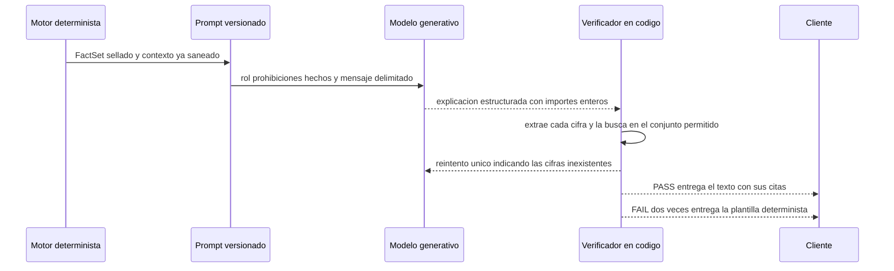
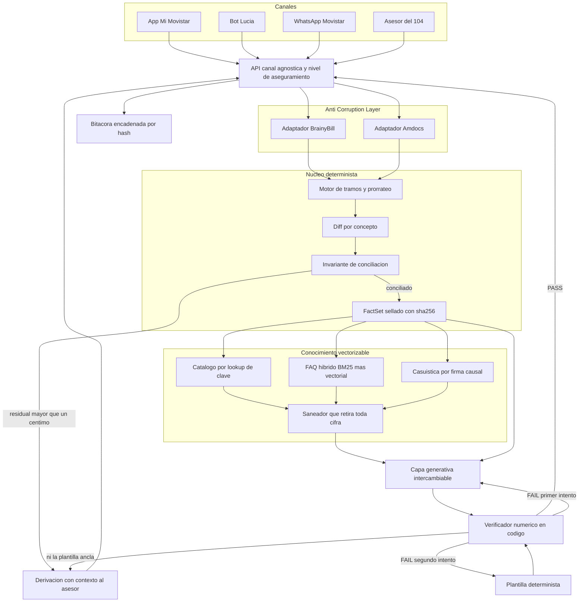

# Fundamentación técnica — por qué este sistema, esta arquitectura y estas tecnologías

Hackathon AI Telecom Challenge 2026 · Desafío 1 · Integratel Perú S.A.A. (Movistar) + Universidad de Lima.

Este documento responde a una sola pregunta, repetida en cada sección: **¿por qué así y no de otra
manera?** Cada decisión va acompañada de las alternativas que se consideraron y del motivo real por
el que se descartaron. Una decisión sin alternativa descartada está a medias, porque no se puede
distinguir de una costumbre.

Existe por el criterio de la fase final: `[CONFIRMADO-OFICIAL]` el jurado califica sobre 20 puntos
repartidos entre innovación de la solución, **viabilidad técnica**, impacto esperado en el negocio,
claridad de la propuesta y calidad del pitch. La viabilidad técnica no se defiende enseñando que algo
funciona; se defiende explicando por qué funcionará también cuando cambie el modelo, cuando llegue el
dataset real y cuando el volumen se multiplique por tres.

**Convención de etiquetado.** `[CONFIRMADO-OFICIAL]` cita literal de las BASES o de la ficha del
desafío · `[SUPUESTO]` · `[PROPUESTA]` del equipo · `[POR VALIDAR]` con Movistar. Nada marcado
`[PROPUESTA]` o `[SUPUESTO]` debe leerse como dato de Movistar.

**Cifras.** Todas las de este documento se obtuvieron ejecutando el sistema el 8 de agosto de 2026
sobre el árbol de trabajo actual. El apéndice A dice qué comando produce cada una. Ninguna cifra de
este documento es una estimación disfrazada de medición. Las **latencias** son la excepción que hay
que leer con cuidado: varían entre ejecuciones. Las que aquí se citan —16 ms de mediana, 22 ms de
p95— salen de cuatro corridas consecutivas de la evaluación en las que la mediana se movió entre 15
y 17 ms y el p95 entre 22 y 23 ms. Son una medición, no una promesa de rendimiento.

Documentos hermanos: [`arquitectura.md`](arquitectura.md) describe **cómo** está construido;
[`PROCEDENCIA.md`](PROCEDENCIA.md) cumple la obligación de declaración de
BASES §10; [`PROCEDENCIA.md`](PROCEDENCIA.md) enumera lo que falta y lo que está roto; los
[`ADR/`](ADR/) registran las decisiones una a una. Este documento explica **por qué**.

---

## 1. La tesis: el problema no es de lenguaje, es de aritmética

### 1.1 Las dos exigencias que parecen incompatibles

La ficha del desafío pide dos cosas en el mismo documento y en páginas contiguas.

La primera es de lenguaje `[CONFIRMADO-OFICIAL]`:

> «Prototipo funcional de chatbot / asistente conversacional generativo que responda en lenguaje
> natural […] con tono humano, transparente y horizontal, evitando estructuras robóticas.»

La segunda es de exactitud, y está redactada como una métrica técnica, no como una aspiración
`[CONFIRMADO-OFICIAL]`:

> «Tasa de Alucinación: Cero invenciones financieras COMPROBABLES MEDIANTE LOGS DE LA TERMINAL.»

Y por si quedara margen de interpretación, la sección de enfoque de IA lo cierra
`[CONFIRMADO-OFICIAL]`:

> «Respuestas limitadas estrictamente a la base de datos de facturación provista, para garantizar
> 0 % de alucinaciones financieras, apoyándose en reglas / base de conocimiento.»

Un modelo de lenguaje que redacta con libertad sobre un recibo cumple la primera exigencia y destruye
la segunda: recalcula diferencias, inventa conceptos plausibles y arrastra cifras de los ejemplos que
vio durante el entrenamiento. Un sistema de plantillas rígidas cumple la segunda y destruye la
primera. La ficha no ofrece elegir: pide las dos.

### 1.2 Por qué la pregunta del cliente es aritmética

La pregunta que hay que responder —*«¿por qué me vino más caro?»*— parece una pregunta de lenguaje.
No lo es. Es una pregunta de descomposición: qué parte del incremento corresponde a qué causa, y que
las partes sumen exactamente el incremento.

El caso de guion `C-DEMO-01` del dataset sintético lo ilustra con cifras reales, medidas ejecutando
el motor hoy: el recibo varió **+2.082 céntimos** entre junio y julio, repartidos en **cuatro líneas**
de concepto, con **residual 0**. Ese residual cero no es un adorno: es la prueba de que la explicación
cubre todo el cambio y no una parte cómoda de él.

Y el caso es más interesante de lo que parece, porque el cliente cambió a un plan cuyo **precio de
lista bajó** y aun así el recibo subió. La aritmética, calculada por el módulo de prorrateo y
verificada ejecutándolo:

| Concepto | Céntimos |
|---|---|
| Renta anticipada del ciclo siguiente, plan nuevo | +9.900 |
| Reverso del cobro anticipado al plan anterior, 20 de 30 días | −6.000 |
| Recobro de esos mismos 20 días al plan nuevo | +6.600 |
| **Total del recibo actual** | **10.500** |
| Total del recibo previo | 9.000 |
| **Variación** | **+1.500 (+16,67 %)** |

Dos mecanismos, ambos invisibles para el cliente, producen la subida: la promoción estaba atada al
plan anterior y murió con el cambio, de modo que la tarifa *efectiva* subió aunque la de *lista*
bajara; y el ajuste retroactivo, que el cliente espera a su favor, resulta positivo porque los veinte
días de julio ya cobrados a la tarifa vieja se recobran a la nueva.

Ningún modelo de lenguaje deduce eso de un texto. Se calcula, o no se sabe.

### 1.3 Por qué esto ordena toda la arquitectura

De la observación anterior se sigue todo lo demás, en cadena:

1. Si la respuesta es aritmética, el cálculo tiene que ocurrir **antes** de la redacción y en un
   componente determinista. → sección 2.
2. Si el cálculo es determinista, tiene que cubrir los cinco escenarios de la ficha **y sus
   combinaciones** con un solo algoritmo, o habrá diez implementaciones divergentes. → sección 3.
3. Si el criterio de éxito es «las partes suman el total, exactamente», la aritmética no puede tener
   error de representación. → sección 4.
4. Si las cifras salen de una tabla, no pueden salir además de una búsqueda por similitud, porque
   entonces habría dos fuentes de verdad compitiendo. → sección 5.
5. Y si la promesa es *comprobable mediante logs*, hace falta un verificador en código y una bitácora
   que un tercero pueda auditar. → secciones 2 y 8.

La tesis, en una línea: **el modelo aporta la forma; el código aporta los números; el verificador
comprueba que el modelo no se pasó de la raya.** Esa separación es lo que permite cumplir las dos
exigencias de la ficha a la vez, y es lo único que las cumple.

---

## 2. La decisión raíz: el modelo no calcula

### 2.1 Qué significa exactamente

El proveedor generativo recibe un objeto de hechos ya calculado y sellado (`FactSet`), el contexto
recuperado ya saneado de cifras y el mensaje del cliente delimitado como dato. **No accede a la base
de datos, no ejecuta acciones y no realiza una sola operación aritmética.** Devuelve una salida
estructurada en la que los importes se piden como **enteros de céntimos**, no como texto:

```python
class CausaExplicadaLLM(BaseModel):
    concepto_id: str
    frase: str                 # max_length=320
    monto_cent_citado: int     # entero con signo
```

Pedir el importe como entero no es un capricho de tipado: convierte la comprobación en una comparación
de enteros en lugar de un análisis de cadenas, y permite exigir que `Σ causas.monto_cent_citado ==
delta_total_cent` como validación estructural.

### 2.2 Qué se gana

**Una métrica comprometida en cero, no en un porcentaje bajo.** La evaluación ejecutada hoy sobre los
261 casos golden devuelve `TA_respuesta = 0,00 %` y `TA_asercion = 0,00 %` sobre **4 625 afirmaciones
numéricas auditadas**, con veredicto `PASS` en los 261 casos. La diferencia entre «cero» y «bajo» es
que cero es falsable: basta una cifra sin anclar para romperlo.

**Un compromiso demostrable en vivo.** El sistema incluye un modo adversario que inyecta a propósito
un importe falso pero plausible en el texto ya redactado. Ejecutado hoy contra la API: el turno limpio
da `PASS`; el envenenado da `FAIL` señalando el infractor `S/ 28.13`, la respuesta se bloquea y el
turno se convierte en derivación con **cero dígitos entregados al cliente**. Un jurado puede pedir esa
demostración y verla.

**El sistema sigue explicando con el modelo apagado.** La evaluación corre en `LLM_MODE=mock`, sin
red y sin credenciales. Eso no es una carencia del banco de pruebas: es la prueba de que las cifras
nunca vinieron del modelo. Si vinieran, apagarlo rompería la exactitud, y no la rompe.

**Determinismo reproducible.** El mismo `FactSet` produce el mismo `sha256`. Verificado hoy en la
prueba de extremo a extremo: el sello que devuelve `GET /v1/hechos` y el que viaja dentro de la
respuesta de `POST /v1/explicar` coinciden byte a byte (`3227801e4fcc`).

### 2.3 Qué se pierde

Se pierde libertad expresiva. El texto no puede improvisar una comparación que al motor no se le
ocurrió, ni redondear «unos veinte soles» cuando el dato es 20,82. Y se pierde la capacidad de
responder preguntas aritméticas arbitrarias sobre el recibo: fuera del perímetro que el `FactSet` sabe
contestar, el sistema **deriva a un asesor con contexto** en lugar de improvisar. Es una pérdida real
y se asume; la sección 10 la registra como contrapartida.

### 2.4 Cómo se verifica

El verificador (`packages/llm_layer/verificador.py`) es **código, no modelo**, y funciona en cuatro
pasos sin ninguna llamada externa y sin ningún juicio subjetivo:

1. Se construye el conjunto `ALLOWED` **exclusivamente** desde el `FactSet`: sus valores literales,
   sus **ocho** renderizados peruanos —para 2 082 céntimos, `variantes_monto` devuelve `S/ 20.82`,
   `S/ 20,82`, `S/. 20.82`, `S/. 20,82`, `S/20.82`, `S/20,82`, `20.82` y `20,82`—, los días, los
   porcentajes, las fechas y los
   números de cuota, más lo que de ahí se deriva por un **álgebra permitida cerrada de seis reglas**
   —`suma`, `resta`, `diferencia_fechas_dias`, `cociente_dias_ciclo`, `porcentaje`,
   `redondeo_centimo`—. Cada derivación queda registrada con su regla, sus operandos y sus fuentes.
2. Una única expresión regular maestra recorre el texto final y extrae **todas** las cifras: importes
   en formato peruano, porcentajes, fechas en cuatro formatos, cantidades de días, «cuota N de M»,
   periodos y cualquier entero suelto.
3. Cada cifra se normaliza al mismo vocabulario de tokens que usa el `FactSet`, **con prefijo de
   magnitud**: `cent:12490` frente a `num:12`. Sin ese prefijo, los 12 días de un prorrateo anclarían
   un importe de S/ 0,12, que es precisamente la clase de coincidencia falsa que arruina un
   verificador ingenuo.
4. Un token que no está en `ALLOWED` deja la aserción en estado `NO_ANCLADA` y el veredicto en `FAIL`.
   Una respuesta con `FAIL` no se entrega: se reintenta **una** vez diciéndole al modelo, literal,
   qué números no existen en el `FactSet`; si vuelve a fallar, se sustituye por la plantilla
   determinista; y si ni siquiera la plantilla anclara, la respuesta se bloquea y se entrega un texto
   **sin ninguna cifra** junto con la derivación.



### 2.5 Alternativas descartadas

**a) Dar herramientas de cálculo al modelo (*function calling* / *tool use*).**
Es la respuesta de moda y es tentadora: el modelo llama a `calcular_prorrateo()` y ya no inventa.
Se descartó por tres motivos concretos, no por prejuicio.

El primero es que traslada al modelo la decisión de **cuándo** llamar y **cómo componer** los
resultados, y la composición es exactamente donde se produce el error. Una llamada correcta a la
herramienta seguida de una suma mental equivocada produce un número falso con pedigrí.

El segundo es que rompe el invariante. La conciliación `residual = (total_actual − total_previo) −
Σ delta_líneas` exige que **todas** las líneas existan antes de redactar nada. Un modelo con
herramientas construye los hechos de forma perezosa y selectiva: al terminar no hay un conjunto
completo contra el que comprobar, y sin conjunto completo no hay residual, y sin residual no hay
señal para saber cuándo *no* explicar.

El tercero es de auditoría. La ficha pide *«comprobables mediante logs de la terminal»*. El log de un
modelo con herramientas es una traza de llamadas cuya corrección hay que juzgar; el log de este
sistema es una lista de aserciones con su estado y el campo exacto del `FactSet` que las respalda. La
primera exige un experto; la segunda, seis líneas de terminal.

**b) Pedirle al modelo que razone el prorrateo.**
Deja el cálculo en manos de un componente no determinista. `temperature=0` reduce la varianza pero no
garantiza salidas idénticas entre versiones del modelo, y en cuanto el proveedor actualice el punto de
enlace, la demo byte-reproducible deja de serlo. Además, un razonamiento correcto y uno equivocado son
indistinguibles en el texto de salida: no hay nada que comprobar salvo el resultado, que es justo lo
que no se sabe. Y hay un motivo más específico: nuestro prorrateo usa redondeo bancario sobre enteros
y reparto por mayor resto. Un modelo al que se le pide esa aritmética reproduce, en el mejor de los
casos, la aritmética decimal en coma flotante, que es exactamente el defecto que la sección 4 elimina.

**c) Aceptar el importe del facturador sin reconstruirlo.**
Es la alternativa más razonable de las tres y merece una respuesta seria. Se podría mostrar el número
del recibo sin recalcular nada: al fin y al cabo, el importe correcto es el que el facturador emitió.
El problema es que entonces se puede **mostrar** el número pero no **explicarlo**. La tabla de tramos
—«del 1 al 12 el Plan Max, del 13 al 30 el Plan Ligero»— *es* la explicación; sin reconstrucción no
hay tabla, y sin tabla la respuesta al «¿por qué?» vuelve a ser una paráfrasis.

Y hay una consecuencia peor: sin reconstrucción no existe el residual, de modo que el sistema perdería
su único mecanismo para saber que **no debe** explicar. Ante un recibo con un descuadre de origen
respondería con la misma seguridad que ante uno correcto.

Conviene precisar que la decisión real no es «reconstruir *en vez de* aceptar», sino **reconstruir y
conciliar**. El importe facturado manda: cuando la reconstrucción no reproduce lo que el cliente ve en
su recibo, el motor **descarta la tabla de tramos** en lugar de adjuntar una explicación supuesta, y
existe `distribuir_renta_por_tramos` precisamente para repartir un total ya fijado sin perder un
céntimo. Es preferible una explicación sin tabla que una tabla que no cuadra.

---

## 3. Por qué un motor de tramos y no una fórmula por escenario

### 3.1 La exigencia

`[CONFIRMADO-OFICIAL]` La ficha impone la demostración en vivo:

> «Se debe incluir una demostración funcional EN VIVO abordando al menos DOS de los siguientes
> escenarios críticos inyectados en la data: (a) Prorrateos, (b) Facturación de cuota de equipo
> financiado, (c) Cobro por reconexión tras suspensión morosa, (d) Fin de descuentos o (e) Cambios de
> plan, todo en ambas modalidades de RENTA ADELANTADA y VENCIDA y para todos los productos de clientes
> B2C.»

Cinco escenarios por dos modalidades son diez casos. Y el dataset sintético inyecta **dos escenarios
simultáneos en el 30 % de los clientes**, porque los casos compuestos son donde la atribución ingenua
se rompe. Diez fórmulas no cubren un cambio de plan *y* una suspensión en el mismo ciclo: ese caso no
es ninguno de los diez.

### 3.2 La aritmética real

Un solo algoritmo. El ciclo `[t0, t1)` se parte por **todos** los eventos del historial de órdenes en
tramos disjuntos que suman exactamente `D` días:

```
Ciclo [t0, t1),  D = (t1 - t0).days
Tramos j = [a_j, b_j),  len_j = b_j - a_j,  Σ len_j = D
  P_j = tarifa mensual vigente en el tramo, con el descuento ya aplicado
  e_j ∈ {ACTIVO, SUSPENDIDO}
  facturable(e_j) = False si SUSPENDIDO y cobro_en_suspension == False

RENTA_ciclo = Σ_j  P_j · len_j / D · facturable(e_j)
```

Sobre esa base, las dos modalidades son dos líneas:

```
VENCIDA      T_k = RENTA_ciclo_k + CONSUMO + CUOTAS + CARGOS − CREDITOS
ADELANTADA   T_k = P_new + AJUSTE_RETRO_k + CONSUMO + CUOTAS + CARGOS − CREDITOS
             AJUSTE_RETRO_k = − P_old·(d_new/D) + P_new·(d_new/D)
```

Y cada evento es un corte, no un caso especial: `CAMBIO_PLAN` cambia la tarifa, `ALTA_SERVICIO` la
fija, `BAJA_SERVICIO` la pone a cero, `SUSPENSION` y `RECONEXION` cambian el estado, `FIN_DESCUENTO`
cierra la vigencia de un descuento. Cambio de plan, alta, baja, suspensión, reconexión y fin de
promoción son **el mismo corte en la recta del ciclo**.

La cuota de equipo financiado es la excepción deliberada: se calcula por sistema francés y **nunca se
prorratea**. Ejecutado hoy sobre un capital de 180.000 céntimos a 200 puntos básicos mensuales en 18
cuotas: la cuota 3 vale 12.006 céntimos con saldo restante 154.274, y la cuota 18 vale 12.012 —absorbe
el céntimo residual— dejando el saldo en **exactamente 0**. Con tasa cero y tres cuotas sobre 100.000,
la última vale 33.334 y el saldo cierra igualmente en 0.

### 3.3 Qué se gana

**Los casos compuestos salen gratis.** Dos eventos generan tres tramos; el algoritmo no cambia. La
evaluación incluye un fichero completo de casos compuestos y el desglose macro por escenario da
100,00 % en los ocho escenarios.

**La tabla de tramos *es* la explicación.** «Del 1 al 12 de julio el Plan Max; del 13 al 30 el Plan
Ligero» es una frase que un analista de facturación verifica mentalmente y que el cliente entiende sin
glosario. Esa frase la produce `describir_tramos`, no un modelo.

**Un solo lugar donde equivocarse.** Con diez fórmulas, un error de convención de días se corrige diez
veces y se olvida en dos. Con un algoritmo, se corrige en `construir_tramos` y se propaga a los cinco
escenarios y a sus combinaciones.

**Los invariantes son comprobables.** `validar_particion` exige que los tramos encadenen sin huecos ni
solapes, que cubran el ciclo entero y que sus días sumen exactamente `D`; lanza `ValueError` si no.
Las pruebas recorren meses de 28, 29, 30 y 31 días.

### 3.4 Alternativas descartadas

| Alternativa | Por qué no |
|---|---|
| **Una fórmula por escenario** | Diez implementaciones y ninguna cubre los casos compuestos, que son el 30 % del dataset. Cada corrección de convención de días habría que aplicarla diez veces |
| **Un motor de reglas externo** (estilo Drools, o reglas declarativas en JSON) | Introduce un tiempo de ejecución cuya semántica de redondeo no es la nuestra, y el redondeo es la parte difícil, no la ramificación. Añade además una dependencia con su propia licencia y su propio ciclo de vida en el corazón del componente que se promete exacto |
| **Una tabla de precios precalculada** por combinación de plan, día del cambio, modalidad y descuentos | Explosión combinatoria, y no sobrevive a una tarifa nueva. Se convierte en un artefacto que hay que regenerar cada vez que comercial toca el catálogo |
| **Que un modelo de lenguaje razone el prorrateo** | Sección 2.5.b |
| **Consumir los tramos que calcule el facturador** | `[POR VALIDAR]` La ficha no declara que el facturador los exponga. Y aunque los expusiera, seguiría haciendo falta comprobar que `Σ tramos` reproduce la línea del recibo, es decir, exactamente el mismo motor con una fuente distinta |

Dos parámetros del modelo quedan explícitamente `[POR VALIDAR]` con Movistar y viven en
`db/reglas/rules.yaml`, versionado y legible por un analista, no enterrados en el código:
`cobro_en_suspension` (hoy `false`) y `convencion_prorrateo` (hoy `actual`, con `30/360` también
implementada). No sabemos cuál usa Movistar; el sistema soporta las dos y declara cuál cierra el
invariante al céntimo. Eso es más defendible que adivinar.

---

## 4. Por qué céntimos enteros

### 4.1 Qué rompe exactamente el punto flotante

No es un argumento de pureza. Es un fallo concreto en el sitio exacto donde este sistema toma su
decisión más importante. Ejecutado hoy en el intérprete del proyecto:

```
0.1 + 0.2                 ->  0.30000000000000004      (no es 0.3)
round(100/3, 2) * 3       ->  99.99                    (falta un céntimo)
repartir_mayor_resto(10000, [1,1,1])
                          ->  [3334, 3333, 3333]       suma exacta 10000
```

La segunda línea es el caso real: repartir un total entre tres líneas de recibo. Con coma flotante y
redondeo a dos decimales, la suma de las partes **no** es el total. Y la suma de las partes es
literalmente el invariante del sistema:

```
residual = (total_actual − total_previo) − Σ delta_líneas
|residual| > 1 céntimo  →  NO se explica, se DERIVA
```

Ese umbral es una puerta dura. Con coma flotante, un residual de `1e-13` la cierra y convierte un
recibo perfectamente correcto en una derivación innecesaria; o bien obliga a introducir un épsilon, y
entonces la puerta deja de ser un hecho y pasa a ser un juicio.

Hay un segundo motivo, menos evidente y igual de decisivo: **el verificador compara por pertenencia a
un conjunto**. `token_monto(12490)` está o no está en `ALLOWED`. Con flotantes, esa pertenencia se
convierte en una comprobación de proximidad, y la proximidad es exactamente lo que explota una cifra
alucinada: `S/ 124.91` está muy cerca de `S/ 124.90`.

Y un tercero: el `FactSet` viaja sellado con un `sha256` que el sistema compara entre el endpoint de
hechos y el de explicación. Un flotante serializa de forma dependiente de la plataforma y de la
versión; el sello dejaría de ser reproducible entre dos réplicas, y con él, el determinismo del que
depende el escalado horizontal.

### 4.2 Cómo se impone

- Todo importe es `int` en céntimos, con sufijo `_cent`.
- El reparto usa **mayor resto**: `c_i = floor(x_i)` y el sobrante se entrega de a un céntimo a los
  elementos de mayor parte fraccionaria, con empates resueltos por índice ascendente para que el
  resultado sea determinista. `sum(repartir_mayor_resto(T, w)) == T` siempre.
- El prorrateo se calcula con `redondear_banca(numerador, denominador)`, implementado **solo con
  enteros**, de modo que no hay error de coma flotante posible ni siquiera dentro de la función.
- Las participaciones porcentuales se guardan en **puntos básicos** (`int`), no como fracción.
- `tests/unit/test_sin_float.py` recorre `packages/facts_engine/` y **hace fallar la construcción** si
  encuentra coma flotante en lógica monetaria.
- `cuota_equipo_financiado` **rechaza un `float` como tasa con `TypeError`** en lugar de aceptarlo y
  redondear en silencio. Una tasa binaria inexacta contaminaría todo el cronograma.

`Decimal` y `Fraction` sí aparecen —dentro de `dinero.py` y de `prorrateo.py`— como aritmética
intermedia exacta. La regla no es «prohibido `Decimal`»; es que **de esos módulos no sale nada que no
sea un `int`**.

### 4.3 Alternativas descartadas

| Alternativa | Por qué no |
|---|---|
| **`float` con épsilon** | Convierte cada comparación en una decisión con umbral y hace irreproducible el residual. Y obliga a elegir el épsilon: cualquiera mayor que un céntimo esconde errores reales; cualquiera menor es ruido. No existe un valor defendible |
| **`Decimal` en los campos del modelo** | Aritméticamente correcto, y esa es la alternativa seria. Se descarta por tres motivos operativos: serializa a texto en JSON, lo que complica el `sha256` canónico del `FactSet`; el contexto decimal es global y mutable, de modo que el redondeo implícito puede diferir según quién importó qué antes; y un viaje de ida y vuelta por JSON puede cambiar el exponente sin cambiar el valor, cambiando el sello sin cambiar el dato |
| **Enteros en soles con los decimales aparte** | Reintroduce el problema con más piezas y más sitios donde olvidarse de una |
| **Enteros en milésimas**, por «tener más precisión | Ningún facturador emite milésimas y ningún cliente lee milésimas. Añade una conversión en la frontera a cambio de nada |

La contrapartida se asume y se declara: hay que pensar en céntimos todo el rato, y la conversión desde
el exterior está centralizada en `dinero.a_centimos`, que acepta las cuatro escrituras peruanas
habituales (`"S/ 1,234.50"`, `"1.234,50"`, `"124,90"`, `"(12.30)"` para negativos). Un solo punto de
entrada es un solo sitio donde equivocarse.

---

## 5. Por qué el recibo no se vectoriza

### 5.1 La distinción: dato transaccional y conocimiento

La lectura ingenua del requisito de RAG consiste en meterlo todo en un índice vectorial y recuperar
por similitud. Cumple la exigencia de arquitectura y hace imposible la de exactitud.

La separación que aplica este proyecto no es por comodidad de implementación, sino por **naturaleza
del dato**:

| Naturaleza | Qué es | Acceso | ¿Vectores? |
|---|---|---|---|
| Recibos y líneas | Dato **transaccional**: aritmética exacta de un cliente y un periodo | Consulta estructurada y *full outer join* por `concepto_id` | **Nunca** |
| Catálogo de conceptos | **Definiciones** en lenguaje de cliente | *Lookup* por clave: el `concepto_id` ya viene en el `FactSet` | Secundario |
| Preguntas frecuentes | **Lenguaje** del cliente, formulaciones ya validadas | Híbrido BM25 + vectorial fusionado con RRF, filtrado por los conceptos del `FactSet` | Sí |
| Casuísticas | **Estructura narrativa**: cómo se cuenta este caso | Vectorial por firma causal | Sí |

### 5.2 Por qué la ficha respalda la separación

No es una interpretación forzada. La propia ficha entrega los datos `[CONFIRMADO-OFICIAL]`:

> «Los datos sintéticos se entregarán en formatos estructurados (archivos CSV/Excel para historiales
> masivos y estructuras JSON para simular las respuestas de las API's existentes), listos para su
> vectorización **o** procesamiento tabular.»

Esa disyunción es explícita: la organización no dice «vectorícenlo todo», dice que los datos sirven
para las dos cosas. Y la métrica técnica que la propia ficha define lo confirma
`[CONFIRMADO-OFICIAL]`:

> «Precisión de Recuperación (Retrieval Accuracy): Capacidad del modelo para extraer **el dato
> exacto** de la base proporcionada.»

«El dato exacto» describe una consulta por clave, no un vecino más próximo en un espacio de
*embeddings*. Una recuperación semántica es aproximada **por diseño**; ese es su valor y también su
límite.

Y la tercera pieza cierra el argumento `[CONFIRMADO-OFICIAL]`: la arquitectura RAG debe
«combinar la naturalidad del lenguaje con la **precisión de la minería de datos**». Son dos
componentes distintos, no uno.

### 5.3 Qué aporta el RAG y qué jamás puede aportar

**Aporta lenguaje y estructura.** El catálogo da la definición oficial de «ajuste retroactivo» en
palabras que un cliente entiende. Las FAQ aportan formulaciones ya probadas con clientes reales. Las
casuísticas dictan el **orden del relato**: qué se cuenta primero y qué malentendido típico hay que
prevenir. Nada de eso lo puede inventar un motor determinista, y sin ello el texto sería correcto y
frío.

**Jamás puede aportar un número.** Y no se confía en que no lo haga: se impide en origen.
`packages/retriever/saneador.py` sustituye toda cifra monetaria, porcentaje y fecha concreta por un
marcador genérico —`«un monto»`, `«una fecha»`— antes de que el texto entre al *prompt*. La garantía
no es heurística: la última regla de sustitución captura cualquier resto numérico, de modo que **el
texto devuelto no contiene ni un solo dígito**. Y no es una recomendación de uso: el único camino por
el que un documento sale del retriever es la función `_fragmento`, que siempre pasa por el saneador.
No existe una variante «sin sanear». Lo retirado se registra en el evento `RETRIEVE` de la bitácora,
de modo que la neutralización es demostrable.

Aunque una cifra sobreviviera a todo eso, el verificador la marcaría como no anclada, porque `ALLOWED`
se construye **solo** desde el `FactSet`. Son tres barreras independientes para el mismo riesgo.

### 5.4 La consecuencia operativa, medida

El índice de conocimiento contiene hoy **95 documentos** —31 fichas de catálogo, 36 preguntas
frecuentes y 28 casuísticas—, verificado ejecutando el cargador de corpus. Y **no crece con los
clientes**.

La alternativa lo pone en perspectiva: `[CONFIRMADO-OFICIAL]` la facturación B2C de Movistar emite
«+5 millones de recibos/mes» y BrainyBill expone «la factura actual y los CINCO recibos previos».
Vectorizar eso serían decenas de millones de vectores, a reconstruir cada ciclo, con su coste de
*embeddings* y su ventana de inconsistencia mientras el índice se pone al día. Y traería, además, una
consecuencia de protección de datos: los importes de facturación son datos personales; no se replican
en un segundo almacén con otro control de acceso y otro ciclo de borrado si no hace falta.

Hay un argumento más, y es el decisivo: **sin recuperación exhaustiva no hay invariante.** Si el
retriever devolviera las *k* líneas más parecidas, el residual dejaría de poder cerrarse y el sistema
perdería su garante del 0 %.

### 5.5 Alternativas descartadas

| Alternativa | Por qué no |
|---|---|
| **RAG puro sobre recibos vectorizados** | No permite conciliar; abre la puerta a mezclar periodos o clientes en la misma respuesta; y el coste crece con la planta |
| **Vectorizar un resumen textual del recibo** | El mismo problema disfrazado: la cifra sigue llegando por una recuperación aproximada |
| **Text-to-SQL sobre la base de facturación** | El modelo escribe la consulta. Un `JOIN` equivocado no falla: devuelve en silencio un número plausible. Y reabre la puerta a que el modelo calcule, porque un `SUM` con `GROUP BY` es aritmética decidida por el modelo. La consulta generada tampoco es auditable en una línea de terminal |
| **Dar al modelo acceso a la base por herramientas** | Sección 2.5.a |
| **Vectorizar el recibo *además* del acceso estructurado, «como apoyo»** | Lo peor de ambos: se paga el coste de los dos y el modelo recibe una segunda fuente de cifras que compite con el `FactSet`, que es exactamente lo que `ALLOWED` prohíbe |

**Contrapartida asumida:** no se puede preguntar al recibo en lenguaje libre y arbitrario. Solo se
responden las preguntas que el `FactSet` sabe contestar; fuera de ese perímetro el sistema deriva a un
asesor en vez de improvisar. Saber dónde **no** aplicar una herramienta es parte de la propuesta.

---

## 6. El stack, tecnología por tecnología

### 6.1 Python 3.12 y FastAPI

**Qué hace aquí.** Todo el código del sistema: 39.281 líneas en 105 archivos, verificado hoy. FastAPI
es el núcleo HTTP del servicio: ocho routers —siete de producto y uno de desarrollo, activo solo con
`ENTORNO=dev`—, esquema OpenAPI generado desde los tipos y una prueba de contrato que compara ese
esquema contra una instantánea versionada.

**Por qué Python.** El motivo no es la familiaridad; es una necesidad de la sección 4. El núcleo
aritmético necesita **enteros de precisión arbitraria, `fractions.Fraction` y `decimal.Decimal` en la
biblioteca estándar**. Los tres están en Python sin instalar nada. En JavaScript, los enteros por
encima de 2^53 exigen `BigInt`, no hay `Fraction` en la biblioteca estándar y la aritmética decimal
depende de un paquete de terceros: es decir, el corazón de lo que se promete exacto pasaría a depender
de una dependencia externa. Java tiene `BigDecimal`, que es excelente, pero su ecosistema para la
parte de recuperación y de modelos generativos es peor y la velocidad de construcción en una ventana
de ocho días es sensiblemente menor.

**Por qué FastAPI frente a Flask o Django.** Porque en este proyecto la validación **es** el contrato,
no un añadido: el `FactSet` y la `RespuestaCanalAgnostica` son modelos Pydantic y el esquema JSON se
deriva de ellos, de modo que las pruebas de contrato validan la respuesta real contra el esquema
publicado. Con Flask habría que ensamblar a mano la validación y la generación de OpenAPI, y esa
instantánea versionada dejaría de ser barata. Django trae un ORM y un panel de administración que este
proyecto no quiere —la especificación fija SQLAlchemy Core, sin ORM pesado— y su modelo de
configuración es más rígido que el que necesita un servicio que debe degradar solo cuando falta la
base de datos.

**Límite honesto.** Python es más lento por turno que Java o Go. Aquí da igual: el turno completo, sin
red, tiene una latencia mediana de **13 ms** y p95 de **29 ms** medidos sobre los 261 casos de la
evaluación, frente a un objetivo de diseño de ~15 peticiones por segundo. El cuello de botella es la
cuota del proveedor generativo, no la CPU.

### 6.2 Pydantic v2

**Qué hace aquí.** El modelo canónico completo (`FactSet`, `LineaDelta`, `Tramo`, `MovementEvent`,
`RespuestaCanalAgnostica`, `Gobernanza`, `Derivacion`…), la lectura tipada de la configuración y el
esquema de salida del proveedor generativo.

**Por qué.** El `FactSet` es una **frontera de seguridad**, no una estructura de datos cómoda. Los
modelos de dominio declaran `extra="forbid"`: un campo que nadie declaró no puede viajar dentro del
objeto del que se construye `ALLOWED`. Un `dataclass` acepta lo que le pasen al constructor y no
comprueba nada en tiempo de ejecución. Además, el sello `sha256` del `FactSet` se calcula sobre una
serialización canónica; con serialización escrita a mano, el sello se rompe el día que alguien añade
un campo y olvida ordenarlo.

**Por qué no `dataclasses`.** En realidad sí se usan, y ahí está el matiz que hace defendible la
decisión: `AjusteRetroactivo` es un `dataclass(frozen=True, slots=True)` porque es un valor puro que
nunca cruza la frontera del proceso. La regla es **Pydantic en los bordes, `dataclass` dentro**. Lo
que un `dataclass` no da es validación en tiempo de ejecución, coerción en la ingesta ni esquema JSON
derivado, y las tres cosas hacen falta exactamente en los bordes.

**Por qué no validación manual.** Es lo que se escribe la primera vez y se olvida la tercera, y no
produce esquema. Sin esquema no hay prueba de contrato, y sin prueba de contrato la promesa de que la
respuesta tiene la forma documentada es una intención.

**Por qué no `attrs` o `msgspec`.** `msgspec` es más rápido serializando, pero su integración con la
generación de OpenAPI de FastAPI no está al mismo nivel, y la velocidad de serialización no es ningún
cuello de botella a 16 ms por turno.

### 6.3 PostgreSQL con pgvector

**Qué hace aquí.** Tres cosas: el corpus RAG con sus vectores, las tablas de hechos y —la más
importante— la bitácora de auditoría persistente. Diecisiete tablas en tres migraciones, verificado
hoy: trece en `001_core.sql`, tres en `002_rag.sql` y una en `003_auditoria.sql`.

**Por qué, y este es el argumento decisivo.** El proyecto necesita una base **relacional** de todos
modos. La bitácora encadenada no se protege con buenas intenciones: `003_auditoria.sql` define un
`CHECK (hash = auditoria_hash_esperado(hash_prev, canonico))` que recalcula el eslabón con el `sha256`
del núcleo de PostgreSQL, un `UNIQUE` sobre el hash, una clave primaria `(cadena, indice)` y
disparadores que abortan `UPDATE`, `DELETE` y `TRUNCATE` incluso para el propietario de la tabla.
Nada de eso existe en una base vectorial.

Dado que la relacional es obligatoria, añadir un segundo motor especializado no compra nada: el índice
son **95 documentos**. Una base vectorial dedicada es la respuesta correcta con 10⁷–10⁹ vectores; con
10² es un servicio más que operar, respaldar, asegurar y —sobre todo— un modo de fallo más el día de
la demostración.

**Alternativas y por qué se descartaron:**

| Alternativa | Motivo del descarte |
|---|---|
| **Qdrant** | Excelente a escala, con filtrado por *payload* de primera clase y HNSW maduro. Añade un plano operativo entero para 95 documentos, y sus capacidades de filtrado ya las cubre un índice GIN sobre un `text[]` |
| **Weaviate** | Buen producto, pero parte de sus capacidades empresariales están sujetas a licencia distinta de la del núcleo, y una dependencia con condiciones diferenciadas es justo lo que la sección 7 evita. Además vuelve a ser un servicio más |
| **Milvus** | Diseñado para miles de millones de vectores. En su despliegue completo arrastra etcd y almacenamiento de objetos. Es una respuesta correcta a un problema que este proyecto no tiene |
| **Chroma** | Funcionaría sin dificultad, y es la alternativa más razonable de la lista. Se descarta porque duplica la capa de almacenamiento que ya existe: dos motores que respaldar, dos que restaurar y dos donde puede estar la verdad |
| **FAISS** | Es una biblioteca, no un servicio. No aporta semántica de persistencia ni filtrado por metadatos de primera clase, y aquí se filtra por corpus, por `concepto_id`, por firma causal **y** por firma del modelo de *embeddings* |
| **Pinecone** | SaaS gestionado. Dos descalificadores: el corpus y sus vectores saldrían del perímetro de Integratel, y es una dependencia comercial permanente. Con la cesión de propiedad intelectual de BASES §9, Integratel heredaría una factura recurrente para desplegar algo que ya es suyo |

**Lo que aporta pgvector concretamente:** operador de distancia coseno `<=>`, índice GIN sobre el
array de conceptos para el filtro, y todo dentro de la misma transacción, el mismo respaldo y el mismo
control de acceso que el resto. La fila lleva además la **firma del modelo** de *embeddings*, y toda
búsqueda filtra por ella: mezclar vectores de dos modelos daría resultados silenciosamente malos, y
aquí no ocurre. Cambiar de modelo obliga a reindexar, y el sistema lo detecta y lo dice con un mensaje
que explica qué hacer.

**Degradación verificada.** Si la base no está —sin Docker, sin extensión, sin credenciales— el índice
degrada a memoria con la misma semántica de filtro y orden, deja un aviso en el log y sigue
funcionando. Verificado hoy: la prueba de extremo a extremo pasa **19 de 19 pasos sin PostgreSQL**.

**Límite honesto.** La búsqueda exacta de pgvector sobre 95 filas es lineal, y eso está bien. Con
millones de vectores haría falta ajustar HNSW o IVFFlat, y entonces la conversación sobre un motor
dedicado sería legítima. Hoy no lo es.

### 6.4 BM25 con `rank-bm25`, y por qué no solo vectorial

**Qué hace aquí.** Es el componente léxico de la recuperación sobre las 36 preguntas frecuentes. Su
ranking se fusiona con el vectorial mediante Reciprocal Rank Fusion con `k = 60`.

**Por qué hace falta un índice léxico habiendo vectores.** Porque los clientes escriben con las
palabras que ven impresas en el recibo: «reconexión», «prorrateo», «Movistar Total». Esos términos son
raros en el corpus y BM25 los premia precisamente por raros, vía IDF, mientras que un *embedding*
tiende a diluirlos entre paráfrasis. El vector aporta lo contrario: recupera «me vino más caro» cuando
la FAQ dice «por qué aumentó mi recibo». Ninguno de los dos basta solo, y el motivo es estructural,
no de ajuste fino.

**Por qué RRF y no una normalización de puntuaciones.** Los puntajes de BM25 y el coseno viven en
escalas incomparables; normalizarlos exigiría supuestos sobre sus distribuciones que no se sostienen
con 36 documentos. El **orden** es lo único que ambos miden igual. `RRF(d) = Σ_r peso_r / (k + posición_r(d))`
fusiona por posición y por eso funciona sin calibrar nada. El valor `k = 60` es el de la literatura y
el que fija la especificación: amortigua las diferencias entre las cabezas de los dos rankings y evita
que un puntaje BM25 alto arrolle al ranking vectorial completo.

**Alternativas descartadas:**

- **Solo vectorial.** Pierde el término exacto, que es la señal más literal que da el cliente. Es el
  error clásico de sustituir la búsqueda léxica por la semántica en lugar de sumarlas.
- **Solo BM25.** Pierde la paráfrasis, que es como escribe un cliente real que no conoce el
  vocabulario del recibo.
- **Reordenación con *cross-encoder*.** Daría mejor calidad, pero añade una segunda llamada a un
  modelo por turno, con su latencia y su coste, sobre un corpus de 36 documentos donde el filtro por
  `concepto_id` del `FactSet` ya hace la mayor parte del trabajo.
- **Elasticsearch u OpenSearch.** Un clúster entero para 36 preguntas frecuentes.

**Nota honesta sobre la dependencia.** `rank-bm25` es Apache-2.0 y es la que fija la especificación.
Aun así, el proyecto incluye una implementación propia y equivalente de BM25 Okapi como respaldo, y la
variable `BM25_IMPL` elige cuál se usa: una dependencia ausente nunca deja al retriever sin funcionar.

### 6.5 Jinja2

**Qué hace aquí.** Dos cosas distintas que conviene no confundir. La primera son las **plantillas
deterministas de explicación**: diez ficheros, nueve por causa dominante —cambio de plan en
adelantada, cambio de plan en vencida, cuota de equipo, deuda anterior, recibo estable, fin de
descuento, nota de crédito, paquete y reconexión— más un genérico, con un `_comun.jinja` compartido
por todos. Son la vía a la que
degrada el sistema cuando el verificador bloquea la respuesta del modelo. La segunda es el ***prompt*
mismo**, `prompts/explicar_v1.jinja`, de modo que el *prompt* es un artefacto versionado y no una
cadena concatenada en medio del código.

**Por qué.** La vía de respaldo tiene que producir texto que, **por construcción**, solo contenga
cifras del `FactSet`. Una plantilla con huecos hace exactamente eso y se puede leer en un minuto para
comprobarlo. Y poner el *prompt* en una plantilla convierte `version_prompt()` en un dato real que
viaja en la telemetría de cada turno: se puede saber con qué *prompt* se generó una respuesta de hace
una semana.

**Alternativas descartadas:**

- **`f-strings` o `str.format`.** Funcionan, pero no hay herencia ni macros compartidas, y aquí hay un
  fragmento común a las diez plantillas. El resultado sería el mismo texto repartido por diez sitios.
- **Mako, Chameleon.** No aportan nada que Jinja2 no tenga, y Jinja2 ya entra como dependencia de
  hecho en el ecosistema.
- **Un segundo modelo de lenguaje que «reescriba» la plantilla para que suene natural.** Añadiría un
  componente no verificable en el camino que existe precisamente para ser verificable.

**Límite honesto.** Las plantillas se leen como plantillas. Eso lo mitiga el *jitter* léxico del
proveedor determinista —tres sinónimos por frase, sorteados con una semilla derivada del `sha256` del
`factset_id`— y lo resuelve un proveedor real. El *jitter* es **numéricamente inerte por diseño**:
ninguna variante contiene dígitos y un guardián compara los dígitos antes y después, descartando
cualquier variación que los altere.

### 6.6 SQLite para el punto de control de la conversación

**Qué hace aquí.** Es el almacén del *checkpointer* del grafo, indexado por `thread_id =
conversation_id`, en un fichero local (`data/checkpoints/turnos.sqlite` por defecto). Es lo que hace
que la conversación sobreviva al reinicio del proceso.

**Qué resolvió.** Antes, el historial de turnos, la histéresis de derivación y las explicaciones
citables vivían en RAM detrás de una caché de proceso. Al reiniciar se perdía todo: `GET /v1/evidencia`
devolvía 404, el score de incomprensión perdía las señales de repregunta y de turnos sin progreso, y
una conversación **ya derivada podía volver a entrar al flujo normal** porque el indicador de
derivación volvía a estar en falso. Eso último no es una molestia: es un fallo de producto, porque un
cliente al que ya se decidió pasar a un humano volvería al asistente.

**Por qué SQLite y no PostgreSQL para esto.** Porque el punto de control es estado por conversación en
un servicio de una réplica, y el objetivo de esta pieza es **no añadir una dependencia operativa** a
algo que ya funciona. SQLite está en la biblioteca estándar, no tiene servicio que levantar y funciona
en la demostración sin Docker.

**Alternativas descartadas:**

- **Redis.** Un servicio más; y la especificación fijó explícitamente «sin Redis en esta fase».
- **PostgreSQL.** Es lo correcto para multi-réplica, y es el siguiente paso declarado: el mismo grafo
  apunta a un *checkpointer* PostgreSQL sin tocar un solo nodo. No se hizo antes porque habría atado
  la persistencia de la conversación a que la base estuviera levantada, y hoy el sistema funciona sin
  ella.
- **Memoria.** Es lo que había, y su fallo está descrito arriba.

**Límites honestos, leídos en el código.** `SqliteSaver` protege cada operación con un cerrojo propio:
es correcto desde el *threadpool* de FastAPI, pero **serializa** las escrituras y es de un solo
proceso. Dos réplicas de la API apuntando al mismo fichero no es una configuración soportada. Y el
deserializador está restringido por una **lista blanca** derivada de los módulos de dominio, porque el
serializador de LangGraph importa y construye la clase que diga el propio punto de control: sin esa
restricción, un fichero manipulado podría provocar la carga de clases arbitrarias.

Además, si la ruta no se puede abrir —disco lleno, volumen de solo lectura, permisos— el sistema
**degrada a memoria y lo dice**, nunca revienta. Perder la persistencia degrada la experiencia; no
degrada la corrección, porque las cifras salen del `FactSet` y el verificador las ancla igual.

### 6.7 El proveedor generativo: por qué es la decisión menos importante del sistema

Esta es la sección que más veces se pregunta y la que más veces se responde mal. La respuesta honesta empieza por reconocer que **«es gratis y la clave se consigue en dos minutos» no es un argumento de arquitectura**. Si esa fuera la única razón, el proyecto tendría un problema.

> **Análisis comparativo aparte.** Esta sección explica **por qué el proveedor actual es Gemini** y por qué esa decisión pesa poco. La comparación con otros fabricantes —precios verificados, coste por explicación, modelos de pesos abiertos autoalojables con sus requisitos de hardware, y qué convendría según se priorice humanización, velocidad, coste o control— vive en [`ELECCION_DEL_MODELO.md`](ELECCION_DEL_MODELO.md). Los dos documentos no se contradicen: uno describe lo implementado, el otro razona la elección para producción.

**El origen real de la decisión.** Gemini se eligió por preferencia del equipo al arrancar la integración, no tras una comparativa técnica. Lo que sí se hizo fue verificar que no era una mala elección y medir su comportamiento sobre nuestra carga real. Reconstruir a posteriori una justificación elaborada sería racionalizar; lo defendible es otra cosa, y es más fuerte.

#### 6.7.1 La decisión de verdad: el proveedor vive detrás de un contrato de dos miembros

```python
class ProveedorLLM(Protocol):
    nombre: str
    def completar(self, prompt: str, esquema: dict, timeout_s: float = 4.0) -> dict: ...
```

Un método. Y el acoplamiento resultante se puede contar:

| Dónde | Líneas que conocen al proveedor |
|---|---|
| `packages/llm_layer/providers/gemini.py` | **298** — todo el código específico |
| `packages/facts_engine/` (tramos, prorrateo, diff, atribución, invariante) | **0** |
| `packages/llm_layer/verificador.py` | **0** |
| `packages/governance/auditoria.py` | 1, y solo para **censurar** el nombre de la clave en los registros |
| `apps/api/settings.py` y `deps.py` | ~6, de configuración |

Cambiar de fabricante es escribir un fichero de unas trescientas líneas y una variable de entorno. No es una promesa: ya hay **tres** implementaciones conviviendo —`mock`, `gemini` y un adaptador sobre `langchain-core` que abre la puerta a cualquier modelo que LangChain soporte— y se eligen con `LLM_MODE`.

Y hay una prueba más contundente de que el sistema no depende del modelo: **la cifra de titular de la evaluación se obtiene en modo `mock`**, es decir, sin modelo alguno. No porque el proveedor determinístico sea más honesto, sino porque **el verificador no se fía de nadie**: se ejecuta sobre el texto final, lo haya escrito quien lo haya escrito. Si mañana se cambia de fabricante, la garantía de cero cifras sin respaldo no se renegocia.

Por eso la pregunta «¿por qué Gemini?» pesa menos de lo que parece. La que sí decide es **«¿qué le exigimos a cualquier proveedor?»**, y son cuatro cosas:

1. **Salida estructurada contra un esquema que le pasamos nosotros.** No uno fijo suyo: el proveedor sirve a dos contratos distintos —la explicación del recibo y el turno conversacional sin cifras—. Pedir `monto_cent_citado` como entero es lo que vuelve trivial al verificador: comparar enteros, no analizar prosa.
2. **Español con registro natural y peruano**, porque la ficha exige *«tono humano, transparente y horizontal, evitando estructuras robóticas»*.
3. **Latencia compatible con un chat.**
4. **Licencia y términos de tratamiento de datos compatibles con la cesión de propiedad intelectual a Integratel** de BASES §9.

#### 6.7.2 Lo que medimos de Gemini, incluido lo que hizo mal

Ninguna de estas cifras es de folleto: salen de ejecutar el sistema.

| Modelo | Turno conversacional | Explicación de recibo |
|---|---|---|
| `gemini-2.5-flash` | **1,46 s** | **2,2 – 3,1 s** |
| `gemini-flash-lite-latest` | 1,76 s | — |
| `gemini-3.6-flash` | 4,5 s | — |

Se eligió `gemini-2.5-flash` por latencia, no por novedad: en un chat, dos segundos de diferencia se notan más que cualquier mejora de calidad en un texto de tres frases.

**Y tres fricciones reales que aparecieron al integrarlo**, que conviene documentar porque son justo el tipo de cosa que no sale en una comparativa de folleto:

1. **Deadline mínimo de 10 segundos.** La especificación fijaba 4 s por llamada; la API devuelve `400 INVALID_ARGUMENT` por debajo de 10. Un tiempo de espera más corto no protege: garantiza que la llamada falle siempre. Se resolvió haciendo que el propio proveedor imponga el mínimo de su API, en vez de dejar que cada llamador lo descubra en producción.
2. **Los tokens de razonamiento se comían el presupuesto de salida.** `gemini-2.5-flash` razona, y con `max_output_tokens = 2048` el JSON llegaba **truncado** —`Unterminated string`— y el sistema degradaba a plantilla creyendo que el modelo había devuelto basura. Se resolvió desactivando el razonamiento y ampliando el presupuesto: la latencia bajó de 10,9 s a 2,2 s.
3. **Cuota agotada en pruebas** (`429 RESOURCE_EXHAUSTED`) con llamadas seguidas. Irrelevante en producción con facturación; decisivo el día de un ensayo.

Ninguna es descalificatoria, y probablemente otro proveedor daría tres distintas. Pero es el balance real, no el prospecto.

#### 6.7.3 Por qué no un modelo local, que es la alternativa más seria

Hay que decirlo claro: **para este proyecto en concreto, un modelo local tiene el argumento más fuerte de todas las alternativas.** BASES §9 impone confidencialidad de diez años sobre los datos de Movistar, y cero salida de datos es la postura que mejor encaja con esa cláusula. Además el coste marginal desaparece y no hay cuota que agotar.

Se descartó **para la hackathon** por razones concretas:

- Un modelo de 7 000 millones de parámetros necesita GPU para responder en tiempo de chat; en la CPU de un portátil, lo que aquí tarda dos segundos tarda decenas.
- Añade gigabytes a la imagen y una descarga previa que hay que declarar.
- Su seguimiento de instrucciones en **salida estructurada y en español** es más frágil que el de un modelo frontera, y aquí la salida estructurada no es un lujo: es lo que hace verificable el texto.

**Pero el argumento clásico a favor de lo local —«funciona sin internet»— aquí ya está resuelto, y mejor.** El modo `mock` no es un simulacro: es la vía determinística de plantillas que el sistema usa como respaldo del verificador, responde en milisegundos, no necesita red y **produce exactamente las mismas cifras**. Un modelo local daría más naturalidad que las plantillas, sí; pero para la propiedad que de verdad importa —seguir explicando bien sin conexión— el respaldo determinístico es más rápido, más reproducible y más fácil de auditar que cualquier modelo.

Para producción en Movistar, en cambio, un endpoint privado —local o en la nube del propio operador— es probablemente el destino correcto. Y el `Protocol` ya lo permite sin tocar una línea del verificador.

#### 6.7.4 Por qué no GPT, Claude u otra API

**Porque para este contrato son técnicamente equivalentes.** El sistema no usa nada específico de ningún fabricante: pide una salida JSON contra un esquema y espera un diccionario. Todos los proveedores serios lo soportan hoy.

Lo que sí los diferenciaría, y que **no hemos medido** —`[POR VALIDAR]`—:

| Criterio | Por qué importaría | Estado |
|---|---|---|
| Fiabilidad de la salida estructurada en español | Es lo que hace verificable el texto | Solo medido en Gemini |
| Latencia real desde Perú | Un chat no tolera cinco segundos | Solo medido en Gemini |
| Términos de tratamiento y retención de datos | Es lo único que decide en producción bajo BASES §9 | **No verificado en ninguno** |
| Acuerdo corporativo preexistente de Integratel | Puede invalidar cualquier análisis técnico nuestro | Desconocido |

Ese último punto es el más honesto de todos: **la elección de fabricante no nos corresponde.** Integratel puede tener ya un contrato marco, una exigencia de residencia de datos o una política de proveedores. Un proyecto que solo funciona con un fabricante es un proyecto que Integratel no puede desplegar — y eso sí sería un defecto de arquitectura, no una preferencia.

#### 6.7.5 El argumento que sí es técnico y decide: la ruta a producción

Verificado inspeccionando el SDK instalado, no de memoria. El mismo paquete `google-genai` que usa
`GeminiProvider` acepta:

```python
genai.Client(enterprise=True, project="...", location="us-central1")
```

o las variables `GOOGLE_GENAI_USE_ENTERPRISE`, `GOOGLE_CLOUD_PROJECT` y `GOOGLE_CLOUD_LOCATION`.
Es decir: **el salto del endpoint público al endpoint empresarial con proyecto y región propios es
un cambio de configuración, no una reescritura.** Mismo SDK, mismo código, misma familia de modelo,
y la región la elige quien despliega.

Eso importa aquí más que en cualquier otro proyecto, porque BASES §9 impone diez años de
confidencialidad sobre los datos de Movistar. La pregunta de producción no es *qué modelo escribe
mejor*, es *dónde se procesa el dato y bajo qué acuerdo*. Una arquitectura cuyo camino a ese
escenario es una variable de entorno vale más que una que escribe prosa un 5 % más bonita.

Los otros grandes proveedores tienen equivalentes —endpoints empresariales con residencia de datos y
acuerdos de tratamiento—, así que esto no convierte a Gemini en superior. Lo que sí hace es que la
ruta desde lo que hoy funciona hasta lo que Integratel podría desplegar sea **la más corta posible**,
y eso es un argumento de arquitectura, no de precio.

#### 6.7.6 La respuesta corta, para cuando la pregunten en el pitch

> «Usamos Gemini, pero la pregunta importante es otra. El proveedor vive detrás de un contrato de un solo método, en trescientas líneas aisladas: cambiarlo es una variable de entorno. Y lo sabemos porque la métrica que publicamos —cero cifras sin respaldo— la medimos **sin modelo**, en modo determinístico. La garantía no viene del modelo: viene del verificador. Para producción, la elección de fabricante les corresponde a ustedes, y probablemente sea un endpoint privado por la cláusula de confidencialidad. La arquitectura ya está construida para eso.»

**Nota aparte sobre los *embeddings*.** Es una decisión distinta y con otro balance. El corpus son 95 documentos que no crecen con los clientes, así que el coste es irrelevante y la calidad multilingüe de un modelo local pequeño bastaría. Hoy se usa `gemini-embedding-001` por tener una sola credencial y un solo SDK que declarar, y existe un `MockEmbedder` determinístico para pruebas sin red. Migrar a *embeddings* locales es de las cosas más baratas de este sistema; la única precaución es que **cambiar de modelo obliga a reindexar el corpus entero**.

### 6.8 LangGraph para la orquestación

**Qué hace aquí.** El turno modelado como un `StateGraph` de siete nodos —clasificar, responder
intención, construir hechos, recuperar contexto, generar, verificar y armar, derivar— con tres aristas
condicionales, compilado con el *checkpointer* persistente. Es la vía por defecto (`ORQUESTADOR=grafo`),
y la función lineal anterior sigue viva detrás de un solo interruptor.

**Por qué.** Compra dos cosas concretas, y conviene decir que solo dos:

1. **La política de enrutado pasa a ser un dato legible y comprobable elemento a elemento.**
   `PRIORIDAD_DE_RUTA` es una tupla, no una cadena de condicionales, y su orden **es** la política:
   una frase sospechosa manda sobre todo y no se envía al modelo aunque mencione el recibo; una
   intención regulatoria —baja, portabilidad, reclamo formal— deriva sin explicar; una petición
   explícita de humano se concede sin regatear; y solo la intención de explicar el recibo construye
   el `FactSet`. Una arista condicional que dependa de un orden implícito es una arista que nadie
   puede auditar.
2. **El *checkpointer*.** Estado de conversación duradero indexado por `conversation_id`, que la caché
   en RAM no podía dar (sección 6.6).

**Qué explícitamente NO hace.** Ni una fórmula, ni un umbral, ni una cifra nace en el grafo. Cada nodo
llama a la función que ya existía. Está comprobado: `tests/unit/test_grafo.py` verifica que las dos
vías —grafo y directa— producen la misma respuesta y la **misma secuencia de eventos en la bitácora**.

**Alternativas descartadas:**

| Alternativa | Motivo |
|---|---|
| **Máquina de estados escrita a mano** | Es lo que había y funciona; de hecho **se conserva** como respaldo de un interruptor. La lectura honesta es que el grafo se gana su sitio por el *checkpointer* y por la política explícita, no por el enrutado en sí |
| **Marcos agénticos** (agentes de LangChain, AutoGen, CrewAI) | Entregan al modelo las decisiones de control. Es exactamente lo contrario de la decisión raíz de la sección 2 |
| **Temporal, Celery u otro motor de flujos duraderos** | Correctos para procesos de larga duración con reintentos y compensaciones. Sobredimensionados para un turno petición-respuesta de 16 ms |
| **`langgraph-api` / LangGraph Platform** | Licencia Elastic 2.0. Sección 7 |

**Límite honesto.** LangGraph es una dependencia pesada para lo que se usa de ella: arrastra
`langchain-core`, `langsmith`, `ormsgpack` y varias más. La mitigación es real y verificable: está
declarada como **extra opcional** en `pyproject.toml`, el sistema arranca sin ella y `ORQUESTADOR=directo`
devuelve la misma respuesta por la vía lineal.

### 6.9 Docker y Docker Compose

**Qué hace aquí.** Cuatro servicios: la base `pgvector/pgvector:pg16` con comprobación de salud, la
API, y los dos mocks de BrainyBill y Amdocs como **servicios separados**.

**Por qué.** Reproducibilidad de la demostración en un comando; la imagen de pgvector evita compilar
la extensión, que es el paso donde se pierde media hora en una máquina ajena; y tener los mocks como
servicios independientes es lo que demuestra que el Anti-Corruption Layer es una frontera real y no
una llamada a función disfrazada.

**Alternativas descartadas:** Kubernetes (correcto para producción, absurdo para una demostración ante
un jurado); un entorno virtual con instrucciones (es donde aparece el clásico «en mi máquina
funciona», y la extensión pgvector es justo el punto donde falla); Nix o *devcontainers* (mejor
hermeticidad, peor familiaridad para quien tenga que evaluarlo).

**Honestidad, y es deliberada.** Está verificado que el sistema **también funciona sin Docker y sin
PostgreSQL**: 19 de 19 pasos de la prueba de extremo a extremo con el almacenamiento degradando a
memoria. Docker es una comodidad, no un requisito, y esa decisión tiene un motivo muy concreto: el
peor sitio del mundo para depender de Docker es un portátil prestado delante de un jurado.

### 6.10 Por qué no hay framework de frontend

**Qué hay.** Una consola de demostración de **3.309 líneas** —HTML, CSS y siete módulos ES— servida
por la propia API en `/ui`. Verificado hoy: **no hay `package.json`, no hay `node_modules` y no hay
una sola referencia a una CDN externa**.

**Por qué, y no es por falta de tiempo.** Dos motivos.

El primero es que **el entregable no es una aplicación web**. `[CONFIRMADO-OFICIAL]` la ficha pide una
experiencia «aplicable tanto a la App como al Bot», y los frontales reales son App Mi Movistar, Bot
Lucía y WhatsApp Movistar, que jamás serán una aplicación React nuestra. Lo que el núcleo expone es
`RespuestaCanalAgnostica` con bloques tipados —`texto`, `kv`, `puente`, `tabla`, `aviso`— para que
cada canal los renderice en su propio lenguaje. Construir aquí un frontend con framework habría sido
un argumento a favor de un producto que no se está proponiendo.

El segundo es que **un paso de compilación es un modo de fallo el día de la demostración**. Los
módulos ES nativos se ejecutan en cualquier navegador moderno sin instalar nada, y como la página se
sirve desde el mismo origen que la API, tampoco hay CORS que configurar.

**Alternativas descartadas:**

- **React, Vue o Svelte.** `node_modules`, un empaquetador, un fichero de bloqueo y una compilación
  que puede romperse, para una consola de dos columnas que llama a seis endpoints.
- **Streamlit o Gradio.** Rápidos de escribir, pero imponen su propio aspecto y, sobre todo, difuminan
  la línea que la demostración tiene que hacer visible: a la izquierda lo que ve el cliente, a la
  derecha la gobernanza que lo respalda.
- **Renderizado en servidor con Jinja.** Funcionaría, pero la consola es interactiva —anima el puente
  entre cada cifra y el `fact_id` que la respalda— y eso vive mejor en el navegador.

**Honestidad.** La consola es un **instrumento de demostración, no un producto**: no tiene auditoría
de accesibilidad, ni internacionalización, ni pruebas propias. Y sus 3.309 líneas no calculan dinero:
piden, mapean y pintan. Cada importe que aparece en pantalla viene de `GET /v1/hechos` o de un bloque
de `POST /v1/explicar`.

---

## 7. Lo que se evaluó y se descartó, con el motivo real

### 7.1 El criterio, y por qué aquí importa más que en otros proyectos

`[CONFIRMADO-OFICIAL]` BASES, apartado de propiedad intelectual y confidencialidad —al que el
resto de la documentación del proyecto se refiere como **§9**; la numeración procede del PDF y
queda `[POR VALIDAR]`, el texto es el extraído—:

> «Los participantes garantizan que los contenidos son originales. Todo uso de terceros (IA
> generativa, API, open source, datasets) debe cumplir estrictamente sus licencias.»

Y, en el mismo apartado, la cláusula que cambia el cálculo entero `[CONFIRMADO-OFICIAL]`:

> «La inscripción implica cesión de los derechos de PI sobre las propuestas a favor de Integratel,
> permitiendo su desarrollo y utilización futura. Se reconoce la autoría de los equipos.»

Esa segunda cita es la que convierte una cuestión de licencias en una cuestión de viabilidad. **Si la
solución se cede, cada dependencia con licencia restringida es un peaje que Integratel tendría que
negociar con un tercero para desplegar algo que ya es suyo.** Un proyecto que gana la hackathon y no
se puede desplegar no vale nada, y ese razonamiento —no una preferencia por el software libre— es lo
que descarta las tres plataformas siguientes.

### 7.2 Las tres exclusiones

| Excluido | Licencia declarada | Por qué es un problema **aquí** |
|---|---|---|
| **Dify** | Apache 2.0 **modificada**: añade dos condiciones sobre la licencia estándar `[POR VALIDAR]` | La primera condición reserva el uso como **servicio multi-inquilino** a una licencia comercial. Un «recibo-claro» que Movistar despliega para su planta de clientes es exactamente eso. La segunda impide **retirar el logotipo y el aviso de copyright** de la consola: un asistente dentro de App Mi Movistar que muestre la marca de un tercero no es desplegable. Nunca se instaló, de modo que la licencia se toma de la declaración del proyecto y no de un fichero local |
| **n8n** | **Sustainable Use License** `[POR VALIDAR]` | No está aprobada por la OSI. Restringe el uso a fines internos de negocio y limita la **marca blanca vendida a clientes finales**. Aquí el producto es, literalmente, algo que Integratel ofrece a sus clientes bajo su propia marca |
| **`langgraph-api`, LangGraph Platform y `langgraph-cli`** | **Elastic License 2.0** `[POR VALIDAR]` | No aprobada por la OSI; condiciona el uso como servicio gestionado y exige clave comercial en producción. **Verificado hoy: NO INSTALADO** — `importlib.metadata.version('langgraph-api')` lanza `PackageNotFoundError`. Al no estar instalado, su licencia no se ha podido leer de un fichero local, y por eso queda `[POR VALIDAR]`. La exclusión no depende de ese matiz: el paquete no aporta nada que el proyecto necesite |

Ninguna de las tres es un mal producto. Las tres son buenas herramientas descartadas por una razón
específica de este encargo.

### 7.3 El caso de LangSmith, con precisión

Es el punto que más se confunde y por eso se explica separado.

**La biblioteca cliente `langsmith` entra como dependencia obligatoria de `langchain-core`, y su
licencia declarada es MIT.** Verificado hoy leyendo los metadatos del paquete instalado: `langsmith`
0.10.17, `License: MIT`. No se puede desinstalar sin desinstalar `langchain-core`, y no hace falta:
siendo MIT, su presencia no compromete la cesión de propiedad intelectual de BASES §9.

**Lo propietario no es el paquete: es el servicio alojado**, que no se usa. Y no se usa por defecto:
**se apaga explícitamente**.

Y aquí está la parte que importa, porque el riesgo real no es de licencia sino de **fuga de datos**:
el texto que maneja este sistema incluye el mensaje del cliente y las cifras de su recibo. Enviarlo a
un servicio SaaS de terceros sería una salida de datos de facturación que ni Integratel ni Movistar
han autorizado.

**Cómo se apaga**, en `packages/orquestacion/telemetria_externa.py`, verificado hoy ejecutándolo:
se fuerzan **seis variables** a `false` —`LANGSMITH_TRACING`, `LANGSMITH_TRACING_V2`,
`LANGCHAIN_TRACING`, `LANGCHAIN_TRACING_V2`, `LANGSMITH_OTEL_ENABLED` y
`LANGCHAIN_CALLBACKS_BACKGROUND`— y se **vacían cuatro** credenciales y destinos —las dos claves de
API y los dos endpoints—. Tres detalles que no son casuales:

1. Se usa **asignación, no `setdefault`**. El objetivo no es poner un valor por defecto sensato, sino
   garantizar que un `.env` heredado, una variable de CI o la máquina de un compañero no puedan
   encender el envío sin que nadie se entere.
2. Ocurre **al importar el módulo**, y ese módulo se importa **antes** que nada de LangGraph. No hay
   una ventana en la que el trazado pudiera estar encendido.
3. Se **invalida la caché** de `langsmith.utils.get_env_var`, que está decorada con `lru_cache`. Sin
   eso, apagar la telemetría después de que algo hubiera consultado el entorno no tendría efecto, y el
   orden de importación sería una trampa silenciosa.

**Comprobado, no supuesto.** El estado consultado a la propia biblioteca —no a nuestra
reinterpretación de las variables— devuelve `tracing activo: False`. Y en el banco de pruebas
documentado en [`PROCEDENCIA.md`](PROCEDENCIA.md) §2.2, con
`socket.socket.connect` parcheado para abortar cualquier salida, se midieron **cero conexiones
salientes** durante una ejecución completa del grafo, con **control negativo**: encendiendo
`LANGSMITH_TRACING=true`, el proceso **sí** intenta salir. El control negativo es lo que demuestra que
la variable es el interruptor real y no un placebo.

**Frontera de lo que se afirma.** Este documento afirma un comportamiento observado y reproducible.
**No afirma nada** sobre las condiciones de tratamiento ni de retención de datos de ningún proveedor.

### 7.4 Otras dos exclusiones y dos asteriscos honestos

Se excluye además todo **copyleft fuerte (GPL / AGPL)**, por el mismo razonamiento de la cesión de
propiedad intelectual.

Y quedan dos matices que este documento prefiere declarar antes que esconder:

- **`psycopg` es LGPL-3.0.** Se usa **como biblioteca, sin modificar y sin enlazado estático**, que es
  el supuesto que la LGPL permite sin propagar la licencia al código propio. `[POR VALIDAR con
  asesoría legal si el proyecto se industrializa]`.
- **Hypothesis es MPL-2.0.** Es una dependencia **solo de desarrollo**: no se distribuye ni se enlaza
  en el artefacto entregado, de modo que el copyleft débil por archivo de la MPL no alcanza a ningún
  código propio.

---

## 8. Por qué esta arquitectura y no otra

### 8.1 El diagrama



### 8.2 Pieza por pieza: qué problema resuelve y qué pasaría sin ella

**El núcleo sin interfaz, con renderizadores delgados.**
*Problema que resuelve:* la ficha exige la misma explicación en App, Bot y WhatsApp, con reglas de
visibilidad distintas en cada uno. El núcleo produce `RespuestaCanalAgnostica` con bloques tipados y
cada canal decide cómo pintarlos.
*Sin ella:* tres implementaciones de la misma explicación, tres sitios donde la cifra puede diferir, y
la regla de WhatsApp —sin importes— sería tres caminos de código en lugar de una única función
auditable, `redactar_para_nivel`, que pasa el texto por el saneador y elimina los bloques que son
importes por definición.

**El Anti-Corruption Layer.**
*Problema que resuelve:* impedir que el esquema de un sistema externo se filtre al modelo de dominio.
Son dos fronteras y las dos existen en código: `apps/api/acl.py` traduce las respuestas HTTP de
BrainyBill y Amdocs, y `packages/datagen/mapping/movistar_map.py` traduce los exportes tabulares. El
transporte se **inyecta**: `TransporteHTTP` apunta al mock o al sistema real cambiando una URL base, y
`TransporteArchivo` lee el dataset del disco para arrancar sin levantar los mocks.
*Sin él:* el día que llegue el dataset real habría que reescribir el motor en lugar de un fichero de
mapeo. Y no habría dónde poner los dos interruptores que el proyecto declara **documentados y no
adivinados**: `IMPORTES_EN_CENTIMOS`, porque un BrainyBill real puede devolver soles decimales, y
`FIN_CICLO_INCLUSIVO_EN_ORIGEN`, porque el modelo canónico usa rangos con fin exclusivo y el origen
puede marcar el último día incluido. Esos dos interruptores existen precisamente **porque no sabemos**
cómo es el sistema real, y ese es el argumento a favor de la capa.

**Los niveles de aseguramiento por canal.**
*Problema que resuelve:* `[CONFIRMADO-OFICIAL]` «No mostrar información sensible sin autenticación».
Cuatro niveles: `LOA0` solo ve el catálogo; `LOA1` —WhatsApp— ve la existencia y la dirección del
cambio pero **ningún importe**; `LOA2` —App— ve la explicación completa; `LOA_ASESOR` ve lo mismo que
`LOA2` con `acting_on_behalf_of` obligatorio y registrado en cada evento de auditoría. Y una regla
innegociable: el `account_ref` se deriva **siempre del token**, jamás del cuerpo, de la *query* ni del
texto del usuario. Una petición cuyo `cuenta_id` difiera del token se rechaza con
403 `CUENTA_NO_AUTORIZADA` y deja un aviso en el log, en lugar de «usar la del token en silencio»:
un intento de acceso cruzado tiene que quedar visible.
*Sin ellos:* o WhatsApp muestra importes que no debe, o WhatsApp necesita un producto propio.
Verificado hoy: en `LOA1` la respuesta tiene **0 dígitos en 869 caracteres**, y `LOA0` recibe 403 al
pedir los hechos.

**El verificador numérico y el invariante de conciliación: las dos puertas.**
*Problema que resuelven:* son cosas distintas y las dos hacen falta. El invariante decide **si se
puede explicar**; el verificador decide **si lo explicado se puede decir**.
*Sin el verificador:* la promesa de cero invenciones es una intención sin instrumento.
*Sin el invariante:* el sistema explicaría con la misma seguridad un recibo que concilia y uno que no,
que es el peor fallo posible —una explicación equivocada dicha con confianza— y precisamente el que
genera la segunda llamada al 104.

**La bitácora encadenada.**
*Problema que resuelve:* `[CONFIRMADO-OFICIAL]` la ficha no pide «cero alucinaciones», pide «cero
invenciones financieras **comprobables mediante logs de la terminal**». Diez etapas —`REQUEST`,
`FACTS_BUILT`, `INVARIANTE`, `RETRIEVE`, `ROUTE`, `LLM_CALL`, `VERIFY`, `CITATIONS`, `RESPONSE`,
`CHAIN`—, que en un turno completo de explicación producen **once eventos** encadenados, medidos hoy,
con `hash_n = SHA256(hash_{n−1} ‖ json_canónico(evento))`. Retocar un evento
pasado cambia su hash y el de todos los posteriores, y `verificar_cadena` señala el índice exacto
donde se rompió.
*Sin ella:* el compromiso sería verificable solo por quien tiene el código delante. Con ella, es un
artefacto que un tercero puede comprobar. La vista de terminal imprime como máximo seis líneas por
turno con el contador `AFIRMACIONES NUMÉRICAS n · ANCLADAS n · NO ANCLADAS 0`, que es exactamente lo
que la ficha pide enseñar.

### 8.3 Por qué no una arquitectura de agentes

Merece respuesta explícita porque es la forma de moda. Un supervisor que orquesta agentes
especializados —uno de facturación, uno de conocimiento, uno de redacción— resolvería este problema
sobre el papel. Se descartó porque **traslada al modelo el control del flujo**, y el control del flujo
es donde vive la garantía: quién decide que un invariante roto no se explica, quién decide que una
intención regulatoria deriva sin pasar por el modelo, quién decide que una respuesta con una cifra sin
anclar no sale. En esta arquitectura esas tres decisiones son código determinista con pruebas. En una
arquitectura de agentes serían instrucciones en un *prompt*.

Hay además un argumento de coste y de latencia: cada agente es una llamada, y este turno se resuelve
hoy en 16 ms de mediana. Y uno de auditoría: la traza de una conversación entre agentes no cabe en
seis líneas de terminal.

---

## 9. Lo que esta arquitectura hace posible mañana

### 9.1 El pico de tres veces la volumetría

`[CONFIRMADO-OFICIAL]` La ficha exige «escalabilidad para picos de hasta 3 veces la volumetría
normal».

`[PROPUESTA]` **El cálculo que sigue es nuestro, y sus supuestos están declarados uno a uno para que
se puedan discutir y sustituir por los datos reales de Movistar.** Partiendo del único dato oficial
—`[CONFIRMADO-OFICIAL]` *«En la App, la explicación de recibo tiene ~1 MILLÓN de transacciones»*,
que este proyecto lee como mensuales `[SUPUESTO]` porque la ficha no declara el periodo—:

```
λ_medio            = 1 000 000 / (30 × 86 400)                     = 0,386 rps
factor dia de ciclo   D = 3     [SUPUESTO: consultas tras la emision]
factor hora pico      H = 2,9   [SUPUESTO: 12 % del dia en una hora]
λ_pico_operativo   = 0,386 × 3 × 2,9                               ≈  3,3 rps
requisito oficial de 3× sobre ese pico                             ≈ 10,0 rps
mas Bot y WhatsApp, +50 % sobre App   [SUPUESTO]                   ≈ 15   rps  ← objetivo
rafaga p99                            [SUPUESTO: 2× el sostenido]  ≈ 30   rps
```

Contra ese objetivo, la latencia **medida** del turno completo sin red es de 16 ms de mediana y 22 ms
de p95. Un trabajador a 22 ms por turno sostiene del orden de 45 turnos por segundo teóricos; con un
margen operativo del 50 %, unos 23. **Una réplica tiene margen.**

Y decir eso es parte de la honestidad del ejercicio: **el reto de este desafío no es el volumen, es la
exactitud.** Quince peticiones por segundo es una cifra modesta y presentarla como una hazaña sería
faltar a la verdad.

**Qué se rompe primero.** No la CPU: **la cuota del proveedor generativo**. Y la mitigación no hay que
construirla, porque ya es el camino de fallo del sistema: bajo presión se deja de llamar al modelo y
se responde con plantilla determinista —mismas cifras del `FactSet`, misma exactitud, menos
naturalidad—. El amortiguador del pico y la red de seguridad de la alucinación son la misma pieza.

`[POR VALIDAR]` **No se ha ejecutado una prueba de carga.** Las latencias son medidas; el
dimensionamiento es aritmética sobre supuestos declarados.

### 9.2 Sustituir los mocks por los sistemas reales

El camino está construido y es corto: `packages/datagen/mapping/movistar_map.py` es **el único
archivo que cambia** cuando llegue el export real, y el transporte se conmuta cambiando una URL base
en lugar de tocar el motor. Los dos interruptores del ACL absorben las dos diferencias de convención
que sí anticipamos.

`[POR VALIDAR]` Lo que no sabemos: el esquema real de BrainyBill y de Amdocs, si los importes vienen
en soles o en céntimos, si el fin de ciclo es inclusivo, y qué convención de prorrateo usa el
facturador. Precisamente por eso las dos convenciones están implementadas y el parámetro vive en
`rules.yaml` versionado.

### 9.3 Cambiar de proveedor generativo

Una variable de entorno. El `Protocol` de dos miembros, tres implementaciones vivas y un adaptador
sobre `langchain-core` como vía de escape hacia cualquier modelo que LangChain soporte. **El
verificador no cambia**, y esa es la propiedad que importa: la garantía de 0 % no se renegocia al
cambiar de fabricante.

### 9.4 Despliegue multi-réplica, y qué NO lo soporta hoy

Lo que **sí** está resuelto: el `FactSet` es determinista, de modo que dos réplicas producen el mismo
`sha256` a partir de los mismos datos —verificado hoy comparando el sello del endpoint de hechos con
el que viaja en la respuesta de explicación—; la API no guarda estado salvo la memoria de
conversación; la bitácora es de solo anexión, sin contención por escritura sobre filas compartidas; y
el arranque en frío construye reglas, corpus e índice **antes** de aceptar tráfico, de modo que
ninguna petición paga la construcción de un índice.

Lo que **no** lo soporta hoy, dicho sin rodeos:

1. **El *checkpointer* SQLite es de un solo proceso.** Dos réplicas apuntando al mismo fichero no es
   una configuración soportada. La salida es el *checkpointer* PostgreSQL: el mismo grafo, los mismos
   nodos, otra configuración.
2. **La bitácora JSONL asume un único escritor.** Lo dice el código y está reproducido hoy: al ejecutar
   la batería de pruebas y la API contra el mismo fichero, la cadena se rompió en el evento 3.306 de
   3.850. Con un fichero limpio y un solo escritor, la cadena queda íntegra y la prueba de extremo a
   extremo pasa 19 de 19. **La tabla de PostgreSQL no tiene ese problema**: clave primaria
   `(cadena, indice)`, `UNIQUE` sobre el hash y un `CHECK` que recalcula el eslabón, de modo que una
   inserción concurrente **falla** en lugar de corromper en silencio. Ese es el camino de migración, y
   la migración ya está escrita.
3. **No hay caché sobre BrainyBill ni Amdocs.** Cada turno hace dos llamadas y el pico se les traslada
   íntegro. La caché por `(cuenta_id, periodo)` es segura —el recibo de un mes cerrado no cambia— pero
   **no está implementada**.

### 9.5 Y una palanca de coste que existe pero no está construida

La plantilla determinista es hoy la vía de respaldo, no la principal: en la evaluación los 261 casos
pasan por la ruta del proveedor y la tasa de degradación es del 0 %. La palanca de coste —cachear el
**arquetipo narrativo** (`causas + signo + banda de monto + producto + modalidad + verbosidad +
versiones`, **sin montos**, precisamente porque el código inyecta las cifras) para servir la mayoría
de los turnos sin invocar al modelo— **no está implementada**. Está registrada como propuesta, no como
logro.

---

## 10. Las contrapartidas asumidas

Un documento que oculta un defecto es peor que no tenerlo. Estas son las renuncias conscientes.

| Se sacrificó | Por qué valía la pena |
|---|---|
| **Libertad expresiva del texto.** El modelo no puede improvisar una comparación ni redondear «unos veinte soles» | Es el precio de poder comprometer `TA_respuesta = 0` en lugar de «un porcentaje bajo». Una métrica en cero es falsable; una métrica baja es una opinión |
| **Responder preguntas aritméticas arbitrarias sobre el recibo.** Fuera del perímetro del `FactSet`, el sistema deriva | La alternativa es improvisar, y una explicación equivocada dicha con confianza cuesta una segunda llamada al 104, que es exactamente el indicador que el desafío quiere reducir |
| **Negarse a explicar cuando el invariante no cierra** | Es la línea roja del sistema. Nunca hay «explicación aproximada»: una cifra que no cuadra en el propio recibo no puede sostener ninguna afirmación al cliente |
| **Pensar en céntimos todo el rato**, y usar `Fraction` o `Decimal` como tipos intermedios en el sistema francés | A cambio, toda comparación monetaria es exacta y el verificador compara por igualdad estricta, lo que elimina una clase entera de falsos negativos |
| **Un algoritmo de tramos más difícil de leer** que una fórmula de dos líneas, con tres invariantes que hay que probar por separado | Los casos compuestos —el 30 % del dataset— salen gratis, y una corrección de convención de días se aplica en un solo sitio |
| **Una dependencia pesada (LangGraph) para lo que se usa de ella** | Mitigado y verificable: extra opcional, el sistema arranca sin ella y `ORQUESTADOR=directo` devuelve la misma respuesta por la vía lineal |
| **Una consola sin framework, sin auditoría de accesibilidad, sin i18n y sin pruebas propias** | Es un instrumento de demostración, no un producto. El producto son los bloques tipados que App y Bot renderizarán |
| **Rendimiento por turno inferior al de un lenguaje compilado** | Irrelevante a 16 ms de mediana contra un objetivo de 15 rps. El cuello es la cuota del proveedor |

### El defecto conocido, y por qué se cuenta aquí

Hay un defecto abierto y documentado en [`PROCEDENCIA.md`](PROCEDENCIA.md) §1, y es el más instructivo
del proyecto.

En `C-DEMO-01` el motor agrupa tres líneas bajo una sola causa —«cambio de plan»— y la explicación
resultante dice que el recibo subió porque el cliente cambió de plan. **Es engañoso.** El cambio de
plan, por sí solo, hizo que el recibo **bajara S/ 32,26**; lo que lo subió fue el fin del descuento
promocional atado al plan anterior. La aritmética es correcta —residual 0, verificación `PASS`,
invariante conciliado— pero la narrativa causal no lo es.

Lo relevante es **por qué la evaluación no lo detectó**: `precision_causa_raiz` reporta 100 % porque
el fichero de verdad de referencia comparte el mismo criterio que el generador, que etiqueta todos los
deltas de un escenario con la causa principal del escenario. Es la circularidad que la propia salida
de la evaluación advierte, materializada en un caso concreto.

Y de ahí sale la contrapartida más importante de todas, que la evaluación imprime ella misma cada vez
que se ejecuta: **la verdad de referencia y el sistema comparten autor.** Las cifras de este documento
validan la **mecánica del motor** —que el prorrateo cierra, que el diff concilia al céntimo, que
ninguna cifra escapa del `FactSet` y que el hand-off se dispara donde debe—; **no predicen el
desempeño sobre datos reales de Movistar.** La única cifra que se traslada tal cual a producción es
`TA_respuesta = 0`, porque el verificador no compara contra la verdad de referencia sino contra el
`FactSet` del propio cliente: es una garantía estructural, no un resultado estadístico.

Que un defecto de producto conviva con una métrica al 100 % es el mejor argumento a favor de publicar
la advertencia de circularidad en lugar de esconderla. Y ese defecto, corregido, es probablemente el
mejor momento de la demostración: un cliente que hizo algo que debía bajarle el recibo, y el recibo
subió.

### Y dos límites más que conviene decir aquí, no en una nota al pie

**Treinta y cuatro casos golden son pocos.** Es el tamaño real de la suite, y con ese tamaño un
100 % es consistente pero **no es estadísticamente informativo**: no hay margen para distinguir un
motor correcto de uno que acierta por construcción sobre los ocho escenarios que él mismo genera. El
objetivo anotado por el equipo es **superar los 200**, y el camino no es generar más casos con el
mismo generador —eso multiplicaría la circularidad, no la reduciría— sino que los redacte el equipo
de facturación de Movistar. Mientras no ocurra, las tres métricas de la ficha deben leerse como
prueba de mecánica y no como medida de calidad.

**`packages/orquestacion/rehidratacion.py` no tiene pruebas automáticas.** Es el módulo que hace que
`GET /v1/evidencia/{id}` sobreviva a un reinicio, y su corrección se ha comprobado **a mano**,
matando el proceso. Ningún fichero de `tests/` lo menciona, y [`PROCEDENCIA.md`](PROCEDENCIA.md) §3.5
lo declara así. Las dos garantías que promete —que nunca lanza y que no relaja la autorización— se
han observado, pero nada hace fallar la construcción el día que dejen de cumplirse. Es una pieza de
recuperación sin red de seguridad propia, y presentarla de otro modo sería vender de más.

---

## Apéndice A. Cómo se reproduce cada cifra de este documento

Todas las cifras se obtuvieron el 8 de agosto de 2026 sobre el árbol de trabajo actual.

| Cifra | Comando |
|---|---|
| 39.281 líneas en 105 archivos Python | `find . -name "*.py" -not -path "*/__pycache__/*" \| xargs wc -l` |
| 7 tablas SQL | `grep -c "CREATE TABLE IF NOT EXISTS" db/esquema.sql` |
| 3.309 líneas de consola web | `wc -l apps/web/estatico/*` |
| 1 427 pruebas superadas, 299 omitidas, 1 726 recogidas | `python -m pytest -q` (código de salida 0) |
| `TA_respuesta 0,00 %` · 4 625 aserciones · 261/261 exactas · 8 escenarios al 100 % · residual medio 0,00 · latencia 13/29 ms | `python -m eval.run_eval` |
| 19/19 pasos de extremo a extremo, sin Docker ni PostgreSQL | `python scripts/probar_e2e.py --api http://127.0.0.1:PUERTO` |
| 95 documentos de corpus (31 + 36 + 28) | `python -c "from packages.retriever.corpus import cargar_corpus; print(cargar_corpus().resumen())"` |
| Ajuste retroactivo −6.000 / +6.600 / +600 y total 10.500 frente a 9.000 | `packages.facts_engine.prorrateo.ajuste_retroactivo` y `total_adelantada` |
| Cuota 3 de 18 = 12.006 · cuota 18 = 12.012 · saldo 0 | `packages.facts_engine.prorrateo.cuota_equipo_financiado` |
| `0.1 + 0.2` y `round(100/3, 2) * 3` · reparto por mayor resto | intérprete de Python y `packages.core_domain.dinero.repartir_mayor_resto` |
| `langgraph-api` no instalado · `langsmith` 0.10.17 MIT · trazado apagado | `importlib.metadata` y `packages.orquestacion.telemetria_externa.telemetria_externa_activa()` |
| Los ocho renderizados de un importe | `python -c "from packages.core_domain.dinero import variantes_monto; print(sorted(variantes_monto(2082)))"` |
| Que `rehidratacion.py` no tiene pruebas | `grep -rl rehidrat tests/` — sin resultados |

---

## Procedencia

**Verificado el 11 de agosto de 2026** contra el árbol de trabajo de esa fecha: **47 193 líneas de
Python en 123 ficheros**, 7 tablas SQL, 3 309 líneas de consola web, `rules_version`
**1.0.0**, dataset de semilla **20260804** y corpus de **95 documentos** (31 + 36 + 28). Estado de
la verificación: `pytest` **1.511 superadas y 299 omitidas** sobre 1.810 recogidas, código de salida 0;
`make eval` **APROBADA** con `TA_respuesta` 0,00 % sobre 4.625 aserciones; `probar_e2e.py` **19/19**
sin Docker ni PostgreSQL. Las citas `[CONFIRMADO-OFICIAL]` se contrastaron contra el extracto
íntegro de las BASES y de la ficha del Desafío 1; la **numeración de los apartados de las BASES**
—«§9», «§10»— procede del PDF original y no del extracto, y queda `[POR VALIDAR]`. Los dos
diagramas Mermaid se compilaron con `mermaid.parse`.
