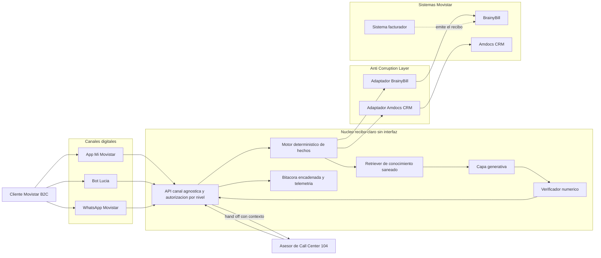
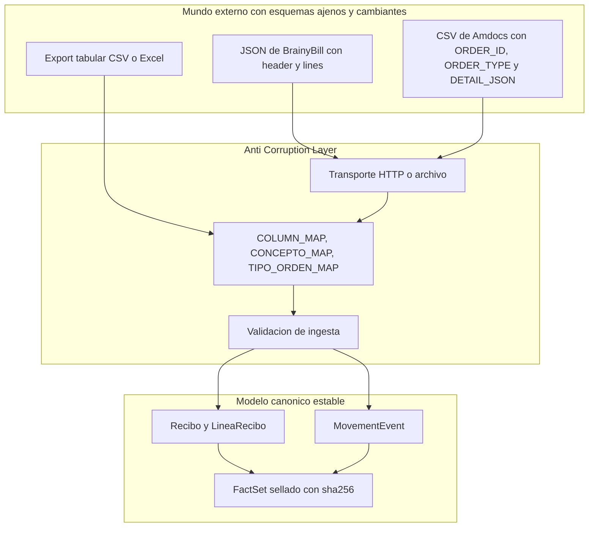
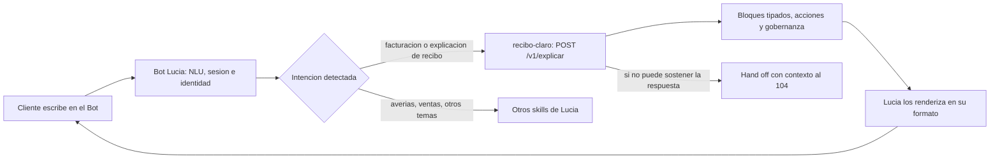
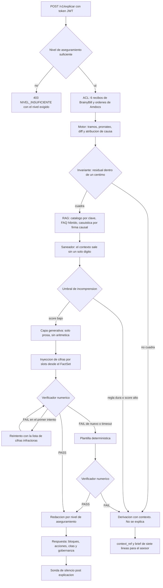
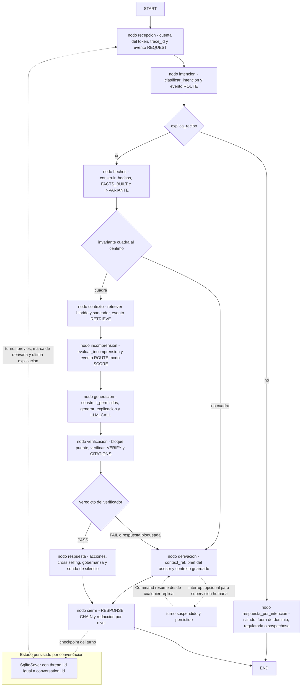
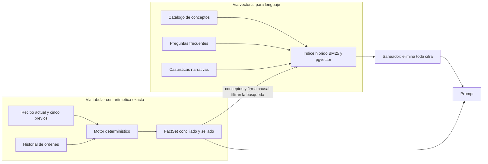
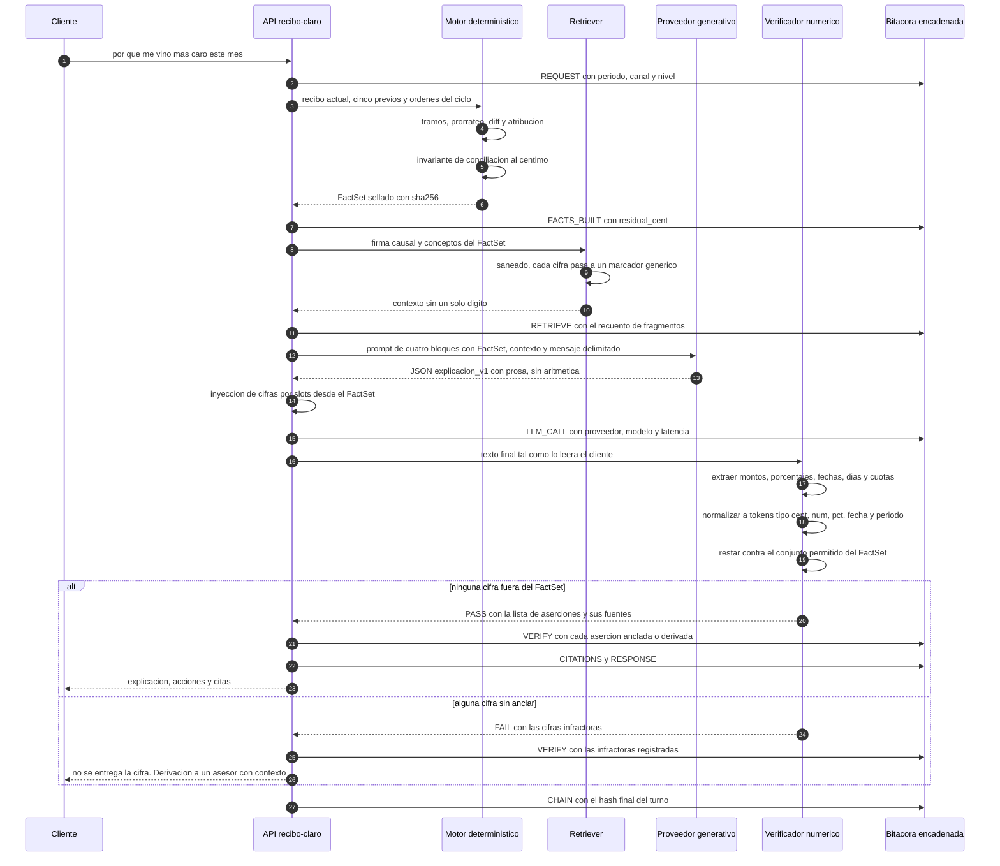

# Arquitectura — recibo-claro

Hackathon AI Telecom Challenge 2026 · Desafío 1 · Integratel Perú S.A.A. (Movistar) + Universidad de Lima.

Etiquetado: `[CONFIRMADO-OFICIAL]` cita literal de BASES o de la ficha · `[SUPUESTO]` ·
`[PROPUESTA]` · `[POR VALIDAR]`. Nada marcado `[PROPUESTA]` o `[SUPUESTO]` debe leerse como
dato de Movistar.

---

## 1. Tesis

> **BrainyBill responde QUÉ se cobró. Nosotros respondemos POR QUÉ cambió.**

La ficha lo dice sin ambigüedad: *«BrainyBill expone la información de la factura actual y de
los cinco recibos previos, pero hoy no explica el recibo de forma inteligente ni orientada al
cliente»* `[CONFIRMADO-OFICIAL]`. El dato ya está normalizado y en línea. Lo que falta es la
capa semántica encima.

No reemplazamos ningún sistema. Nos apoyamos en los que existen.

---

## 2. Contexto: los sistemas reales

Todos los nombres de esta sección salen de la ficha `[CONFIRMADO-OFICIAL]`: *«Sistemas y
canales involucrados: App Mi Movistar, Bot Lucía, WhatsApp Movistar, Amdocs (CRM), el sistema
facturador y BrainyBill»*.



**Dónde vive cada cosa** `[PROPUESTA]`:

| Sistema | Qué aporta | Qué consumimos | Mock en la hackathon |
|---|---|---|---|
| **BrainyBill** | El **qué**: recibo actual + 5 previos, ya normalizados | `GET /bills/{cuenta_id}?cycles=6` con `header` (periodo, modalidad de renta, vencimiento, total) y `lines[]` en céntimos | `apps/mocks/brainybill` sirviendo los JSON de `data/sintetico/bills/` |
| **Amdocs (CRM)** | El **porqué**: historial de órdenes — cambios de plan, suspensiones, reconexiones, altas de equipo financiado, fin de promoción | `GET /orders/{cuenta_id}` con las columnas nativas del export, traducidas a `MovementEvent[]` por el ACL | `apps/mocks/amdocs` sirviendo `ordenes.csv` |
| **Sistema facturador** | Catálogo de conceptos y reglas de negocio | Catálogo + `db/reglas/rules.yaml` versionado | `db/reglas/rules.yaml` |

> **La unión BrainyBill × Amdocs es el producto.** El Δ mes a mes sale del primero; el evento
> que lo explica sale del segundo. Ninguno de los dos, por separado, puede responder
> *«¿por qué me vino más caro?»*.

**Precisión sobre el sistema facturador.** La flecha punteada del diagrama es `[SUPUESTO]`: la
ficha nombra el facturador pero no publica su flujo hacia BrainyBill. **recibo-claro no se
integra con él** y no hay adaptador para ese sistema en `apps/api/acl.py`. El recibo ya llega
por BrainyBill; añadir una segunda fuente para el mismo dato solo añadiría formas de que las
dos no coincidan. Lo que sí tomamos de ese dominio —el catálogo de conceptos y las reglas— vive
versionado en `rules.yaml`, que es un artefacto que un analista de facturación puede leer y
corregir.

---

## 3. Anti-Corruption Layer

`[PROPUESTA]` El ACL es la frontera que impide que el esquema de un sistema externo se filtre
al modelo de dominio. En este proyecto son **dos** fronteras, y las dos existen en código:

| Frontera | Archivo | Qué traduce |
|---|---|---|
| Ingesta en línea | `apps/api/acl.py` | Respuestas HTTP de BrainyBill y de Amdocs → `Recibo` y `MovementEvent` |
| Ingesta de exportes | `packages/datagen/mapping/movistar_map.py` | CSV/Excel tabulares → el mismo modelo canónico |



**Qué compra esta capa.**

1. **El motor no conoce a BrainyBill.** `packages/facts_engine/` recibe `Recibo` y
   `MovementEvent`; no sabe si vinieron de un JSON, de un CSV o de un mock. Se prueba sin red y
   sin base de datos.
2. **Un solo archivo cambia cuando llegue el dataset real.** `movistar_map.py` es declarativo:
   `COLUMN_MAP` (25 columnas), `CONCEPTO_MAP` (45 códigos de facturador → conceptos canónicos),
   `TIPO_ORDEN_MAP` y `validar()`. Ningún otro módulo se toca.
3. **La validación es un guardia de entrada, no una excepción tardía.** `validar()` rechaza un
   recibo cuya suma de líneas no reproduce su total (±1 céntimo) **antes** de que entre al
   dominio. Un dato que no cuadra en origen no puede producir una explicación que cuadre.
4. **Los mocks son parte del contrato.** `apps/mocks/*` hablan el formato nativo de los sistemas
   reales —columnas en mayúsculas, detalle como cadena JSON— para que el ACL se ejercite en cada
   llamada y no aparezca por sorpresa el día del export de verdad. El salto a producción es
   cambiar `BRAINYBILL_BASE_URL` y `AMDOCS_BASE_URL`; los tests de contrato corren idénticos
   contra el mock y contra el sistema real.

**Interruptores declarados en el ACL**, para no descubrirlos en producción:

| Interruptor | Valor asumido | Estado |
|---|---|---|
| `IMPORTES_EN_CENTIMOS` | `True` | `[POR VALIDAR]` — si el sistema real entrega soles decimales, se pone a `False` y todo pasa por `dinero.a_centimos` |
| `FIN_CICLO_INCLUSIVO_EN_ORIGEN` | `False` | `[POR VALIDAR]` — usamos rangos `[inicio, fin)` con fin exclusivo; un origen con fin inclusivo desplazaría un día **todos** los prorrateos |
| `TOLERANCIA_CUADRE_CENT` | `1` | `[PROPUESTA]` — misma tolerancia que el invariante |

---

## 4. Posicionamiento frente a Bot Lucía

`[PROPUESTA]` **No competimos con Lucía: somos el skill de facturación que hoy le falta.**

La ficha dice que *«en el Bot, facturación representa aproximadamente el 5 % de las
atenciones»* `[CONFIRMADO-OFICIAL]`. El bot existe y funciona; facturación está subatendida
dentro de él.



Consecuencias de diseño:

| Razón | Consecuencia práctica |
|---|---|
| Lucía ya tiene NLU, sesión, identidad y canal | No se duplica lo que funciona. recibo-claro no clasifica intenciones ni gestiona la conversación general |
| El 5 % de facturación es un *intent* acotado | La adopción es **un cambio de enrutamiento**, no una migración de canal ni un cambio de hábito del cliente |
| Lucía ya tiene un flujo de derivación al 104 | El hand-off se enchufa al que existe, aportando `context_ref` y brief; no se inventa una cola nueva |
| La respuesta es canal-agnóstica | El mismo endpoint sirve App, Bot y WhatsApp, que es lo que la ficha pide con *«experiencia omnicanal App + Bot (+ WhatsApp)»* `[CONFIRMADO-OFICIAL]`. Lo único que cambia es el nivel de aseguramiento y el renderizado |
| El riesgo reputacional está acotado | Si recibo-claro no puede sostener una cifra, calla y deriva. Nunca degrada la conversación de Lucía con una respuesta inventada |

Lo mismo aplica a la App Mi Movistar: recibo-claro es el backend de la vista *«¿por qué cambió
mi recibo?»*, no una app nueva.

---

## 5. Flujo de una explicación

Un turno completo, desde el token hasta la sonda de silencio. Cada rombo es una compuerta que
puede terminar en derivación.



**Tres salidas posibles, y ninguna es una cifra inventada:**

| Salida | Cuándo | Qué recibe el cliente |
|---|---|---|
| Explicación verificada | El invariante cierra y el verificador da `PASS` | Prosa + bloques con importes anclados + acciones + citas |
| Explicación degradada | El proveedor generativo falla o agota el tiempo | Lo mismo, por plantilla determinística. `200` con cabecera `X-Degradado: PLANTILLA`. **No es un error** |
| Derivación | Invariante roto, verificación fallida, regla dura o incomprensión alta | Un aviso **sin cifras** y la derivación abierta con contexto |

**El punto no negociable:** cuando el invariante de conciliación no cierra, el sistema **no
explica**. No hay «explicación aproximada». Callar y derivar es la funcionalidad, no la
carencia.

**Detalle de orden que hace posible el verificador.** Las cifras **no** las escribe el modelo.
El modelo devuelve `resumen` y `causas[].frase`; los importes de los bloques `kv`, `puente` y
`tabla` los inyecta `componer_bloques` con `formatear_soles` sobre enteros del `FactSet`. El
paso `slots` del diagrama es lo que convierte la verificación en una comprobación trivial en
lugar de una tarea imposible.

### 5.1 El mismo flujo, declarado como grafo

El diagrama anterior describe **la lógica**. Esta sección describe **dónde vive esa lógica**.

Hasta la decisión del [`ADR/005`](ADR/005-langgraph-para-la-orquestacion.md), las once ramas de
un turno vivían dentro de `explicar_recibo` (`apps/api/routers/explicar.py:396-825`, en un archivo
de 1194 líneas): cuatro `return` —tres de ellos salidas tempranas— más dos caminos que salen por
excepción. Correcto y probado, pero legible solo de arriba abajo.

`[PROPUESTA]` **Se declara como `StateGraph` de LangGraph.** Cada nodo es una llamada a la
función que ya existe y ya está probada; **ninguna se reimplementa**. Los nombres de nodo de este
diagrama son la propuesta del ADR 005 y el contrato que la implementación respeta. El estado que
viaja por él está tipado en `packages/orquestacion/estado.py` (`EstadoTurno`), y los acumuladores
`eventos` y `nodos` llevan reductor `operator.add` para que cada nodo devuelva **solo su
aportación**.



**Tres invariantes que el grafo hereda del código actual y no puede mejorar sin romper la
bitácora:**

1. `rint` y los errores del ACL terminan **sin emitir `CHAIN`**, porque hoy no llaman a
   `_cerrar`. Unificar el cierre cambiaría la cadena de hashes y movería los tests de contrato.
2. El fallo del retriever **no corta el turno**: se explica sin contexto
   (`explicar.py:535-539`). En el grafo sigue siendo una arista que no bifurca.
3. La derivación por umbral de incomprensión **tampoco corta**: la explicación se entrega **y**
   se abre la derivación. Es la rama que más se malinterpreta al leer el flujo.

**Y una regla nueva que impone el mecanismo de `interrupt`:** al reanudar, LangGraph
**re-ejecuta el nodo desde el principio**. Por eso `auditoria.emitir` nunca puede ir antes de un
`interrupt()` dentro del mismo nodo: con una bitácora *append-only* encadenada, duplicaría
eventos. Los `emitir` van en nodos separados o después del `interrupt()`.

### 5.2 Estado persistente: qué deja de perderse

**El defecto que motivó el cambio.** `MemoriaConversaciones` (`apps/api/deps.py:251-345`) son
cuatro estructuras en RAM servidas por un `@lru_cache(maxsize=1)`: `_explicaciones` y
`_contextos` (LRU de 512), `_turnos` (LRU de 512, recortado a los 20 últimos por conversación) y
`_derivadas` (un `set` sin recorte). **Un reinicio del proceso las borra.**

| Lo que se perdía al reiniciar | Consecuencia observable |
|---|---|
| `_explicaciones` | `GET /v1/evidencia/{explicacion_id}` → **404 `EXPLICACION_NO_ENCONTRADA`** (`evidencia.py:156-163`). La trazabilidad que el proyecto ofrece como diferenciador desaparecía |
| `_contextos` | El asesor del 104 se quedaba sin el brief de su `context_ref` |
| `_explicaciones` por conversación | `POST /v1/derivacion` recalculaba el `FactSet` en vez de reutilizar el del turno derivado (`derivacion.py:293`) |
| `_turnos` | El score de incomprensión perdía `s3` (repregunta) y `s6` (turnos sin progreso) |
| `_derivadas` | La histéresis se reseteaba: **una conversación ya derivada podía reentrar al flujo normal** |

`[CONFIRMADO-OFICIAL]` La ficha exige *«derivar a asesor humano con contexto»*. Un contexto que
se evapora al reiniciar el proceso no es contexto.

**Qué aporta el checkpointer, verificado ejecutando el código del proyecto** —no la documentación
del paquete. `packages/orquestacion/checkpointer.py`:

| Prueba | Resultado |
|---|---|
| `abrir_checkpointer()` desde dos **procesos distintos** contra el mismo fichero | El proceso B (PID 10908) recuperó el estado que dejó el A (PID 20944) y siguió acumulando: 12345 → 24690 céntimos, enteros. `persistente=True` en ambos |
| `FactSet` real de `C-DEMO-01`, ida y vuelta por el serializador del proyecto | El otro proceso (PID 34752) lo reconstruyó **como instancia de `FactSet`**, con `sha256` idéntico `3227801e4fcca4c4`, `total_actual_cent = 21637` y `isinstance(..., int) is True` |
| 16 hilos concurrentes sobre el mismo `SqliteSaver` desde el threadpool | **0 errores en 0,932 s.** `cursor()` toma un `threading.Lock` propio y la conexión se abre con `check_same_thread=False`, que es lo correcto para un endpoint `def` que FastAPI corre en el threadpool |
| `interrupt()` y `Command(resume=…)` | El turno queda suspendido con su estado persistido y se reanuda **desde otro objeto grafo, con otra conexión, al mismo fichero** |
| `telemetria_externa_activa()` con la configuración del proyecto | **`False`** en ambos procesos |

**Tres decisiones del módulo que conviene conocer.** (1) Conexión propia con vida de proceso, no
`from_conn_string` —ese *helper* cierra la conexión al salir del `with`: sirve para un guion, no
para un servidor—. (2) **Si el fichero no se puede abrir, degrada a `InMemorySaver` y avisa;
nunca lanza**: un disco lleno no puede tumbar la explicación de un recibo, exactamente la misma
política que el retriever sin pgvector, y el objeto publica `persistente` y `motivo` para
responder de un vistazo a *«¿esta demo está persistiendo?»*. (3) **Lista blanca de tipos al
deserializar** —92 tipos derivados por introspección de catorce módulos del dominio—, porque el
serializador de LangGraph importa y construye la clase que diga el propio checkpoint.

**Qué se persiste y qué no.** `packages/orquestacion/estado.py` separa dos cosas que es fácil
confundir: `EstadoTurno` son los **datos** del turno y se persisten; `Servicios` son las
**dependencias vivas** —bitácora, repositorio, proveedor, memoria— y viajan por el `context`
efímero de LangGraph. Meter la bitácora en el estado haría que cada paso intentara serializar un
`threading.Lock`.

**Dónde vive el fichero.** `CHECKPOINT_PATH`, por defecto `data/checkpoints/turnos.sqlite`.
Queda dentro de `data/`, ya cubierto por `.gitignore` (`data/*`) y `.dockerignore` (`data/`):
**el estado de conversación de un cliente no se versiona ni entra en la imagen.** El valor
`:memory:` fuerza el almacén volátil para pruebas.

**Encaje con lo que ya existe, dicho con precisión.** El checkpointer indexa por `thread_id`, así
que cubre de forma natural lo que se indexa por conversación: `_turnos`, `_derivadas` y el
puntero a la última explicación. **No cubre por sí solo** `_explicaciones` (clave
`explicacion_id`) ni `_contextos` (clave `context_ref`): esos dos mapas necesitan otro almacén o
un `BaseStore`. Decirlo evita presentar como resuelto algo que se resuelve a medias.

**Contrapartida.** SQLite es de un nodo: resuelve el reinicio y la evidencia, no el multi-réplica
salvo sobre volumen compartido. Para varias réplicas, el mismo grafo apunta a un checkpointer
PostgreSQL **sin tocar los nodos**. Y aparece un fichero nuevo que hay que abrir en el
`lifespan`, cerrar en `cerrar_recursos()` y **borrar según una política que todavía no está
definida** — infraestructura que antes no existía porque el estado se perdía solo.

**Estado de la implementación, 7 de agosto de 2026** (suite en verde): están escritos el
checkpointer, el estado, el apagado de telemetría y el adaptador de proveedor;
**no está escrito el grafo** (`packages/orquestacion/grafo.py` no existe) ni su
enganche con el ciclo de vida de la API. El diagrama de §5.1 describe el destino, no lo que hoy
ejecuta el endpoint. Ver [`ADR/005`](ADR/005-langgraph-para-la-orquestacion.md) y
[`PROCEDENCIA.md`](PROCEDENCIA.md) §3.5.

**Ninguna dependencia con licencia restringida entra por esta puerta.** `langgraph`,
`langgraph-checkpoint`, `langgraph-checkpoint-sqlite` y `langchain-core` son MIT, verificado
leyendo el `LICENSE` de cada paquete instalado. Se excluyen `langgraph-api`, `langgraph-cli` y el
**servicio** LangSmith, con el tracing apagado por variable de entorno y comprobado con un
cortafuegos de sockets. El detalle está en
[`PROCEDENCIA.md`](PROCEDENCIA.md) §2.1 y §2.2.

---

## 6. El motor determinístico

Cero IA. Es el 70 % del valor del proyecto.

**Modelo de tramos.** Un solo algoritmo cubre los cinco escenarios que exige la ficha. El ciclo
se parte por todos los eventos en tramos disjuntos que suman exactamente D días:

```
RENTA_ciclo = Σ_j  P_j · (len_j / D) · facturable(e_j)
```

La tabla de tramos **es** la explicación: *«del 1 al 12 el Plan A, del 13 al 30 el Plan B»*. Es
auditable y un analista de facturación la verifica mentalmente. Ver
[`ADR/004`](ADR/004-modelo-de-tramos.md).

**Las dos modalidades de renta**, que la ficha exige explícitamente (*«todo en ambas modalidades
de renta adelantada y vencida»* `[CONFIRMADO-OFICIAL]`):

```
VENCIDA     T_k = RENTA_ciclo_k + CONSUMO_k + CUOTAS_k + CARGOS_k − CREDITOS_k

ADELANTADA  T_k = P_new + AJUSTE_RETRO_k + CONSUMO_k + CUOTAS_k + CARGOS_k
            AJUSTE_RETRO_k = (P_new − P_old) · (d_new / D)
```

`[PROPUESTA]` **El insight que sostiene el proyecto:** en renta adelantada, un cambio de plan a
mitad de ciclo hace convivir **dos rentas en un mismo documento**. El recibo puede subir aunque
el plan nuevo sea más barato. Cualquier solución que trate el prorrateo como una fórmula única
lo explicará mal. Es el caso `C-DEMO-01`: de S/ 99.90 a S/ 79.90, y el recibo sube S/ 20.82.

**El invariante de conciliación**, compuerta dura:

```
Δ = T_k − T_{k−1} = Σ_c Δ_c          full outer join por concepto_id, sin ML
residual = Δ − Σ causas atribuidas
|residual| > 1 céntimo  →  NO se explica, se deriva
```

Es simultáneamente el garante del 0 % de alucinaciones, la señal primaria del umbral de
incomprensión y el KPI demostrable en vivo.

**Todo en céntimos enteros.** Reparto por mayor resto, de modo que la suma de líneas es
idénticamente igual al total. `tests/unit/test_sin_float.py` falla la build si aparece un
`float(` en la lógica monetaria. Ver [`ADR/002`](ADR/002-montos-en-centimos-enteros.md).

---

## 7. RAG: qué se vectoriza y qué no

`[CONFIRMADO-OFICIAL]` La ficha exige *«una arquitectura RAG»* y a la vez *«respuestas
limitadas estrictamente a la base de datos de facturación provista, para garantizar 0 % de
alucinaciones financieras»*. La única forma de cumplir ambas es separar dos cosas que suelen
mezclarse. La propia ficha distingue los dos caminos: los datos llegan *«listos para su
vectorización **o** procesamiento tabular»* `[CONFIRMADO-OFICIAL]`.

**El recibo se procesa de forma tabular. El conocimiento se vectoriza.**



| Corpus | Acceso | Vectores | Qué aporta |
|---|---|---|---|
| **Recibos y líneas** | Consulta por clave + full outer join por `concepto_id` | ❌ **Nunca** | Los **números** |
| **Catálogo de conceptos** (31) | Lookup **por clave** — el `concepto_id` ya lo dio el motor | Secundario | Las **definiciones** |
| **FAQs** (36) | Híbrido BM25 + vectorial, fusión RRF con k=60, **filtrado por los conceptos del `FactSet`** | ✅ | El **lenguaje del cliente** |
| **Casuísticas** (28) | Vectorial por **firma causal**: causas ordenadas + modalidad + signo del Δ | ✅ | La **estructura narrativa** |

**Por qué el recibo no se vectoriza** (ver [`ADR/001`](ADR/001-el-recibo-no-se-vectoriza.md)):

| Motivo | Consecuencia si se vectorizara |
|---|---|
| Un *embedding* no distingue `S/ 124.90` de `S/ 129.40` | La cifra recuperada podría ser la de otra línea, otro mes u otro cliente |
| La explicación exige **conciliar**: Σ variaciones = Δ total | Con recuperación aproximada el invariante no se puede ni plantear |
| La consulta está perfectamente determinada: `cuenta_id` + `periodo` | La búsqueda semántica resuelve un problema que aquí no existe |
| Los datos del recibo son **datos personales de facturación** | Vectorizarlos los multiplica en otro almacén, con otro control de acceso |

**Por qué híbrido y no solo vectorial:** los términos de facturación son jerga exacta
—*prorrateo*, *reconexión*, *nota de crédito*— y BM25 los clava. Los vectores capturan el
*«¿por qué me vino más caro?»* que no comparte ni una palabra con *«variación de monto entre
ciclos»*.

**El saneador es obligatorio.** Antes de que cualquier texto recuperado entre al prompt,
`packages/retriever/saneador.py` sustituye toda cifra monetaria, porcentaje y fecha concreta por
marcadores genéricos —`«un monto»`, `«una fecha»`, `«una cantidad de días»`—. La última regla
captura cualquier resto numérico, así que **el texto que sale del retriever no contiene ni un
dígito**. Si una FAQ dice *«por ejemplo, S/ 49,90»*, ese número no es de este cliente. Y aunque
sobreviviera, el verificador lo marcaría como no anclado, porque el conjunto permitido se
construye **solo** desde el `FactSet`.

Sin el saneador, el RAG sería la vía de entrada de alucinaciones más difícil de detectar: una
cifra plausible, procedente de un documento real de la empresa, que no es de este cliente.

**Degradación sin cascada.** Sin `DATABASE_URL` el índice cae a memoria; sin `GEMINI_API_KEY`
el embebedor cae a `MockEmbedder`; sin `rank-bm25` se usa una implementación propia de BM25
Okapi; si el embebedor falla, se responde con BM25 puro. **Construir el recuperador nunca
lanza excepción.** Cada degradación se refleja en `contexto.motivos`, en `/salud/preparacion` y
en el log.

**Quién decide si se toca PostgreSQL: `MODO_ALMACENAMIENTO`.** El DSN se le pasa al
`IndiceVectorial` desde `apps/api/deps.py`, no lo lee él del entorno, de modo que hay un solo
interruptor: `memoria` no abre ninguna conexión (ni paga su timeout), `postgres` la exige y
`auto` —el valor por defecto— usa la base solo si `DATABASE_URL` trae valor. Lo único que
persiste en PostgreSQL es este índice: el dataset se lee del disco por el ACL y la bitácora
encadenada es un JSONL local, así que **la API responde exactamente lo mismo sin base de
datos**; solo pierde la persistencia del índice entre reinicios (reconstruirlo cuesta ~0,15 s
para 95 documentos). `GET /salud/preparacion` distingue las dos cosas: `almacenamiento` dice
qué se pidió y `rag.vectorial.respaldo`, qué se consiguió.

`[POR VALIDAR]` Cambiar `GEMINI_EMBED_MODEL` o `EMBED_DIM` obliga a reindexar: cada fila guarda
la firma del modelo y las búsquedas filtran por ella. `python -m db.migrar --verificar-dim` lo
detecta y sale con código 1 en vez de fallar con un error críptico de pgvector.

---

## 8. Gobierno del LLM y verificación anti-alucinación

`[CONFIRMADO-OFICIAL]` La ficha no pide una métrica de marketing: pide *«Tasa de Alucinación:
cero invenciones financieras **comprobables mediante logs de la terminal**»*. Eso es una
instrucción de diseño de observabilidad.

**El LLM genera la forma; el código inyecta las cifras.** Esa frase resuelve la tensión entre el
tono *«humano, transparente, evitando estructuras robóticas»* y la exigencia de anclaje total,
ambos literales de la ficha. Ver [`ADR/003`](ADR/003-el-llm-no-calcula.md).

El modelo recibe **solo** el `FactSet` ya validado. No accede a la base de datos, no ejecuta
acciones, no tiene herramientas de cálculo. El mensaje del cliente entra delimitado entre `<<<`
y `>>>`, como dato y nunca como instrucción. El `account_ref` se deriva del token, jamás del
texto.



### Qué contiene el conjunto permitido, exactamente

Se construye **solo** desde el `FactSet` (`packages/llm_layer/verificador.py`):

1. **Anclados.** Cada entero del `FactSet` con sus renderizados en formato peruano: totales,
   deuda, montos y deltas por línea, participación de cada causa, días de ciclo y de prorrateo,
   días, tarifa, prorrateado y fechas de cada tramo, número y monto de cuota, periodos y sus
   años. De cada importe se ancla el valor con signo **y** su valor absoluto.
2. **Derivados por álgebra permitida.** Lista cerrada de seis reglas: suma, resta, diferencia de
   fechas en días, cociente días/D, porcentaje y redondeo al céntimo. **Cada derivación queda
   registrada** con su regla, sus operandos y sus fuentes.
3. **Enteros contenidos en textos del propio `FactSet`** —nombre comercial, plan vigente, equipo
   financiado— anclados **solo** como `num:`, nunca como `cent:`.

```
1. regex sobre el texto: montos, porcentajes, fechas, dias, "cuota N de M"
2. normalizar con prefijo de magnitud: 12490 -> cent:12490 ; 12 dias -> num:12
3. token ∉ ALLOWED  ->  NO_ANCLADA
4. FAIL -> un reintento -> si vuelve a fallar, plantilla determinística
```

El prefijo de magnitud no es un detalle: sin él, los 12 días de un prorrateo anclarían un
importe de S/ 0.12 y el verificador dejaría pasar una cifra inventada. Un `5` de «Plan Max 5G»
tampoco puede autorizar un importe de S/ 5.00.

**Métrica comprometida:** `TA_respuesta = 0` — cero respuestas con al menos una aserción no
anclada. No «porcentaje bajo». Medida en `make eval` sobre 261 casos y 4 625 afirmaciones
numéricas.

### La prueba en la terminal

```
╭─ RECIBO CLARO · trace tr-ec7383011318 ──────────────────╮
│ AFIRMACIONES NUMÉRICAS 12 · ANCLADAS 12 · NO ANCLADAS 0 │
╰─────────────────────────────────────────────────────────╯
  ✔ PETICIÓN    C-DEMO-01 · 2026-07 · APP · LOA2
  ✔ HECHOS      Δ +S/ 20.82 · 4 líneas · residual 0 c · invariante OK
  ✔ CONTEXTO    5 faq · 1 casuística · saneado · U=0.43
  ✔ GENERACIÓN  mock · mock-plantillas-1.0.0 · 21 ms
  ✔ VERIFICA    PASS · 12 ancladas · 0 derivadas · 0 no ancladas · 12 citas
  ✔ RESPUESTA   5 bloques · 3 acciones · LLM · 21 ms · cadena íntegra (10 eventos)
```

Y para ver al verificador trabajar de verdad, `POST /dev/alucinar` inyecta una cifra inexistente
en una explicación ya generada: el veredicto pasa a `FAIL`, la respuesta se bloquea, el turno
termina en derivación y el contador muestra `NO ANCLADAS 1`. Un `PASS` no prueba nada si nunca
se ha visto un `FAIL`.

---

## 9. Niveles de aseguramiento por canal

`[CONFIRMADO-OFICIAL]` La ficha repite dos veces: *«No se debe mostrar información sensible sin
autenticación»* — y a la vez pide atención por **WhatsApp**, donde la identidad se apoya en un
número de teléfono. Las dos cosas son ciertas y hay que resolverlas juntas.

| Nivel | Cómo se prueba | Qué se puede responder |
|---|---|---|
| **LOA0** anónimo | nada | Solo catálogo: *qué es un prorrateo*. **Cero cifras del cliente** |
| **LOA1** WhatsApp | el canal prueba control del dispositivo, **no titularidad de la cuenta** | Existencia del recibo, dirección del cambio y causa. **Ningún monto** |
| **LOA2** App | sesión autenticada | Explicación completa con desglose línea a línea |
| **LOA_ASESOR** | identidad del asesor + `acting_on_behalf_of` obligatorio | Como LOA2, con auditoría nominal |

### El caso WhatsApp, resuelto en dos planos

**Plano 1 — lo que ya está implementado.** En `LOA1`, `redactar_para_nivel`
(`apps/api/security.py`) actúa **sobre la respuesta ya generada y verificada**, no sobre un
prompt distinto:

1. **Elimina** los bloques `kv`, `puente` y `tabla`: son importes por definición.
2. **Sanea** el texto de los bloques `texto` y `aviso`, y también `derivacion.motivo` y
   `resumen_asesor`, con el mismo saneador del RAG. El resultado **no contiene un solo dígito**;
   hay una prueba de contrato que lo comprueba contando caracteres numéricos.
3. **Vacía** `gobernanza.citas` y `gobernanza.aserciones` — porque `texto_original` de una
   aserción **es literalmente el importe**. Vaciarlas es la diferencia entre redactar de verdad
   y dejar la cifra en un campo secundario del JSON.
4. **Conserva los contadores** de gobernanza y marca `telemetria["redactado_por_nivel"]`: la
   auditoría sigue sabiendo que hubo doce afirmaciones ancladas aunque al cliente no se le hayan
   entregado.

El cliente de WhatsApp recibe *«su recibo subió respecto del mes pasado, y el motivo principal
es un cambio de plan»* más una acción para **elevar el nivel** —abrir la App o autenticarse— y
ver el detalle. Se conserva la utilidad conversacional sin exponer importes en un canal de
aseguramiento bajo.

**Plano 2 — controles que solo Movistar puede implementar** `[PROPUESTA]`:

1. El MSISDN es una **pista de vinculación, nunca una credencial**.
2. Sin vinculación previa atestiguada desde la App, **WhatsApp transporta un puntero, no
   contenido**: enlace de un solo uso con TTL corto; la App abre autenticada y muestra la
   explicación.
3. **Titularidad ≠ usuario de la línea.** Un MSISDN identifica *la línea*, no al titular de la
   cuenta ni al pagador. Si no coinciden, jamás se responde el recibo consolidado.
4. Si hubo **cambio de SIM o portabilidad en las últimas 72 horas**, se prohíbe elevar el nivel
   por WhatsApp. Neutraliza el SIM-swap. `[POR VALIDAR]` — requiere un dato que solo el operador
   tiene.

`[POR VALIDAR]` La correspondencia canal → nivel es nuestra propuesta. Movistar puede decidir
que un WhatsApp con verificación adicional alcanza `LOA2`; el cambio es de configuración del
emisor de tokens, no de código.

### El `account_ref` nunca sale del texto

La cuenta sobre la que se responde sale **siempre** del token: `sub`, o `act`
(`acting_on_behalf_of`) cuando el nivel es `LOA_ASESOR`. Jamás del cuerpo, de la query ni del
mensaje del cliente. Un `cuenta_id` distinto en la petición no se resuelve en silencio: es
**`403 CUENTA_NO_AUTORIZADA`** y queda en la bitácora, para que el intento cruzado sea visible.
Hay tres casos golden adversariales de inyección de prompt que lo comprueban.

---

## 10. Dimensionamiento del pico 3×

`[CONFIRMADO-OFICIAL]` La ficha exige *«prever escenarios de escalabilidad para soportar picos
de alta concurrencia, hasta 3 veces la volumetría normal»*.

`[PROPUESTA]` **Todo el cálculo que sigue es nuestro.** Una sola entrada es oficial; el resto
son supuestos explícitos, puestos aquí para que se puedan discutir uno a uno y sustituir por los
datos reales de Movistar.

### El cálculo, a la vista

Partiendo de *«aproximadamente 1 millón de transacciones»* de explicación de recibo en la App
`[CONFIRMADO-OFICIAL]`, y asumiendo que ese millón es mensual `[POR VALIDAR: la ficha no declara
el periodo]`:

```
λ_medio            = 1 000 000 / (30 × 86 400)                    = 0,386 rps
factor dia de ciclo   D = 3      [SUPUESTO: consultas concentradas tras la emision]
factor hora pico      H = 2,9    [SUPUESTO: 12 % del dia en una hora]
λ_pico_operativo   = 0,386 × 3 × 2,9                              ≈  3,3 rps
requisito oficial de 3× sobre ese pico                            ≈ 10,0 rps
mas Bot y WhatsApp, +50 % sobre App   [SUPUESTO]                  ≈ 15   rps  <- objetivo de diseno
rafaga p99                            [SUPUESTO: 2× el sostenido] ≈ 30   rps
```

**Objetivo de diseño: ~15 peticiones por segundo sostenidas y ráfagas de ~30.** Es una cifra
modesta, y decirlo es parte de la honestidad del ejercicio: el reto de este desafío **no es el
volumen, es la exactitud**.

### Capacidad medida

| Régimen | Latencia por turno | Cuello | Qué hace falta para 15 rps |
|---|---|---|---|
| Determinístico (plantilla o mock, sin red) | mediana **13 ms**, p95 **29 ms** — medido en `make eval` sobre 261 casos | CPU | **1 réplica con margen.** Un trabajador a 20 ms/turno sostiene ~50 rps teóricos; con 50 % de margen operativo, ~25 rps |
| Con proveedor generativo | dominada por la llamada externa; `LLM_TIMEOUT_S=4` | E/S de red y **cuota del proveedor** | Ley de Little con 1,5 s de latencia `[SUPUESTO]`: 15 × 1,5 = **23 peticiones en vuelo**. El proceso es asíncrono, así que la concurrencia no es el problema; la cuota sí |

### Qué se rompe primero, y qué se hace

| # | Se rompe | Mitigación | Estado |
|---|---|---|---|
| 1 | **La cuota del proveedor generativo.** A 3× se pega contra el límite de peticiones por minuto antes que contra la CPU | **La degradación a plantilla determinística.** Bajo presión el sistema deja de llamar al modelo y responde con plantilla: mismas cifras del `FactSet`, misma exactitud, menos naturalidad. Es el amortiguador natural del pico | ✅ implementado en `packages/llm_layer/generador.py`. `[POR VALIDAR]` la cuota real |
| 2 | **La memoria de conversación**, un LRU de 512 entradas en el proceso | **Implementado:** checkpointer persistente de LangGraph con `thread_id = conversation_id` ([`ADR/005`](ADR/005-langgraph-para-la-orquestacion.md), §5.2). `ORQUESTADOR=grafo` es el valor por defecto (`apps/api/settings.py:162`) y el arranque publica `checkpoints: {'tipo': 'SqliteSaver', 'persistente': True}`. Para varias réplicas, el mismo grafo apunta a un checkpointer PostgreSQL sin tocar los nodos | ✅ implementado y por defecto: `packages/orquestacion/checkpointer.py` (SQLite en `data/checkpoints/turnos.sqlite`), con `tests/integracion/test_rehidratacion.py` cruzando la frontera del disco en un proceso nuevo. 🟡 **queda abierto el multi-réplica**: SQLite es de un nodo — riesgo R-03 de [`PROCEDENCIA.md`](PROCEDENCIA.md) |
| 3 | **BrainyBill y Amdocs.** Cada turno hace dos llamadas; el pico se les traslada íntegro | Caché por `(cuenta_id, periodo)` con TTL corto: el recibo de un mes cerrado **no cambia**, así que es cacheable sin riesgo de servir dato viejo | ⛔ **no implementado.** `[POR VALIDAR]` su capacidad y sus límites |
| 4 | Caché de arquetipo narrativo para ahorrar llamadas al modelo — la clave sería `causas + signo + banda de monto + producto + modalidad + verbosidad + versiones`, **sin montos**, precisamente porque el modelo genera la forma y el código inyecta las cifras | Reduciría la dependencia del proveedor por debajo del 20 % de los turnos | ⛔ **no implementado.** `[PROPUESTA]` para la siguiente fase |
| 5 | El arranque en frío de las réplicas nuevas | Ya resuelto: el `lifespan` de `apps/api/main.py` construye reglas, corpus e índice **antes** de aceptar tráfico. Ninguna petición paga la construcción de un índice | ✅ implementado |
| 6 | El índice vectorial | No es un problema: **el corpus no crece con los clientes.** Son 95 documentos de conocimiento, no 5 millones de recibos. Es la consecuencia operativa directa de no vectorizar el recibo | ✅ por diseño |

### Propiedades que hacen posible el escalado horizontal

- **Sin estado, salvo la memoria de conversación.** El `FactSet` se recalcula de forma
  determinística desde los mismos datos de entrada: dos réplicas producen el mismo `sha256`. Y
  ese determinismo es lo que permite externalizar el estado sin perder exactitud: el `FactSet`
  vuelve del checkpointer con el **mismo `sha256`** con el que entró (§5.2).
- **Un trabajador por contenedor** y escalado por réplicas (`Dockerfile.api`). Varios
  trabajadores en el mismo contenedor fragmentarían la memoria de conversación en silencio.
- **La base de datos no está en el camino crítico de una explicación.** El motor trabaja sobre
  lo que devuelve el ACL; PostgreSQL sostiene el corpus RAG y la auditoría persistente.
- **La bitácora es *append-only*.** No hay contención por escritura sobre filas compartidas.
- **Degradación elegante:** si el modelo cae o se satura, el `FactSet` sigue produciendo la
  explicación por plantilla. El servicio no cae; pierde naturalidad, no exactitud.

`[POR VALIDAR]` **No se ha ejecutado una prueba de carga.** Las latencias son medidas; el
dimensionamiento es aritmética sobre supuestos declarados. Antes de producción hay que
contrastarlo con la volumetría real y con los límites de BrainyBill, Amdocs y el proveedor
generativo.

---

## 11. Auditoría y trazabilidad

JSONL *append-only* con cadena de hash: `hash_n = SHA256(hash_{n−1} ‖ json_canónico(evento))`.
Manipular un evento pasado rompe la cadena y `verificar_cadena()` señala el índice exacto. En
PostgreSQL, el mismo hash se recalcula en un `CHECK` y `UPDATE` / `DELETE` / `TRUNCATE` están
bloqueados por *trigger* además de por `REVOKE`.

Etapas: `REQUEST · FACTS_BUILT · INVARIANTE · RETRIEVE · ROUTE · LLM_CALL · VERIFY ·
CITATIONS · RESPONSE · CHAIN`.

**Reproducibilidad:** mismos hechos + misma `rules_version` + mismo `model_version` = misma
explicación. El `factset_id` es un UUID5 determinista y `generado_en` está excluido del hash, de
modo que la demo es byte-reproducible entre ejecuciones.

`formatear_para_terminal()` produce la vista de la demo: máximo 6 líneas por turno y una
cabecera con `AFIRMACIONES NUMÉRICAS n · ANCLADAS n · NO ANCLADAS 0`. Cada mensaje lleva su
`trace_id` visible: el jurado elige un mensaje y ve su bloque `VERIFY` con una aserción por
cifra, su estado (`ANCLADA`, `DERIVADA`, `NO_ANCLADA`) y el campo exacto del `FactSet` que la
respalda.

**Tasa de silencio post-explicación** `[CONFIRMADO-OFICIAL]`: cada respuesta abre una sonda
(`silence_probe_id`). El silencio **con** señal de cierre cuenta como comprensión; la
repregunta, como fallo; y el silencio **sin** señal de cierre queda como *abandono ambiguo* y
**no cuenta como éxito**. Se publican cota inferior, cota superior y la banda de incertidumbre
entre ambas, en vez de un número optimista.

---

## 12. Lo que esta arquitectura deliberadamente no hace

- No reemplaza a BrainyBill, ni al facturador, ni a Bot Lucía.
- No calcula montos con un modelo de lenguaje.
- No vectoriza recibos.
- No responde cuando el invariante no cierra.
- No muestra cifras sin autenticación.
- No decide ofrecer nada por su cuenta: el cross-selling requiere la doble compuerta que exige
  la ficha — consulta *«resuelta positivamente»* **y** regla de negocio explícita
  `[CONFIRMADO-OFICIAL]`.
- No entrega **la** interfaz de producto: la App de Movistar y Bot Lucía siguen siendo suyas, y lo
  que este sistema publica son bloques tipados (`texto`, `kv`, `puente`, `tabla`, `aviso`) para que
  cada canal los renderice a su manera. Sí se entrega una **consola de demostración** —3 309 líneas
  de HTML, CSS y JavaScript sin dependencias, en `apps/web/estatico/`, montada en `/ui` por
  `apps/api/main.py:191`— cuya única razón de ser es enseñar el mecanismo: el `FactSet` al lado del
  texto, la cascada de causas y el veredicto del verificador cifra por cifra. Es superficie de
  demostración, no capa de producto: la API responde igual sin ella y el directorio puede faltar
  (`main.py:188` lo registra y sigue).
- No depende de ninguna plataforma con licencia restringida ni de ningún servicio de trazas de
  terceros: la orquestación usa bibliotecas MIT y excluye `langgraph-api`, `langgraph-cli` y el
  servicio LangSmith, con el tracing apagado por variable de entorno
  ([`ADR/005`](ADR/005-langgraph-para-la-orquestacion.md)).

---

## 13. Decisiones registradas

| ADR | Decisión |
|---|---|
| [001](ADR/001-el-recibo-no-se-vectoriza.md) | El recibo no se vectoriza: es consulta estructurada |
| [002](ADR/002-montos-en-centimos-enteros.md) | Todo monto es un entero en céntimos; prohibido `float` |
| [003](ADR/003-el-llm-no-calcula.md) | El LLM no calcula: recibe hechos y solo aporta prosa |
| [004](ADR/004-modelo-de-tramos.md) | Un modelo de tramos, no una fórmula por escenario |
| [005](ADR/005-langgraph-para-la-orquestacion.md) | LangGraph orquesta y persiste el estado; no calcula ni verifica |

Pendientes, supuestos abiertos y riesgos: [`PROCEDENCIA.md`](PROCEDENCIA.md).
Declaración de herramientas exigida por BASES §10: [`PROCEDENCIA.md`](PROCEDENCIA.md).
